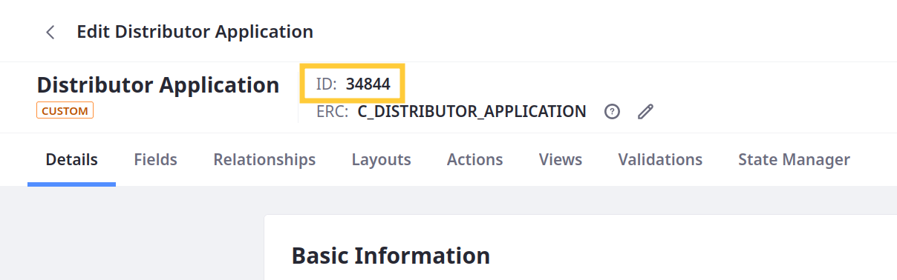
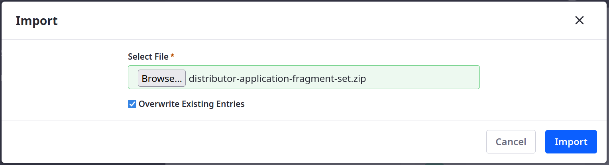

# Importing Fragments for the Distributor Application Pages

<!-- Intro -->

1. Download the Distributor Application fragments ZIP:

   ```bash
   curl https://learn.liferay.com/courses/latest/en/application-development/designing-user-interfaces/importing-fragments-for-the-distributor-application-pages/distributor-application-fragment-set.zip -O
   ```

1. Open the *Site Menu* (), expand *Design*, and click *Fragments*.

1. Click the *Actions* button for Fragment Sets and select *Import*.

   

1. Select the `distributor-application-fragment-set.zip` file and click *Import*.

   

1. Confirm the Distributor Application fragments imported successfully. This set should include four fragments:

   * Form Page
   * Success Page
   * Overview Page
   * Display Page

   

<!-- Can now add these fragments to each of the pages. -->

Next: [Adding the Form to the Apply Page](./adding-the-form-to-the-apply-page.md)
