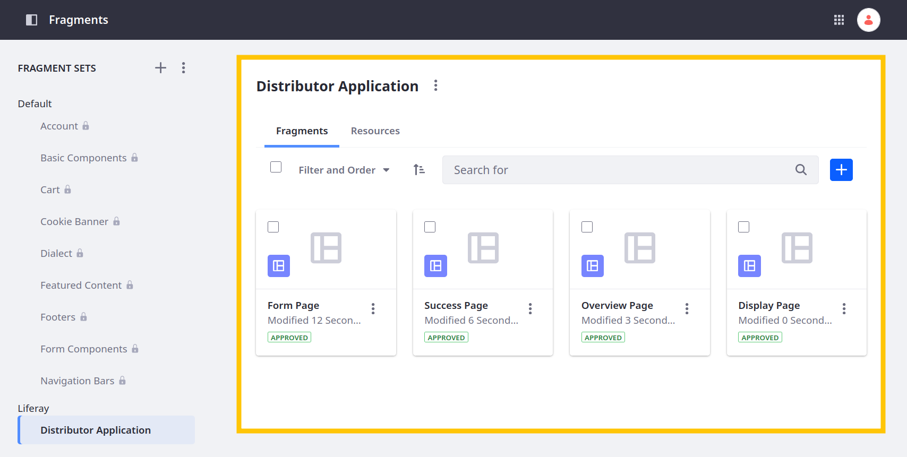

# Importing Fragments for the Distributor Application Pages

Published objects are integrated with Liferay's core frameworks, so you can map page fragments to object entries, such as form fragments and the Collection Display fragment. Here you'll import pre-configured fragment compositions for use in distributor application pages. However, before you can import the fragments, unzip and update the object id for the provided form container with the ID for the Distributor Application object in your instance.

## Preparing the Fragments for Import

1. Retrieve the ID for the Distributor Application object and save it for later.

   

1. Download and unzip the [Distributor Application fragment set](./liferay-b2m3.zip):

   ```bash
   curl https://learn.liferay.com/courses/latest/en/application-development/designing-user-interfaces/importing-fragments-for-the-distributor-application-pages/liferay-b2m3.zip -O
   ```

   ```bash
   unzip liferay-b2m3.zip
   ```

1. Navigate to this folder: `liferay-b2m3/fragment-compositions/application-form`.

1. Open the `fragment-composition-definition.json` file in your code editor.

1. Enter this value for `className`, replacing `[OBJECT_ID]` with the ID of the Distributor Application object: `com.liferay.object.model.ObjectDefinition#[OBJECT_ID]`.

   For example,

   ```json
   "formReference": {
       "className": "com.liferay.object.model.ObjectDefinition#34844",
       "classType": 0
   }
   ```

1. Save the file and zip the fragment set:

   ```bash
   zip distributor-application-fragment-set.zip liferay-b2m3 -r
   ```

Now you can import the fragment set into your site.

## Importing the Fragment Set

1. Open the *Site Menu* (  ), expand *Design*, and click *Fragments*.

1. Click *Actions* (  ) for Fragment Sets and select *Import*.

   

1. Select the `distributor-application-fragment-set.zip` file and click *Import*.

   

1. Confirm the Distributor Application fragments imported successfully. This set should include three fragments:

   * Form Page
   * Success Page
   * Display Page

   

Now that you've imported the fragments, you can use them to integrate the Distributor Application object with your pages.

Next: [Adding the Form to the Apply Page](./adding-the-form-to-the-apply-page.md)

## Relevant Concepts

* [Displaying Object Entries](https://learn.liferay.com/web/guest/w/dxp/building-applications/objects/displaying-object-entries)
* [Using Fragments to Build Forms](https://learn.liferay.com/web/guest/w/dxp/building-applications/objects/using-fragments-to-build-forms)
