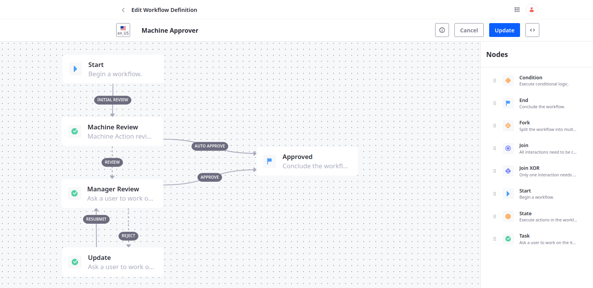
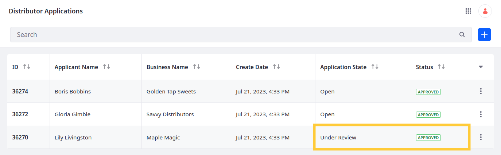
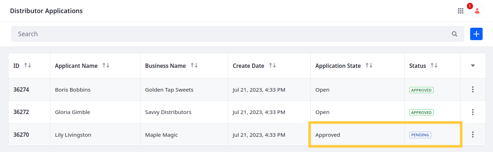
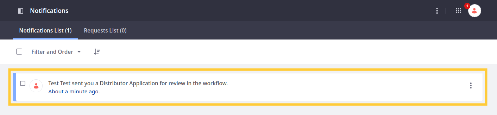
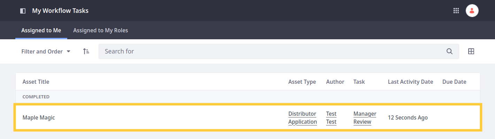
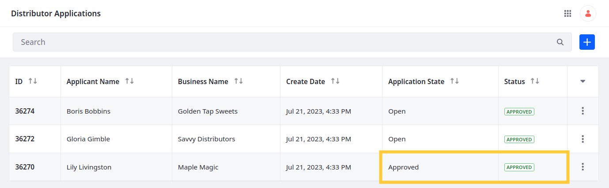

# Adding an Approval Workflow

After adding the `applicationState` field, Delectable Bonsai wants to implement a workflow for reviewing and approving changes made to it. Currently, all updates to an application are automatically approved, regardless of the selected state. Since Delectable Bonsai is associating additional business logic with the `approved` and `denied` states, they need a workflow that can check the `applicationState` field and require manager review if one of these values is selected. Here you'll deploy and set up this workflow process using Liferay [client extensions](https://learn.liferay.com/web/guest/w/dxp/building-applications/client-extensions).

## Deploying the Client Extensions

1. Download and unzip the sample workspace:

   ```bash
   curl -o https://learn.liferay.com/courses/latest/en/application-development/implementing-business-logic/liferay-c6s3.zip
   ```

   ```bash
   unzip liferay-c6s3.zip
   ```

1. Navigate to `liferay-c6s3/liferay-course-workspace/client-extensions`:

   ```bash
   cd liferay-c6s3/liferay-course-workspace/client-extensions
   ```

   This includes two client extension projects: `liferay-course-batch` and `liferay-course-etc-spring-boot`.

1. Run this command to deploy the client extensions and confirm the deployment in your Liferay instance’s console:

   ```bash
   ../gradlew clean deploy -Ddeploy.docker.container.id=$(docker ps -lq)
   ```

   ```log
   2023-07-20 21:03:07.142 INFO  [Refresh Thread: Equinox Container: 8b6a806c-654e-44f8-8210-75b61d29063c][BundleStartStopLogger:77] STARTED liferaycoursebatch_1.0.0 [1721]
   2023-07-20 21:03:12.408 INFO  [Refresh Thread: Equinox Container: 8b6a806c-654e-44f8-8210-75b61d29063c][BundleStartStopLogger:77] STARTED liferaycourseetcspringboot_1.0.0 [1722]
   ```

1. Navigate to the `liferay-course-etc-spring-boot` project and start the Spring Boot application:

   ```bash
   cd liferay-course-etc-spring-boot
   ```

   ```bash
   ./../../gradlew bootRun
   ```

1. Once the application finishes starting up, go to `http://localhost:58081/ready`. If the application is ready for use, the page should say "READY."

Now you can enable the workflow for the Distributor Application object.

## Examining the Code

The provided Workflow Action client extension performs these operations:

1. Retrieves the application's state value and uses it to determine the workflow transition

1. Makes an asynchronous HTTP POST request for the transition

### Determining the Workflow Transition

<!--TASK:
```{literalinclude} ./resources/liferay-c6s3.zip/liferay-course-workspace/client-extensions/liferay-course-etc-spring-boot/src/main/java/com/liferay/course/WorkflowAction1RestController.java
    :dedent: 1
    :language: java
    :lines:
```
-->

```java
   @PostMapping
   public ResponseEntity<String> post(
      @AuthenticationPrincipal Jwt jwt, @RequestBody String json) {

      log(jwt, _log, json);

      String transition = "auto-approve";

      JSONObject payload = new JSONObject(json);

      JSONObject entryDTO = payload.getJSONObject("entryDTO");

      JSONObject applicationState = entryDTO.getJSONObject("applicationState");

      String applicationStateKey = applicationState.getString("key");

      if (Objects.equals("approved", applicationStateKey) || Objects.equals("denied", applicationStateKey)) {
         transition = "review";
      }
      ...
   }
```

The post method for `WorkflowAction1RestController` has two parameters: the JSON Web Token (JWT) for authenticating its HTTP calls and the request body, which it receives as a string in JSON format.

After logging the request body, the code initializes the `transition` variable and sets its value to `auto-approve`.

It then uses the `JSONObject()` constructor and `.getJSONObject()` method to extract the `key` value for the `applicationState` field and stores the key in the `applicationStateKey` variable.

Finally, it defines a conditional block that updates the `transition` variable to `review` if the state key equals `approved` or `denied`.

### Making the POST Request

<!--TASK:
```{literalinclude} ./resources/liferay-c6s3.zip/liferay-course-workspace/client-extensions/liferay-course-etc-spring-boot/src/main/java/com/liferay/course/WorkflowAction1RestController.java
    :dedent: 1
    :language: java
    :lines:
```
-->

```java
      try {
         WebClient.Builder builder = WebClient.builder();

         WebClient webClient = builder.baseUrl(
            lxcDXPServerProtocol + "://" + lxcDXPMainDomain
         ).defaultHeader(
            HttpHeaders.ACCEPT, MediaType.APPLICATION_JSON_VALUE
         ).defaultHeader(
            HttpHeaders.CONTENT_TYPE, MediaType.APPLICATION_JSON_VALUE
         ).build();

         webClient.post(
         ).uri(
            payload.getString("transitionURL")
         ).bodyValue(
            "{\"transitionName\": \"" + transition + "\"}"
         ).header(
            HttpHeaders.AUTHORIZATION, "Bearer " + jwt.getTokenValue()
         ).exchangeToMono(
            clientResponse -> {
               HttpStatus httpStatus = clientResponse.statusCode();

               if (httpStatus.is2xxSuccessful()) {
                  return clientResponse.bodyToMono(String.class);
               }
               else if (httpStatus.is4xxClientError()) {
                  return Mono.just(httpStatus.getReasonPhrase());
               }

               Mono<WebClientResponseException> mono =
                  clientResponse.createException();

               return mono.flatMap(Mono::error);
            }
         ).doOnNext(
            output -> {
               if (_log.isInfoEnabled()) {
                  _log.info("Output: " + output);
               }
            }
         ).subscribe();
      }
```

After determining the workflow transition, the code proceeds to make an asynchronous HTTP POST request. First, it initializes and configures the `WebClient`, determining its base URL and header, and then it calls the `post()` method on the `WebClient`.

This POST request uses the `transitionURL` value from the original response body for its `uri()`. It then uses `bodyValue()` to update the workflow task's `transitionName` with the `transition` variable's value. The request is authenticated using the JWT and logged according to the response's HTTP status code.

## Enabling the Workflow for Distributor Application

1. Open the *Global Menu* (), go to the *Applications* tab, and click *Process Builder*.

1. Confirm the *Machine Approver* process appears.

   

   This process was added by the batch client extension and defines five nodes: Start, Machine Review, Manager Review, Update, and Approved.

   The Machine Review node uses the workflow action client extension to check each application's state field. If the value equals `approved` or `denied`, the application is directed to the Manager Review node for approval by a Business Development Manager. Otherwise, the Machine Review node automatically directs the application to the Approved node.

   

1. Go to the *Configuration* tab.

1. Click *Edit* for Distributor Application, select *Machine Approver*, and click *Save*.

## Testing the Workflow

1. Open Distributor Applications and begin editing an entry.

1. Set the state to *Under Review* and click *Save*.

1. Check the entry's status. It should be Approved.

   

1. Change the entry's state to *Approved*.

1. Check the entry's status. It should be *Pending*.

   

1. Open the *Personal Menu*, go to *Notifications*, and click the new *workflow notification*.

   

1. Assign the review task to yourself and approve it.

   

1. Check the entry's status. It should be Approved.

   

Great! You've set up an approval workflow that requires manager review for application.

Now Delectable Bonsai needs to automate notifications for application submissions, approvals, and rejections.

Next: [Adding Notification Templates](./adding-notification-templates.md)

## Relevant Concepts

* [Workflow Designer](https://learn.liferay.com/web/guest/w/dxp/process-automation/workflow/designing-and-managing-workflows/workflow-designer/workflow-designer-overview)
* [Enabling Workflow for Objects](https://learn.liferay.com/web/guest/w/dxp/building-applications/objects/enabling-workflows-for-objects)
* [Microservice Client Extensions](https://learn.liferay.com/web/guest/w/dxp/building-applications/client-extensions/microservice-client-extensions)
* [Batch Client Extensions](https://learn.liferay.com/web/guest/w/dxp/building-applications/client-extensions/batch-client-extensions)
