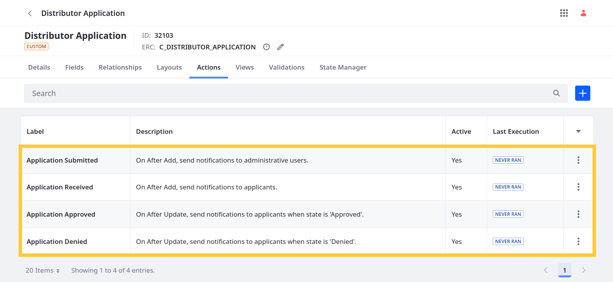

# Adding Notification Actions to Distributor Application

The first two actions trigger when an entry is created. The other two depend on status updates. <!--FINISH-->

## Action for Application Submitted

1. Open the *Global Menu* (  ), go to the *Control Panel* tab, and click *Objects*.

1. Begin editing the *Distributer Application* object.

1. Go to the *Actions* tab and click *Add* (  ).

1. Enter these values in the Basic Info tab:

   | Field        | Value                                                     |
   |:-------------|:----------------------------------------------------------|
   | Action Label | Application Submitted                                     |
   | Action Name  | applicationSubmitted                                      |
   | Description  | On After Add, send notifications to administrative users. |
   | Active       | True                                                      |

   

1. Go to the *Action Builder* tab and set these values:

   | Field | Value |
   |:------|:------|
   | Trigger | On After Add |
   | Condition | N/A |
   | Action | Notification |
   | Notification Template | Application Submitted, Admin, User |

   

1. Click *Save*.

## Action for Application Received

1. In the *Actions* tab, click *Add* (  ).

1. Enter these values for Basic Info:

   | Field | Value |
   |:------|:------|
   | Action Label | Application Received |
   | Action Name | applicationReceived |
   | Description | On After Add, send notifications to applicants. |
   | Active | True |

1. Go to the *Action Builder* tab and set these values:

   | Field | Value |
   |:------|:------|
   | Trigger | On After Add |
   | Condition | N/A |
   | Action | Notification |
   | Notification Template | Application Received, Applicant, Email |

1. Click *Save*.

## Action for Application Approved

1. In the *Actions* tab, click *Add* (  ).

1. Enter these values for Basic Info:

   | Field | Value |
   |:------|:------|
   | Action Label | Application Approved |
   | Action Name | applicationApproved |
   | Description | On After Update, send notifications to applicants when state is 'Approved'. |
   | Active | True |

1. Go to the *Action Builder* tab and set these values:

   | Field | Value |
   |:------|:------|
   | Trigger | On After Update |
   | Condition | `applicationState == "approved" AND status == "approved"` |
   | Action | Notification |
   | Notification Template | Application Approved, Applicant, Email |

   <!-- Confirm this is how you validate using the status field. Do you have to use the key or the label? -->

1. Click *Save*.

## Action for Application Denied

1. In the *Actions* tab, click *Add* (  ).

1. Enter these values for Basic Info:

   | Field | Value |
   |:------|:------|
   | Action Label | Application Denied |
   | Action Name | applicationDenied |
   | Description | On After Update, send notifications to applicants when state is 'Denied'. |
   | Active | True |

1. Go to the *Action Builder* tab and set these values:

   | Field | Value |
   |:------|:------|
   | Trigger | On After Update |
   | Condition | `applicationState == "denied" AND status == "approved"` |
   | Action | Notification |
   | Notification Template | Application Denied, Applicant, Email |

   <!-- Confirm this is how you validate using the status field. Do you have to use the key or the label? -->

1. Click *Save*.

<!-- 
## Triggering Notifications
-->

Next: [Designing User Interfaces](../../designing-user-interfaces.md)

## Relevant Concepts

* [Defining Object Actions](https://learn.liferay.com/w/dxp/building-applications/objects/creating-and-managing-objects/actions/defining-object-actions)
* [Notification Actions](https://learn.liferay.com/w/dxp/building-applications/objects/creating-and-managing-objects/actions/understanding-action-types#notification)
