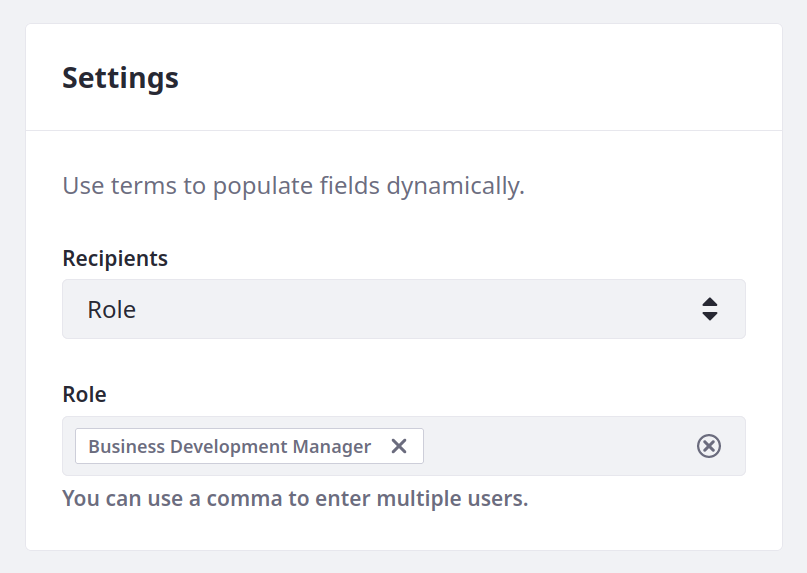
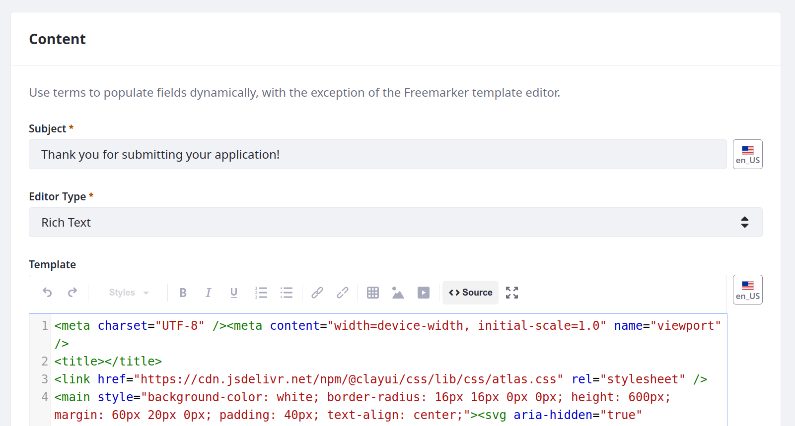

# Adding Notification Templates for Distributor Application

With Liferay, you can design automated email and user notification templates. Both template types determine the notification's sender, recipients, and content. While designing the template, you can search supported entities and add field references that insert their data dynamically into each message. <!--REFINE-->

Delectable Bonsai needs these notification templates for use with the Distributor Application object:

| Event                 | Recipient | Type  |
|:----------------------|:----------|:------|
| Application Submitted | Admin     | User  |
| Application Received  | Applicant | Email |
| Application Approved  | Applicant | Email |
| Application Denied    | Applicant | Email |

```{note}
If the out-of-the-box notification types do not satisfy your requirements, you can use client extensions to create custom [notification types](https://learn.liferay.com/w/dxp/building-applications/client-extensions/microservice-client-extensions#notification-type-client-extensions). You will practice this when building the ticketing system in Module Four. <!--REFINE-->
```


## Application Submitted Template

1. Open the *Global Menu* (  ), go to the *Control Panel* tab, and click *Templates*.

1. Click *Add* (  ) and select *User Notification*.

1. Scroll down to Definition of Terms and use the Entity drop-down menu to select the *Distributor Application* object.

   

   You can use these field references in the template to dynamically populate notifications with entry data. In the General Terms section you can find terms for referencing fields for the user that triggers the notification action.

1. Enter these values for Basic Info:

   | Field       | Value                                                                                               |
   |:------------|:----------------------------------------------------------------------------------------------------|
   | Name        | Application Submitted, Admin, User                                                                  |
   | Description | Sends user notifications to an administrative role whenever a distributor application is submitted. |

   

1. Enter these values for Settings:

   | Field      | Value                        |
   |:-----------|:-----------------------------|
   | Recipients | Role                         |
   | Role       | Business Development Manager |

   

1. Enter this value for Content:

   | Field   | Value                                                                                                                                                        |
   |:--------|:-------------------------------------------------------------------------------------------------------------------------------------------------------------|
   | Subject | APP-[%DISTRIBUTORAPPLICATION_ID%]: [%DISTRIBUTORAPPLICATION_APPLICANTNAME%] submitted a distributor application for [%DISTRIBUTORAPPLICATION_BUSINESSNAME%]. |

   

1. Click *Save*.

   ```{tip}
   Notification template ERCs use a randomly generated UUID, but you can change a template's ERC after creation. Using consistent and human-readable ERCs can help when moving your templates and objects between environments (e.g., `APPLICATION_SUBMITTED_ADMIN_USER`).
   ```

## Application Received Template

1. Click *Add* (  ) and select *Email*.

1. Enter these values for Basic Info:

   | Field       | Value                                                                                      |
   |:------------|:-------------------------------------------------------------------------------------------|
   | Name        | Application Received, Applicant, Email                                                     |
   | Description | Sends email notifications to applicants to indicate their applications have been received. |

   

1. Enter these values for Settings:

   | Field        | Value                                     |
   |:-------------|:------------------------------------------|
   | To           | [%DISTRIBUTORAPPLICATION_APPLICANTEMAIL%] |
   | CC           | N/A                                       |
   | BCC          | N/A                                       |
   | From Address | `sales@delectable-bonsai.com`             |
   | From Name    | Delectable Bonsai                         |

   

1. Enter this values for Content:

   | Field | Value |
   |:------|:------|
   | Subject | Thank you for submitting your application! |
   | Editor Type | Rich Text |
   | Template | <!--See below...--> |

   For the Template field, click the *Source* button (  ). Then, copy and paste the contents of [`ApplicationReceived_Applicant_Email.html`](https://resources.learn.liferay.com/courses/latest/en/application-development/implementing-business-logic/automating-notifications/adding-notification-templates-for-distributor-application/ApplicationReceived_Applicant_Email.html) into the Template field.

   

   When rendered, the body of the message should look like this:

   

1. Click *Save*.

## Application Approved Template

1. Click *Add* (  ) and select *Email*.

1. Enter these values for Basic Info:

   | Field       | Value                                                                                              |
   |:------------|:---------------------------------------------------------------------------------------------------|
   | Name        | Application Approved, Applicant, Email                                                             |
   | Description | Sends email notifications to applicants to inform them that their applications have been approved. |

1. Enter these values for Settings:

   | Field        | Value                                     |
   |:-------------|:------------------------------------------|
   | To           | [%DISTRIBUTORAPPLICATION_APPLICANTEMAIL%] |
   | CC           | N/A                                       |
   | BCC          | N/A                                       |
   | From Address | `sales@delectable-bonsai.com`             |
   | From Name    | Delectable Bonsai                         |

1. Enter this values for Content:

   | Field       | Value                              |
   |:------------|:-----------------------------------|
   | Subject     | Sweet things are in store for you! |
   | Editor Type | Rich Text                          |
   | Template    | <!--See below...-->                |

   For the Template field, click the *Source* button (  ). Then, copy and paste the contents of [`ApplicationApproved_Applicant_Email.html`](https://resources.learn.liferay.com/courses/latest/en/application-development/implementing-business-logic/automating-notifications/adding-notification-templates-for-distributor-application/ApplicationApproved_Applicant_Email.html) into the Template field.

   When rendered, the body of the message should look like this:

   

1. Click *Save*.

## Application Denied Template

1. Click *Add* (  ) and select *Email*.

1. Enter these values for Basic Info:

   | Field       | Value                                                                                            |
   |:------------|:-------------------------------------------------------------------------------------------------|
   | Name        | Application Denied, Applicant, Email                                                             |
   | Description | Sends email notifications to applicants to inform them that their applications have been denied. |

1. Enter these values for Settings:

   | Field        | Value                                     |
   |:-------------|:------------------------------------------|
   | To           | [%DISTRIBUTORAPPLICATION_APPLICANTEMAIL%] |
   | CC           | N/A                                       |
   | BCC          | N/A                                       |
   | From Address | `sales@delectable-bonsai.com`             |
   | From Name    | Delectable Bonsai                         |

1. Enter this values for Content:

   | Field       | Value                       |
   |:------------|:----------------------------|
   | Subject     | Application Decision Update |
   | Editor Type | Rich Text                   |
   | Template    | <!--See below...-->         |

   For the Template field, click the *Source* button (  ). Then, copy and paste the contents of [`ApplicationDenied_Applicant_Email.html`](https://resources.learn.liferay.com/courses/latest/en/application-development/implementing-business-logic/automating-notificiations/adding-notification-templates-for-distributor-application/ApplicationDenied_Applicant_Email.html) into the Template field.

   When rendered, the body of the message should look like this:

   

1. Click *Save*.

Next: [Adding Notification Actions to Distributor Application](./adding-notification-actions-to-distributor-application.md)

## Relevant Concepts

* [Creating Notification Templates](https://learn.liferay.com/w/dxp/process-automation/notifications/creating-notification-templates)
