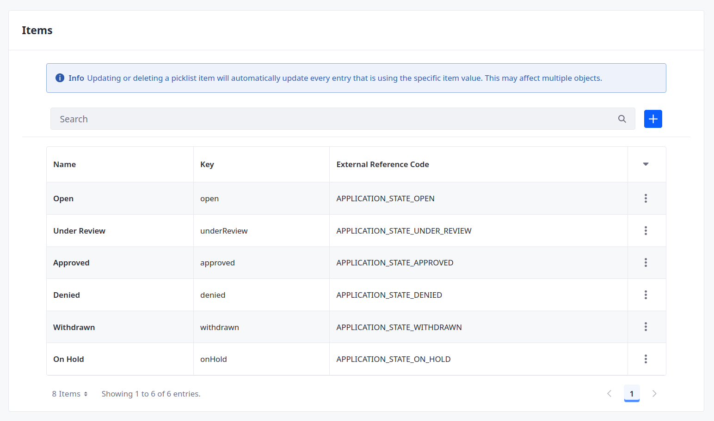
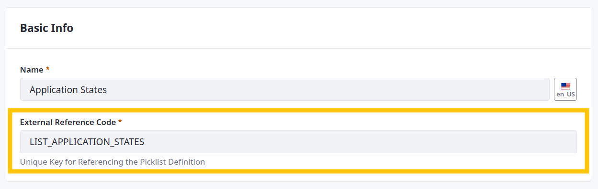
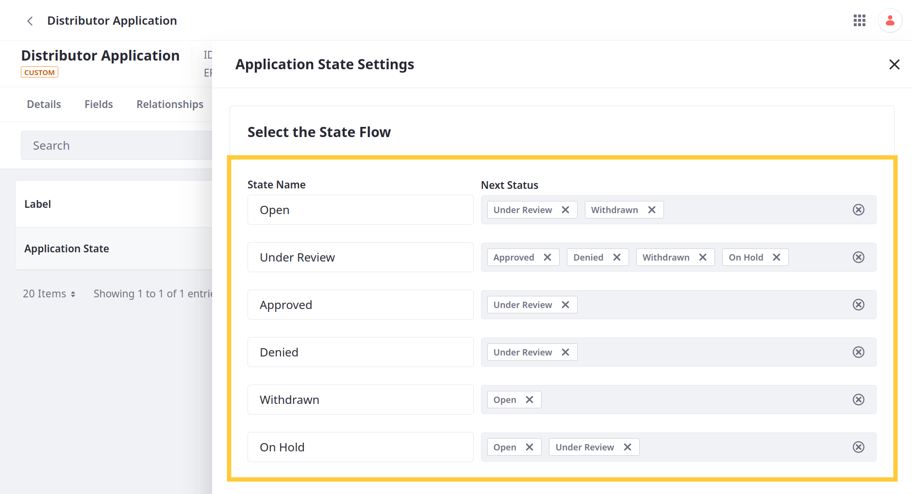
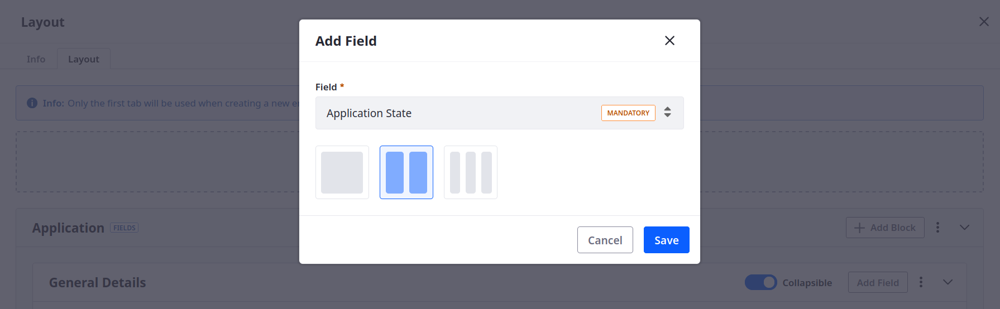
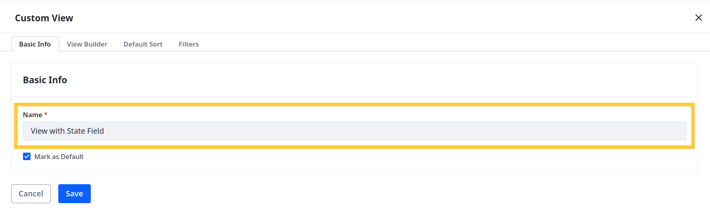
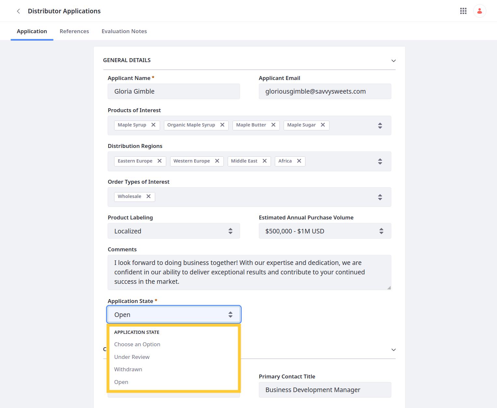

# Adding a State Field to Distributor Application

<!-- INTRO -->

## Adding a Picklist for Application States

1. Open the *Global Menu* (  ), go to the *Control Panel* tab, and click *Picklists*.

1. Click *Add* (  ).

1. For name, enter Application States and click *Save*.

1. Begin editing the picklist.

   

1. Click *Add* (  ) to add these items to the picklist:

   | Name         | Key           |
   |:-------------|:--------------|
   | Open         | `open`        |
   | Under Review | `underReview` |
   | Approved     | `approved`    |
   | Denied       | `denied`      |
   | Withdrawn    | `withdrawn`   |
   | On Hold      | `onHold`      |

1. Edit each item and set their ERCs to these values:

   | External Reference Code          |
   |:---------------------------------|
   | `APPLICATION_STATE_OPEN`         |
   | `APPLICATION_STATE_UNDER_REVIEW` |
   | `APPLICATION_STATE_APPROVED`     |
   | `APPLICATION_STATE_DENIED`       |
   | `APPLICATION_STATE_WITHDRAWN`    |
   | `APPLICATION_STATE_ON_HOLD`      |

   

1. Change the Picklist's ERC to `LIST_APPLICATION_STATES`.

   

1. Click *Save*.

You can now use the picklist to create a state field in the Distributor Application object.

## Adding the Application State Field

1. Open the *Global Menu* (  ), go to the *Control Panel* tab, and click *Objects*.

1. Begin editing the Distributor Application object and go to the *Fields* tab.

1. Click *Add* (), enter these details, and click *Save*:

   | Field         | Value              |
   |:--------------|:-------------------|
   | Label         | Application State  |
   | Field Name    | `applicationState` |
   | Type          | Picklist           |
   | Picklist      | Application States |
   | Mandatory     | True               |
   | Mark as State | True               |
   | Default Value | Open               |

   

## Managing State Flow

1. While editing the Distributor Application object, go to the *State Manager* tab.

1. Click *Application State*.

1. Set these flow values:

   | Field        | Value                                |
   |:-------------|:-------------------------------------|
   | Open         | Under Review, Withdrawn              |
   | Under Review | Approved, Denied, Withdrawn, On Hold |
   | Approved     | Under Review                         |
   | Denied       | Under Review                         |
   | Withdrawn    | Open                                 |
   | On Hold      | Open, Under Review                   |

   

1. Click *Save*.

When updating the Application State field, user options are determined by the state flow.

## Using the Application State Field

To practice using the application state, you must first add the field to the object's layout and view.

### Adding the Field the Custom Layout

1. While editing the Distributor Application object, go to the *Layouts* tab and begin editing the layout.

1. In the Info tab, rename the layout to Layout with State Field.

   

1. Go to the *Layout* tab

1. Click *Add Field* for the General Details block

1. Select the Application State field and click *Save*.

   

1. Click *Save* for the layout.

### Adding the Field to the Custom View

1. Go to the *Views* tab and begin editing the view.

1. In the Info tab, rename the view to View with State Field.

   

1. Go to the *View Builder* tab.

1. Click *Add*, select the *Application State* field, and click *Save*.

   

1. Click *Save* for the view.

### Creating Entries

Go to the Distributor Application page. Begin editing an existing entry and update the value for Application State. Available options depend on the defined state flow. <!---->

The state field also appears in the view.

Great! Now that you've added a state field, Delectable Bonsai wants to add a workflow process that requires review for when users update it to 'approved' or 'denied'.

Next: [Adding a Custom Workflow Action](./adding-a-custom-workflow-action.md)

## Relevant Concepts
