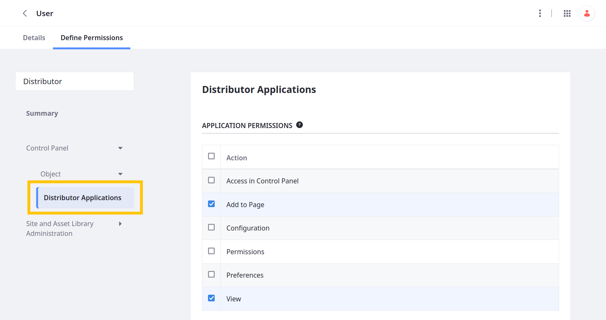
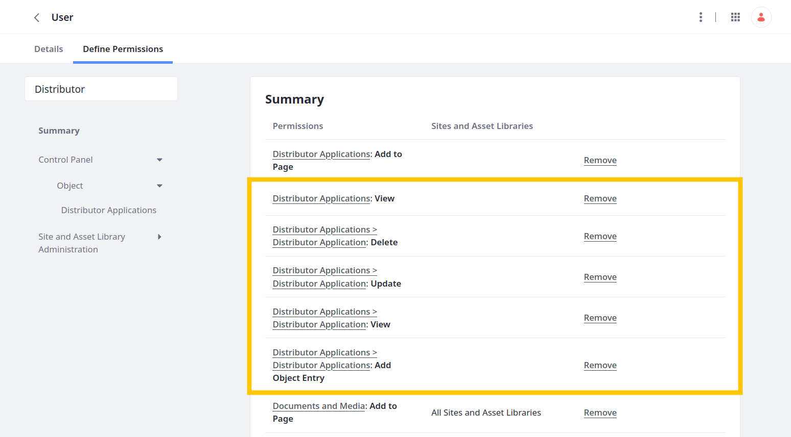
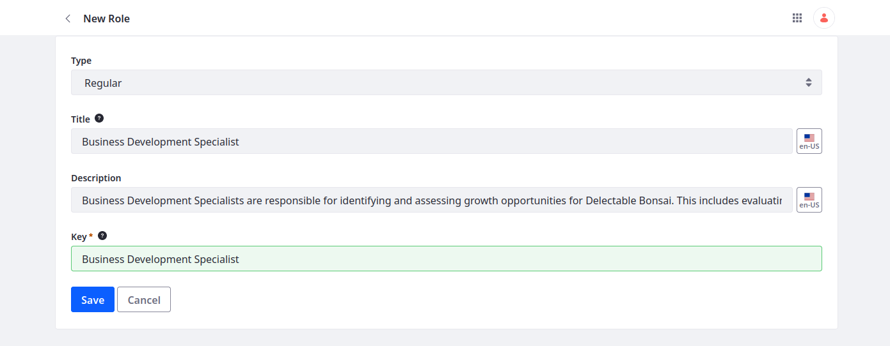
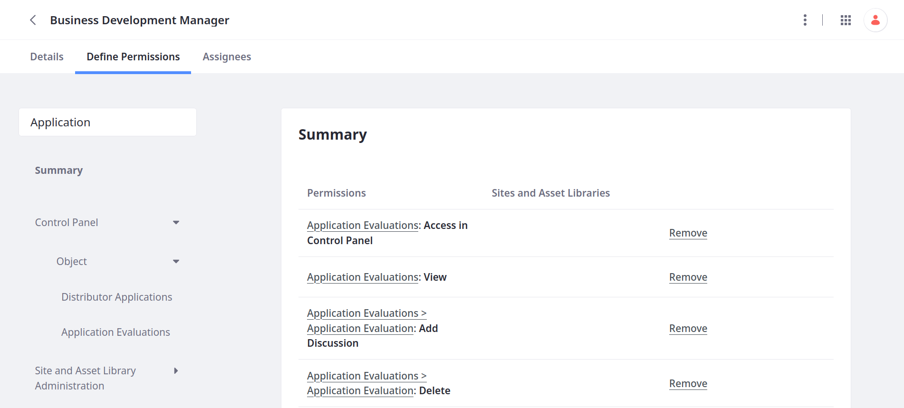
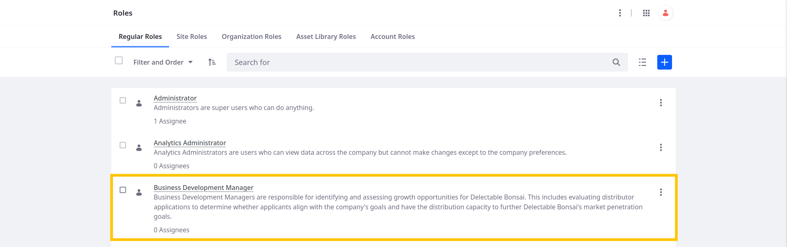
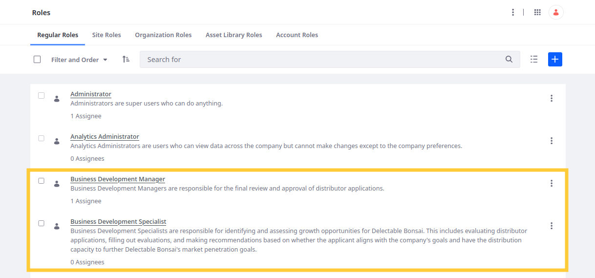

# Managing Access to Data

Delectable Bonsai wants to ensure that all authorized users can submit distributor applications. They also want to allow a limited number of employees can view all submitted applications and fill out evaluations. Here you'll assign basic Distributor Application permissions to the User role and create an internal role that's responsible for reviewing applications.

## Allow Users to Submit Distributor Applications

1. Open the *Global Menu* (  ), go to the *Control Panel* tab, and click *Roles*.

1. Edit the *User* role.

1. Go to the *Define Permissions* tab and add these permissions:

   | Permission                                                            |
   |:----------------------------------------------------------------------|
   | Distributor Applications: View                                        |
   | Distributor Applications > Distributor Application: Delete            |
   | Distributor Applications > Distributor Application: Update            |
   | Distributor Applications > Distributor Applications: Add Object Entry |

   

1. Click *Save*.

1. Verify the User role has the desired permissions.

   

## Creating Roles for Reviewing Distributor Applications

1. Open the *Global Menu* (  ), go to the *Control Panel* tab, and click *Roles*.

1. Click *Add* ().

1. Enter these details and click *Save*:

   | Field       | Value                                                                                                                                                                                                                                                                                                                                                                                        |
   |:------------|:---------------------------------------------------------------------------------------------------------------------------------------------------------------------------------------------------------------------------------------------------------------------------------------------------------------------------------------------------------------------------------------------|
   | Type        | Regular                                                                                                                                                                                                                                                                                                                                                                                      |
   | Title       | Business Development Specialist                                                                                                                                                                                                                                                                                                                                                              |
   | Description | Business Development Specialists are responsible for identifying and assessing growth opportunities for Delectable Bonsai. This includes evaluating distributor applications, filling out evaluations, and making recommendations based on whether the applicant aligns with the company's goals and have the distribution capacity to further Delectable Bonsai's market penetration goals. |
   | Key         | Business Development Specialist                                                                                                                                                                                                                                                                                                                                                              |

   

1. Go to the *Define Permissions* tab, add these permissions, and click *Save*:

   * Distributor Applications

      | Permission                                                 |
      |:-----------------------------------------------------------|
      | Distributor Applications: Access in Control Panel          |
      | Distributor Applications: View                             |
      | Distributor Applications > Distributor Application: Update |
      | Distributor Applications > Distributor Application: View   |

   * Application Evaluations

      | Permission                                                          |
      |:--------------------------------------------------------------------|
      | Application Evaluations: Access in Control Panel                    |
      | Application Evaluations: View                                       |
      | Application Evaluations > Application Evaluation: Add Discussion    |
      | Application Evaluations > Application Evaluation: Delete            |
      | Application Evaluations > Application Evaluation: Delete Discussion |
      | Application Evaluations > Application Evaluation: Update            |
      | Application Evaluations > Application Evaluation: Update Discussion |
      | Application Evaluations > Application Evaluation: View              |
      | Application Evaluations > Application Evaluations: Add Object Entry |

   Liferay automatically assigns the Portal: View Control Panel Menu permission.

   

1. Repeat this process to create a second role and assign it the same permissions:

   | Field       | Value                                                                                                        |
   |:------------|:-------------------------------------------------------------------------------------------------------------|
   | Type        | Regular                                                                                                      |
   | Title       | Business Development Manager                                                                                 |
   | Description | Business Development Managers are responsible for the final review and approval of distributor applications. |
   | Key         | Business Development Manager                                                                                 |

1. For test purposes, go to the *Assignees* tab and assign this role to the default `test@liferay.com` power user.

   

Great! Delectable Bonsai can assign these roles to members of their business development team so they can view submitted applications, create evaluations, and approve or deny applications.

Now Delectable Bonsai wants to keep track of each application's state during the review process.

Next: [Defining a State Field](./defining-a-state-field.md)

## Relevant Concepts

* [Permissions Framework Integration](https://learn.liferay.com/w/dxp/building-applications/objects/understanding-object-integrations/permissions-framework-integration)
