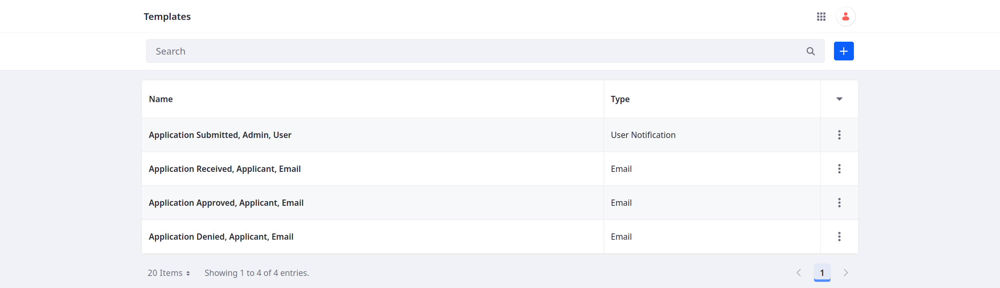
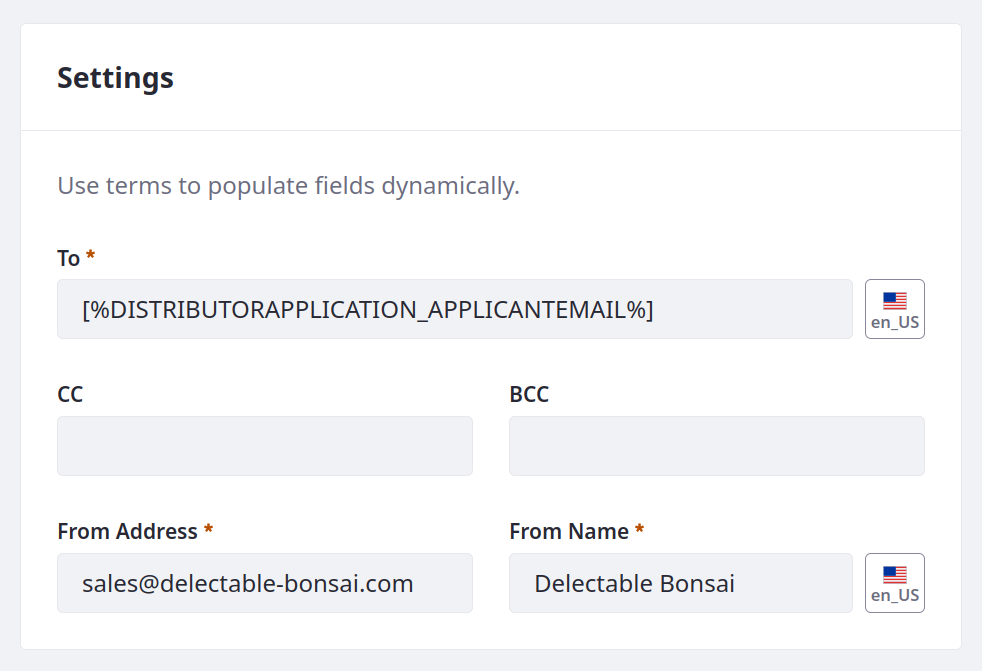
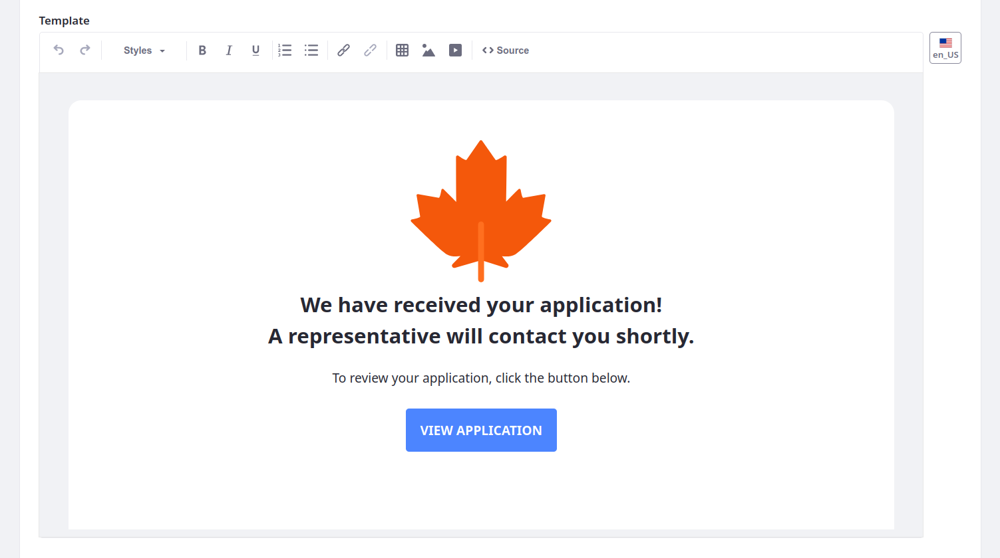
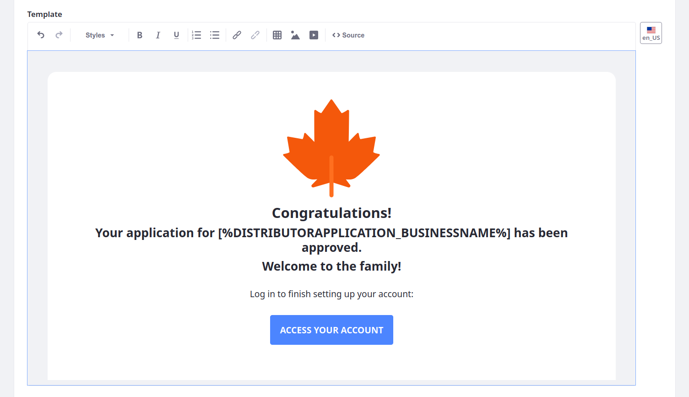
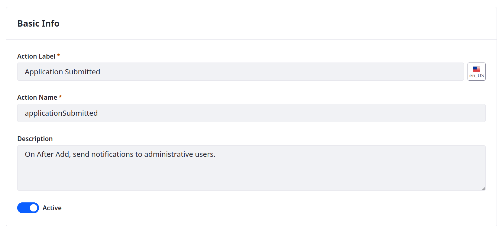

# Notifications

<!-- Separate Article. -->

Notifications can improve visibility in your application by providing real-time updates to users and system administrators for object entry events. With Liferay, this involves creating notification templates and then using those templates with object actions. The template provides the notification content and design, while the object action determines the trigger and conditions for when the notification is sent<!--ALT: for sending the notification--> (e.g., at entry creation, at entry update). <!--REFINE-->

<!-- Diagram? -->

To this point, Delectable Bonsai's Distributor Application has no automated notifications for entry events. This means administrators must regularly check the application table to learn of new submissions, as well as manually inform applicants on the status of their applications. Relying on _ does not scale and leaves room for human error, resulting in missed opportunities or poor user experience.

Delectable Bonsai needs to automate notifications for administrators and applicants. To do this, first create the desired email or user notification template. Then add a notification action to your object definition that uses the notification template.

## Adding Notification Templates for the Distributor Application Object

With Liferay, you can design automated email and user notification templates. Both template types determine the notification's sender, recipients, and content. While designing the template, you can search supported entities and add field references that insert their data dynamically into each message. <!--REFINE-->

Delectable Bonsai needs these notification templates for use with the Distributor Application object:

| Event                 | Recipient | Type  |
|:----------------------|:----------|:------|
| Application Submitted | Admin     | User  |
| Application Received  | Applicant | Email |
| Application Approved  | Applicant | Email |
| Application Denied    | Applicant | Email |

```{note}
If the out-of-the-box notification types do not satisfy your requirements, you can use client extensions to create custom [notification types](https://learn.liferay.com/w/dxp/building-applications/client-extensions/microservice-client-extensions#notification-type-client-extensions). You will practice this when building the ticketing system in Module Four. <!--REFINE-->
```



### Application Submitted Template

1. Open the *Global Menu* (  ), go to the *Control Panel* tab, and click *Templates*.

1. Click *Add* (  ) and select *User Notification*.

1. Scroll down to Definition of Terms and use the Entity drop-down menu to select the *Distributor Application* object.

   

   You can use these field references in the template to dynamically populate notifications with entry data. In the General Terms section you can find terms for referencing fields for the user that triggers the notification action.

1. Enter these values for Basic Info:

   | Field       | Value                                                                                               |
   |:------------|:----------------------------------------------------------------------------------------------------|
   | Name        | Application Submitted, Admin, User                                                                  |
   | Description | Sends user notifications to an administrative role whenever a distributor application is submitted. |

   

1. Enter these values for Settings:

   | Field      | Value                        |
   |:-----------|:-----------------------------|
   | Recipients | Role                         |
   | Role       | Business Development Manager |

   

1. Enter this value for Content:

   | Field   | Value                                                                                                                                                        |
   |:--------|:-------------------------------------------------------------------------------------------------------------------------------------------------------------|
   | Subject | APP-[%DISTRIBUTORAPPLICATION_ID%]: [%DISTRIBUTORAPPLICATION_APPLICANTNAME%] submitted a distributor application for [%DISTRIBUTORAPPLICATION_BUSINESSNAME%]. |

   

1. Click *Save*.

   ```{tip}
   Notification template ERCs use a randomly generated UUID, but you can change a template's ERC after creation. Using consistent and human-readable ERCs can help when moving your templates and objects between environments (e.g., `APPLICATION_SUBMITTED_ADMIN_USER`).
   ```

### Application Received Template

1. Click *Add* (  ) and select *Email*.

1. Enter these values for Basic Info:

   | Field       | Value                                                                                      |
   |:------------|:-------------------------------------------------------------------------------------------|
   | Name        | Application Received, Applicant, Email                                                     |
   | Description | Sends email notifications to applicants to indicate their applications have been received. |

   

1. Enter these values for Settings:

   | Field        | Value                                     |
   |:-------------|:------------------------------------------|
   | To           | [%DISTRIBUTORAPPLICATION_APPLICANTEMAIL%] |
   | CC           | N/A                                       |
   | BCC          | N/A                                       |
   | From Address | `sales@delectable-bonsai.com`             |
   | From Name    | Delectable Bonsai                         |

   

1. Enter this values for Content:

   | Field | Value |
   |:------|:------|
   | Subject | Thank you for submitting your application! |
   | Editor Type | Rich Text |
   | Template | <!--See below...--> |

   For the Template field, click the *Source* button (  ). Then, copy and paste the contents of [`ApplicationReceived_Applicant_Email.html`](https://resources.learn.liferay.com/courses/latest/en/application-development/implementing-business-logic/notifications/ApplicationReceived_Applicant_Email.html) into the Template field.

   

   When rendered, the body of the message should look like this:

   

1. Click *Save*.

### Application Approved Template

1. Click *Add* (  ) and select *Email*.

1. Enter these values for Basic Info:

   | Field       | Value                                                                                              |
   |:------------|:---------------------------------------------------------------------------------------------------|
   | Name        | Application Approved, Applicant, Email                                                             |
   | Description | Sends email notifications to applicants to inform them that their applications have been approved. |

1. Enter these values for Settings:

   | Field        | Value                                     |
   |:-------------|:------------------------------------------|
   | To           | [%DISTRIBUTORAPPLICATION_APPLICANTEMAIL%] |
   | CC           | N/A                                       |
   | BCC          | N/A                                       |
   | From Address | `sales@delectable-bonsai.com`             |
   | From Name    | Delectable Bonsai                         |

1. Enter this values for Content:

   | Field       | Value                              |
   |:------------|:-----------------------------------|
   | Subject     | Sweet things are in store for you! |
   | Editor Type | Rich Text                          |
   | Template    | <!--See below...-->                |

   For the Template field, click the *Source* button (  ). Then, copy and paste the contents of [`ApplicationApproved_Applicant_Email.html`](https://resources.learn.liferay.com/courses/latest/en/application-development/implementing-business-logic/notifications/ApplicationApproved_Applicant_Email.html) into the Template field.

   When rendered, the body of the message should look like this:

   

1. Click *Save*.

### Application Denied Template

1. Click *Add* (  ) and select *Email*.

1. Enter these values for Basic Info:

   | Field       | Value                                                                                            |
   |:------------|:-------------------------------------------------------------------------------------------------|
   | Name        | Application Denied, Applicant, Email                                                             |
   | Description | Sends email notifications to applicants to inform them that their applications have been denied. |

1. Enter these values for Settings:

   | Field        | Value                                     |
   |:-------------|:------------------------------------------|
   | To           | [%DISTRIBUTORAPPLICATION_APPLICANTEMAIL%] |
   | CC           | N/A                                       |
   | BCC          | N/A                                       |
   | From Address | `sales@delectable-bonsai.com`             |
   | From Name    | Delectable Bonsai                         |

1. Enter this values for Content:

   | Field       | Value                       |
   |:------------|:----------------------------|
   | Subject     | Application Decision Update |
   | Editor Type | Rich Text                   |
   | Template    | <!--See below...-->         |

   For the Template field, click the *Source* button (  ). Then, copy and paste the contents of [`ApplicationDenied_Applicant_Email.html`](https://resources.learn.liferay.com/courses/latest/en/application-development/implementing-business-logic/notifications/ApplicationDenied_Applicant_Email.html) into the Template field.

   When rendered, the body of the message should look like this:

   

1. Click *Save*.

## Adding Notification Actions to the Distributor Application Object

The first two actions trigger when an entry is created. The other two depend on status updates. <!--FINISH-->

### Action for Application Submitted

1. Open the *Global Menu* (  ), go to the *Control Panel* tab, and click *Objects*.

1. Begin editing the *Distributer Application* object.

1. Go to the *Actions* tab and click *Add* (  ).

1. Enter these values in the Basic Info tab:

   | Field        | Value                                                     |
   |:-------------|:----------------------------------------------------------|
   | Action Label | Application Submitted                                     |
   | Action Name  | applicationSubmitted                                      |
   | Description  | On After Add, send notifications to administrative users. |
   | Active       | True                                                      |

   

1. Go to the *Action Builder* tab and set these values:

   | Field | Value |
   |:------|:------|
   | Trigger | On After Add |
   | Condition | N/A |
   | Action | Notification |
   | Notification Template | Application Submitted, Admin, User |

   

1. Click *Save*.

### Action for Application Received

1. In the *Actions* tab, click *Add* (  ).

1. Enter these values for Basic Info:

   | Field | Value |
   |:------|:------|
   | Action Label | Application Received |
   | Action Name | applicationReceived |
   | Description | On After Add, send notifications to applicants. |
   | Active | True |

1. Go to the *Action Builder* tab and set these values:

   | Field | Value |
   |:------|:------|
   | Trigger | On After Add |
   | Condition | N/A |
   | Action | Notification |
   | Notification Template | Application Received, Applicant, Email |

1. Click *Save*.

### Action for Application Approved

1. In the *Actions* tab, click *Add* (  ).

1. Enter these values for Basic Info:

   | Field | Value |
   |:------|:------|
   | Action Label | Application Approved |
   | Action Name | applicationApproved |
   | Description | On After Update, send notifications to applicants when state is 'Approved'. |
   | Active | True |

1. Go to the *Action Builder* tab and set these values:

   | Field | Value |
   |:------|:------|
   | Trigger | On After Update |
   | Condition | `applicationState == "approved" AND status == "approved"` |
   | Action | Notification |
   | Notification Template | Application Approved, Applicant, Email |

   <!-- Confirm this is how you validate using the status field. Do you have to use the code or the label? -->

1. Click *Save*.

### Action for Application Denied

1. In the *Actions* tab, click *Add* (  ).

1. Enter these values for Basic Info:

   | Field | Value |
   |:------|:------|
   | Action Label | Application Denied |
   | Action Name | applicationDenied |
   | Description | On After Update, send notifications to applicants when state is 'Denied'. |
   | Active | True |

1. Go to the *Action Builder* tab and set these values:

   | Field | Value |
   |:------|:------|
   | Trigger | On After Update |
   | Condition | `applicationState == "denied" AND status == "approved"` |
   | Action | Notification |
   | Notification Template | Application Denied, Applicant, Email |

   <!-- Confirm this is how you validate using the status field. Do you have to use the code or the label? -->

1. Click *Save*.

<!-- 
## Triggering Notifications
-->

<!-- Next: []() -->

## Relevant Concepts

* [Creating Notification Templates](https://learn.liferay.com/w/dxp/process-automation/notifications/creating-notification-templates)
* [Defining Object Actions](https://learn.liferay.com/w/dxp/building-applications/objects/creating-and-managing-objects/actions/defining-object-actions)
* [Notification Actions](https://learn.liferay.com/w/dxp/building-applications/objects/creating-and-managing-objects/actions/understanding-action-types#notification)
