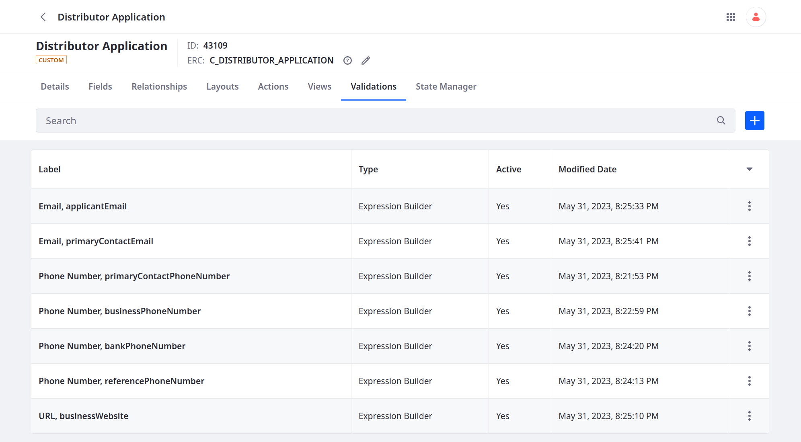
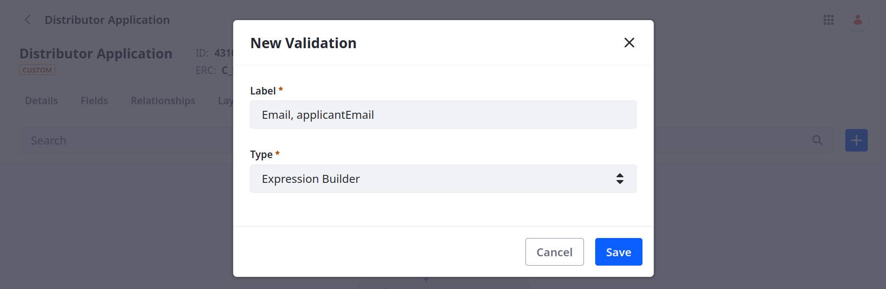
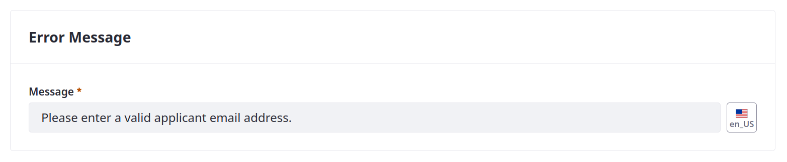
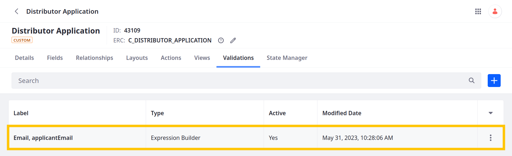
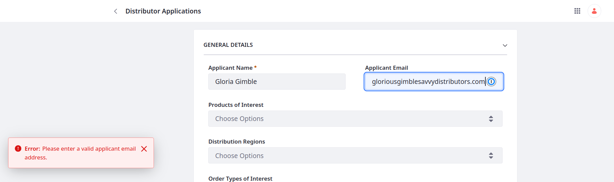
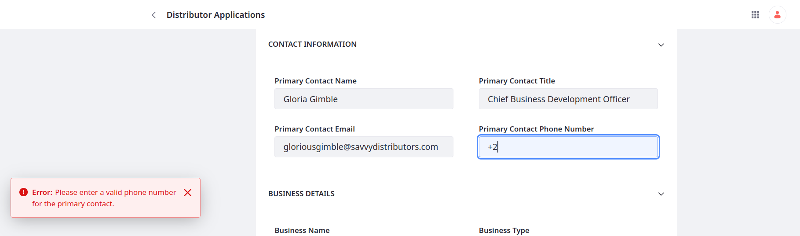
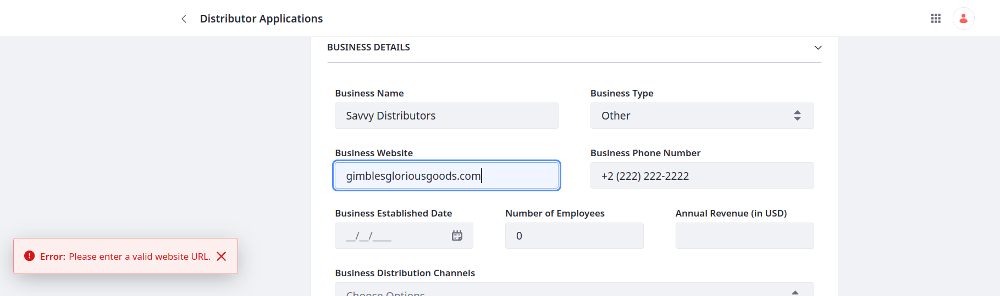

# Validating Fields

So far, Delectable Bonsai has no way to ensure applicants provide valid, consistent data in their applications. Here you'll add validations for Distributor Application's email, phone number, and URL fields to improve data integrity and consistency.



## Adding Validations for Email Fields

Liferay provides the `isEmailAddress()` function for checking whether a field's value uses standard email elements (e.g., @gmail, .com).

Follow these steps to validate the `applicantEmail` and `primaryContactEmail` fields:

1. Open the *Global Menu* (  ), go to the *Control Panel* tab, and click *Objects*.

1. Begin editing the Distributor Application object and go to the *Validations* tab.

1. Click *Add* (  ), enter these details, and click *Save*.

   | Field | Value                 |
   |:------|:----------------------|
   | Label | Email, applicantEmail |
   | Type  | Expression Builder    |

   

1. Begin editing the newly created validation.

1. In the Basic Info tab, set these values:

   | Field             | Value         |
   |:------------------|:--------------|
   | Active Validation | True          |
   | Trigger Event     | On Submission |

   

1. Go to the *Conditions* tab and enter these values:

   | Field              | Value                                                    |
   |:-------------------|:---------------------------------------------------------|
   | Expression Builder | `isEmailAddress(applicantEmail) OR applicantEmail == ""` |
   | Error Message      | Please enter a valid applicant email address.            |

   This requires the field's value to follow a standard email pattern or be empty.

   ```{tip}
   You can use validations to make optional fields mandatory by not allowing users to leave the field empty.
   ```

   

   If users attempt to submit an entry with an invalid value, Liferay displays the set error message.

   

1. Click *Save*.

   

1. Repeat the above steps to validate the `primaryContactEmail` field using the `isEmailAddress()` function.

## Adding Validation for Phone Number Fields

Liferay provides the `match()` function for checking whether the field's value matches a specified RegEx pattern or string value. In this scenario, Delectable Bonsai wants to use this expression to validate their phone number fields: `^(\+\d{1,3} ?)?((\(\d{1,3}\))|\d{1,3})[- .]?\d{3,4}[- .]?\d{4}$`.

Follow these steps to validate the `primaryContactPhoneNumber`, `businessPhoneNumber`, `bankPhoneNumber`, `referencePhoneNumber` fields:

1. In the Validations tab, click *Add* (  ), enter these details, and click *Save*.

   | Field | Value                                   |
   |:------|:----------------------------------------|
   | Label | Phone Number, primaryContactPhoneNumber |
   | Type  | Expression Builder                      |

1. Begin editing the newly created validation.

1. In the Basic Info tab, set these values:

   | Field             | Value         |
   |:------------------|:--------------|
   | Active Validation | True          |
   | Trigger Event     | On Submission |

1. Go to the *Conditions* tab and enter these values:

   | Field              | Value                                                                                                                                    |
   |:-------------------|:-----------------------------------------------------------------------------------------------------------------------------------------|
   | Expression Builder | `match(primaryContactPhoneNumber, "^(\+\d{1,3} ?)?((\(\d{1,3}\))|\d{1,3})[- .]?\d{3,4}[- .]?\d{4}$") OR primaryContactPhoneNumber == ""` |
   | Error Message      | Please enter a valid phone number for the primary contact.                                                                               |

   <!--FINISH: Confirm the above regex pattern renders correctly in the site. In my preview, the | character breaks the table. -->

   This validation supports a wide range of international phone numbers, allowing for international country codes, area codes, and separators. It also allows for format variations (e.g., spaces, dashes, dots), but enforces a minimum of 7 digits and a maximum of 11 digits. Since the field is optional, this validation also allows for empty values.

1. Click *Save*.

1. Repeat these steps for the `businessPhoneNumber`, `bankPhoneNumber`, `referencePhoneNumber` fields.

## Adding Validation for Business Website Field

Liferay provides the `isURL()` function for checking whether the field's value uses standard URL elements (e.g., `http`, `://`, `.com`).

<!--FINISH: Confirm :// renders correctly in the site. My preview renders :/ as an emoji. -->

Follow these steps to validate the `businessWebsite` field:

1. In the Validations tab, click *Add* (  ), enter these details, and click *Save*.

   | Field | Value                    |
   |:------|:-------------------------|
   | Label | URL, businessWebsite     |
   | Type  | Expression Builder       |

1. Begin editing the newly created validation.

1. In the Basic Info tab, set these values:

   | Field             | Value         |
   |:------------------|:--------------|
   | Active Validation | True          |
   | Trigger Event     | On Submission |

1. Go to the *Conditions* tab and enter these values:

   | Field              | Value                                             |
   |:-------------------|:--------------------------------------------------|
   | Expression Builder | `isURL(businessWebsite) OR businessWebsite == ""` |
   | Error Message      | Please enter a valid website URL.                 |

1. Click *Save*.

When finished, you should have seven validations.


## Testing the Validations

Since they are active, you can begin testing your validations:

1. Open Distributor Applications and begin editing an entry.

1. Update an email field to an invalid value and click *Save*. The validation's error message appears.

   

1. Enter a valid email for the field and click *Save*. It saves successfully.

1. Repeat this process to test the phone number and website validations.

   <!--  -->

   <!--  -->

Great! Distributors submitting applications must enter valid field values.

Now Delectable Bonsai wants to ensure only the intended users have access to data for the Distributor Application and Application Evaluation objects.

Next: [Managing Access to Data](./managing-access-to-data.md)

## Relevant Concepts

* [Validations](https://learn.liferay.com/web/guest/w/dxp/building-applications/objects/creating-and-managing-objects/validations)
* [Expression Builder Validations Reference](https://learn.liferay.com/web/guest/w/dxp/building-applications/objects/creating-and-managing-objects/validations/expression-builder-validations-reference)
