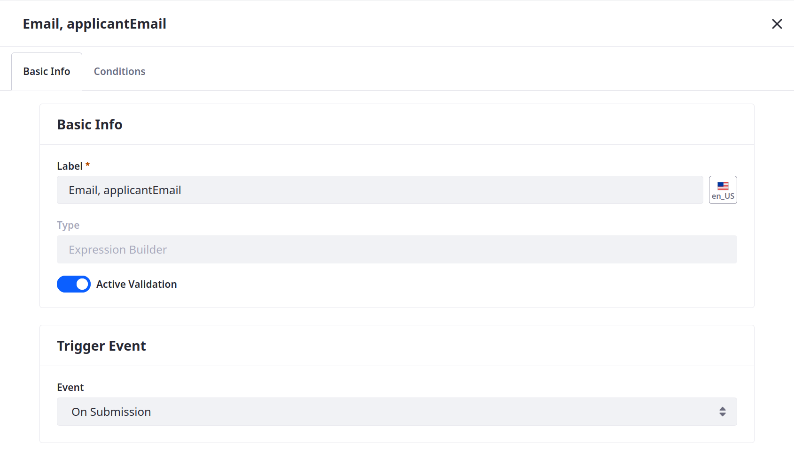
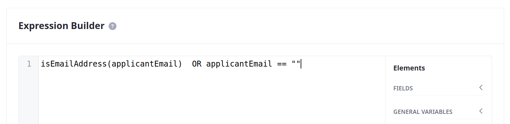

# Validations

Validations set rules for determining whether field values are valid, ensuring user input meets your criteria. By validating data at the point of entry, applications can ensure the data meets the required format, type, and constraints, preventing data errors and reducing the need for manual data cleanup. In this way, validations can improve the integrity and consistency of gathered data (e.g., email addresses, phone numbers). With Liferay, this involves adding [validations](https://learn.liferay.com/web/guest/w/dxp/building-applications/objects/creating-and-managing-objects/validations) directly to object definitions.

<!-- Implementation img -->

Thus far, Delectable Bonsai applicants can enter any value into Distributor Application fields. To ensure applicants provide the correct information, add validations for all email, phone number, and URL fields.


## Adding Validation for Email Fields

Liferay provides the `isEmailAddress()` function for checking whether a field's value uses standard email elements (e.g., `@gmail`, `.com`).

Follow these steps to validate the `applicantEmail` and `primaryContactEmail` fields:

1. Open the *Global Menu* (  ), go to the *Control Panel* tab, and click *Objects*.

1. Begin editing the Distributor Application object and go to the *Validations* tab.

1. Click *Add* (  ), enter these details, and click *Save*.

   | Field | Value                 |
   |:------|:----------------------|
   | Label | Email, applicantEmail |
   | Type  | Expression Builder    |

   

1. Begin editing the newly created validation.

1. In the Basic Info tab, set these values:

   | Field             | Value         |
   |:------------------|:--------------|
   | Active Validation | True          |
   | Trigger Event     | On Submission |

   

1. Go to the *Conditions* tab and enter these values:

   | Field              | Value                                                    |
   |:-------------------|:---------------------------------------------------------|
   | Expression Builder | `isEmailAddress(applicantEmail) OR applicantEmail == ""` |
   | Error Message      | Please enter a valid applicant email address.            |

   This requires the field's value to follow a standard email pattern or be empty.

   ```{tip}
   You can use validations to make optional fields mandatory by not allowing users to leave the field empty.
   ```

   

   If users attempt to submit an entry with an invalid value, Liferay displays the set error message.

   

1. Click *Save*.

   

1. Repeat the above steps to validate the `primaryContactEmail` field using the `isEmailAddress()` function.

## Adding Validation for Phone Number Fields

Liferay provides the `match()` function for checking whether the field's value matches a specified RegEx pattern or string value. In this scenario, Delectable Bonsai wants to use this expression to validate their phone number fields: `^(\+\d{1,3} ?)?((\(\d{1,3}\))|\d{1,3})[- .]?\d{3,4}[- .]?\d{4}$`. <!--REFINE-->

Follow these steps to validate the `primaryContactPhoneNumber`, `businessPhoneNumber`, `bankPhoneNumber`, `referencePhoneNumber` fields:

1. In the Validations tab, click *Add* (  ), enter these details, and click *Save*.

   | Field | Value                                   |
   |:------|:----------------------------------------|
   | Label | Phone Number, primaryContactPhoneNumber |
   | Type  | Expression Builder                      |

1. Begin editing the newly created validation.

1. In the Basic Info tab, set these values:

   | Field             | Value         |
   |:------------------|:--------------|
   | Active Validation | True          |
   | Trigger Event     | On Submission |

1. Go to the *Conditions* tab and enter these values:

   | Field              | Value                                                                                                                                    |
   |:-------------------|:-----------------------------------------------------------------------------------------------------------------------------------------|
   | Expression Builder | `match(primaryContactPhoneNumber, "^(\+\d{1,3} ?)?((\(\d{1,3}\))|\d{1,3})[- .]?\d{3,4}[- .]?\d{4}$") OR primaryContactPhoneNumber == ""` |
   | Error Message      | Please enter a valid phone number for the primary contact.                                                                               |

   This validation supports a wide range of international phone numbers, allowing for international country codes, area codes, and separators. It also allows for format variations (e.g., spaces, dashes, dots), but enforces a minimum of 7 digits and a maximum of 11 digits. Since the field is optional, this validation also allows for empty values.

1. Click *Save*.

1. Repeat these steps for the `businessPhoneNumber`, `bankPhoneNumber`, `referencePhoneNumber` fields.

## Adding Validation for Business Website Field

Liferay provides the `isURL()` function for checking whether the field's value uses standard URL elements (e.g., `http`, `://`, `.com`).

Follow these steps to validate the `businessWebsite` field:

1. In the Validations tab, click *Add* (  ), enter these details, and click *Save*.

   | Field | Value                    |
   |:------|:-------------------------|
   | Label | URL, businessWebsite     |
   | Type  | Expression Builder       |

1. Begin editing the newly created validation.

1. In the Basic Info tab, set these values:

   | Field             | Value         |
   |:------------------|:--------------|
   | Active Validation | True          |
   | Trigger Event     | On Submission |

1. Go to the *Conditions* tab and enter these values:

   | Field              | Value                                             |
   |:-------------------|:--------------------------------------------------|
   | Expression Builder | `isURL(businessWebsite) OR businessWebsite == ""` |
   | Error Message      | Please enter a valid website URL.                 |

1. Click *Save*.

<!-- 
## Testing the Validations
-->

<!-- Next: []() -->

## Relevant Concepts

* [Validations](https://learn.liferay.com/web/guest/w/dxp/building-applications/objects/creating-and-managing-objects/validations)
* [Expression Builder Validations Reference](https://learn.liferay.com/web/guest/w/dxp/building-applications/objects/creating-and-managing-objects/validations/expression-builder-validations-reference)
