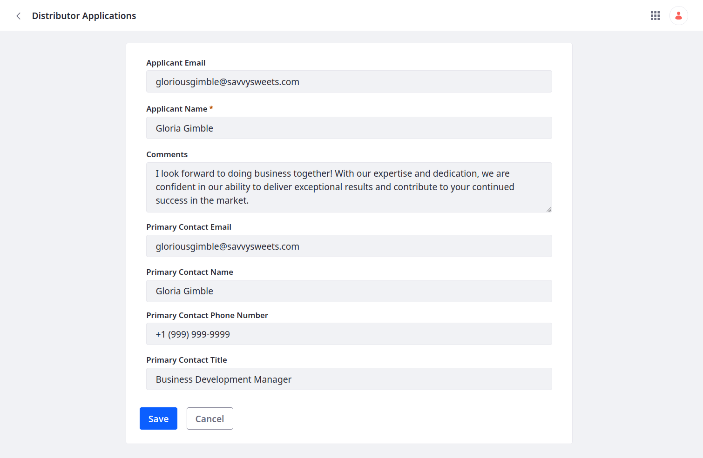
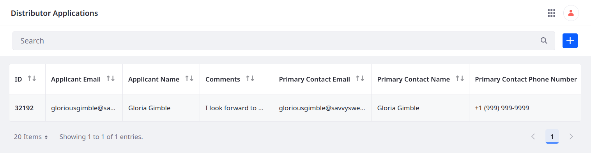

# Adding Fields to the Distributor Application Object

Here you'll add general fields to the Distributor Application object for gathering additional applicant and contact information:

1. Open the *Global Menu* (  ), go to the *Control Panel* tab, and click *Objects*.

1. Begin editing the Distributor Application object and go to the *Fields* tab.

1. Click *Add* (), enter these details, and click *Save*:

   | Field                     | Value            |
   |:--------------------------|:-----------------|
   | Label                     | Applicant Email  |
   | Field Name                | `applicantEmail` |
   | Type                      | Text             |
   | Mandatory                 | False            |
   | Accept Unique Values Only | True             |

   

1. Add a field for the primary contact's name:

   | Field                     | Value                |
   |:--------------------------|:---------------------|
   | Label                     | Primary Contact Name |
   | Field Name                | `primaryContactName` |
   | Type                      | Text                 |
   | Mandatory                 | False                |
   | Accept Unique Values Only | False                |

1. Add a field for the primary contact's title:

   | Field                     | Value                 |
   |:--------------------------|:----------------------|
   | Label                     | Primary Contact Title |
   | Field Name                | `primaryContactTitle` |
   | Type                      | Text                  |
   | Mandatory                 | False                 |
   | Accept Unique Values Only | False                 |

1. Add a field for the primary contact's email:

   | Field                     | Value                 |
   |:--------------------------|:----------------------|
   | Label                     | Primary Contact Email |
   | Field Name                | `primaryContactEmail` |
   | Type                      | Text                  |
   | Mandatory                 | False                 |
   | Accept Unique Values Only | True                  |

1. Add a field for the primary contact's phone number:

   | Field                     | Value                        |
   |:--------------------------|:-----------------------------|
   | Label                     | Primary Contact Phone Number |
   | Field Name                | `primaryContactPhoneNumber`  |
   | Type                      | Text                         |
   | Mandatory                 | False                        |
   | Accept Unique Values Only | True                         |

1. Add a Comments field:

   | Field      | Value      |
   |:-----------|:-----------|
   | Label      | Comments   |
   | Field Name | `comments` |
   | Type       | Long Text  |
   | Mandatory  | False      |

Each saved field is added immediately to the Distributor Application object and automatically appears in its default layout when creating entries.

The new fields also appear in the object's default table view.

Great! These fields can help Delectable Bonsai follow up with prospective applicants.

Now the object definition needs additional fields for collecting business information in compliance with KYC and AML policies. Rather than add these fields manually, you'll use the `object-admin` REST APIs to add them programmatically.

Next: [Adding Fields Using REST APIs](./adding-fields-using-rest-apis.md)

## Relevant Concepts

* [Fields](https://learn.liferay.com/en/w/dxp/building-applications/objects/creating-and-managing-objects/fields)
* [Adding Fields to Objects](https://learn.liferay.com/w/dxp/building-applications/objects/creating-and-managing-objects/fields/adding-fields-to-objects)
