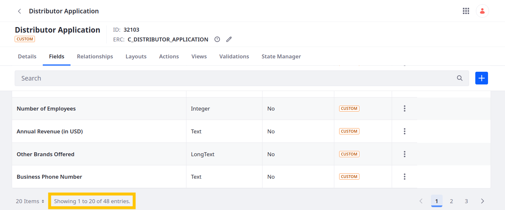

# Adding Fields Using REST APIs

The `object-admin` service provides REST APIs for performing CRUD operations on object definitions, such as adding fields. Here you'll use these APIs to add business and credit reference fields to the Distributor Application object.

1. Download and unzip [the resources](./liferay-p6k3.zip) for this exercise.

   ```bash
   curl https://resources.learn.liferay.com/courses/latest/en/application-development/modeling-data-structures/liferay-p6k3.zip -O
   ```

   ```bash
   unzip liferay-p6k3.zip
   ```

   This .zip file includes shell scripts that call the `object-admin` REST APIs.

1. Navigate to `liferay-p6k3/curl`.

   ```bash
   cd liferay-p6k3/curl
   ```

1. Run this script to create fields for storing business information:

   ```bash
   ./ObjectField_POST_BusinessDetails_ByExternalReferenceCode.sh
   ```

   | Field Name                     | Type                 |
   |:-------------------------------|:---------------------|
   | `businessName`                 | Text                 |
   | `businessWebsite`              | Text                 |
   | `businessEstablishedDate`      | Date                 |
   | `businessEmployeeNumber`       | Integer              |
   | `businessAnnualRevenue`        | Text                 |
   | `businessOtherBrandsOffered`   | Long Text            |
   | `businessPhoneNumber`          | Text                 |
   | `businessAddressLineOne`       | Text                 |
   | `businessAddressLineTwo`       | Text                 |
   | `businessCity`                 | Text                 |
   | `businessStateProvinceRegion`  | Text                 |
   | `businessZipPostalCode`        | Text                 |
   | `businessCountry`              | Text                 |
   | `businessLicenseNumber`        | Text                 |
   | `businessResaleNumber`         | Text                 |
   | `businessTaxIDNumber`          | Text                 |
   | `businessLicense`              | Attachment           |
   | `businessProofOfInsurance`     | Attachment           |

1. Create fields for storing the business's bank details:

   ```bash
   ./ObjectField_POST_BankDetails_ByExternalReferenceCode.sh
   ```

   | Field Name                | Type |
   |:--------------------------|:-----|
   | `bankName`                | Text |
   | `bankAccountNumber`       | Text |
   | `bankPhoneNumber`         | Text |
   | `bankAddressLineOne`      | Text |
   | `bankAddressLineTwo`      | Text |
   | `bankCity`                | Text |
   | `bankStateProvinceRegion` | Text |
   | `bankZIPPostalCode`       | Text |
   | `bankCountry`             | Text |

1. Create fields for receiving business reference details:

   ```bash
   ./ObjectField_POST_BusinessReference_ByExternalReferenceCode.sh
   ```

   | Field Name                     | Type |
   |:-------------------------------|:-----|
   | `referenceSupplierName`        | Text |
   | `referencePhoneNumber`         | Text |
   | `referenceAddressLineOne`      | Text |
   | `referenceAddressLineTwo`      | Text |
   | `referenceCity`                | Text |
   | `referenceStateProvinceRegion` | Text |
   | `referenceZIPPostalCode`       | Text |
   | `referenceCountry`             | Text |

When finished, the Distributor Application should have 48 fields.



Great! These fields can help Delectable Bonsai collect the data they need for evaluating and vetting each applicant in compliance with KYC policies and AML laws.

Now the object definition needs to collect information to assess the business value of each potential partnership.

Next: [Creating Picklists for Distributor Applications](./creating-picklists-for-distributor-applications.md)
