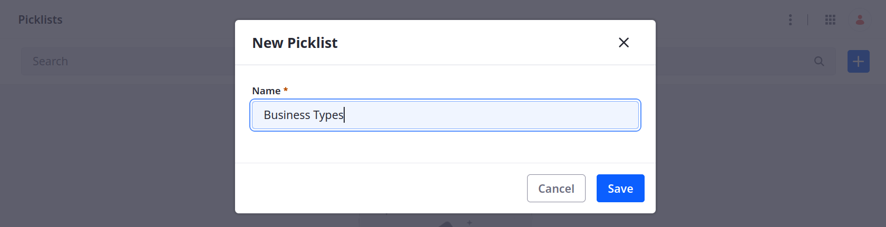
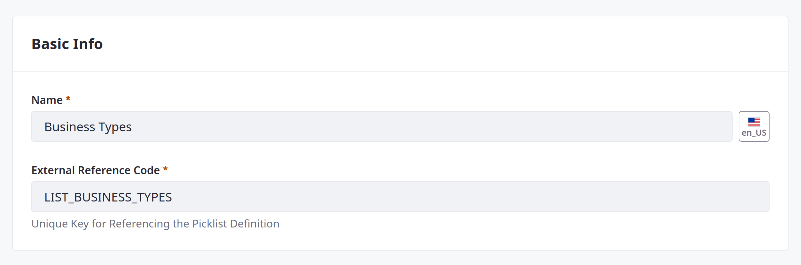

# Creating Picklists for Distributor Applications

Delectable Bonsai wants to collect information to help them assess the relative value of each business opportunity. In this case, they want applicants to select from predefined options. You can achieve this using Liferay picklists.

Picklists are predefined lists of string values that determine options in single-select and multiple-select fields. Delectable Bonsai needs these lists for the Distributor Application object:

* Business Types
* Distribution Regions
* Distribution Channels
* Order Types
* Product Types
* Annual Purchase Volumes
* Product Labels

Here you'll create the first picklist via the Liferay UI.

1. Open the *Global Menu* (  ), go to the *Control Panel* tab, and click *Picklists*.

1. Click *Add* (  ), enter Business Types for name, and click *Save*.

   

1. Begin editing the picklist.

1. Click *Add* (  ) and add these items to the picklist:

   | Name                 | Key                   |
   |:---------------------|:----------------------|
   | Independent Business | `independentBusiness` |
   | Franchise            | `franchise`           |
   | Other                | `other`               |

1. Edit each item and set their ERCs to these values:

   | External Reference Code              |
   |:-------------------------------------|
   | `BUSINESS_TYPE_INDEPENDENT_BUSINESS` |
   | `BUSINESS_TYPE_FRANCHISE`            |
   | `BUSINESS_TYPE_OTHER`                |

   

1. Change the Picklist's ERC to `LIST_BUSINESS_TYPES`.

   

1. Click *Save*.

Once saved, you can use this picklist as a field in the Distributor Application object.

Before you do that, Delectable Bonsai needs six more picklists. But instead of creating these lists manually, you'll create them programmatically using the `headless-admin-list-type` REST APIs.

Next: [Creating Picklists Using REST APIs](./creating-picklists-using-rest-apis.md)

## Relevant Concepts

* [Picklists](https://learn.liferay.com/en/w/dxp/building-applications/objects/picklists)
