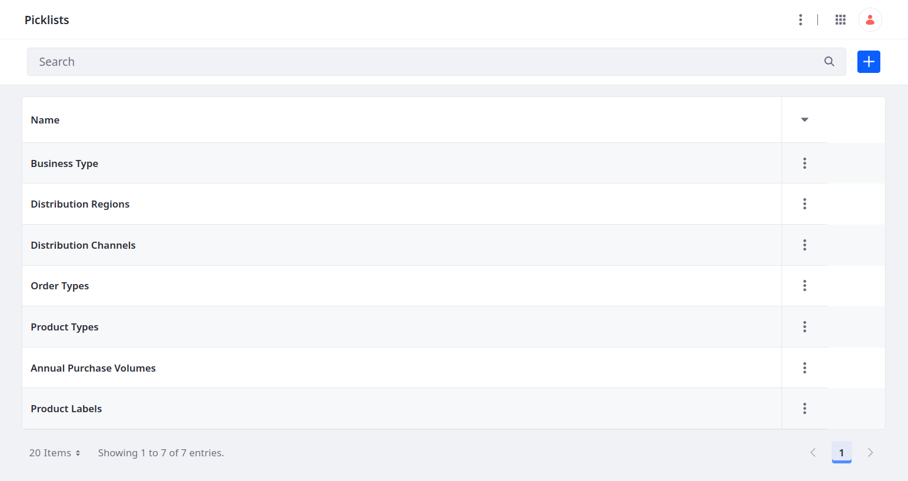
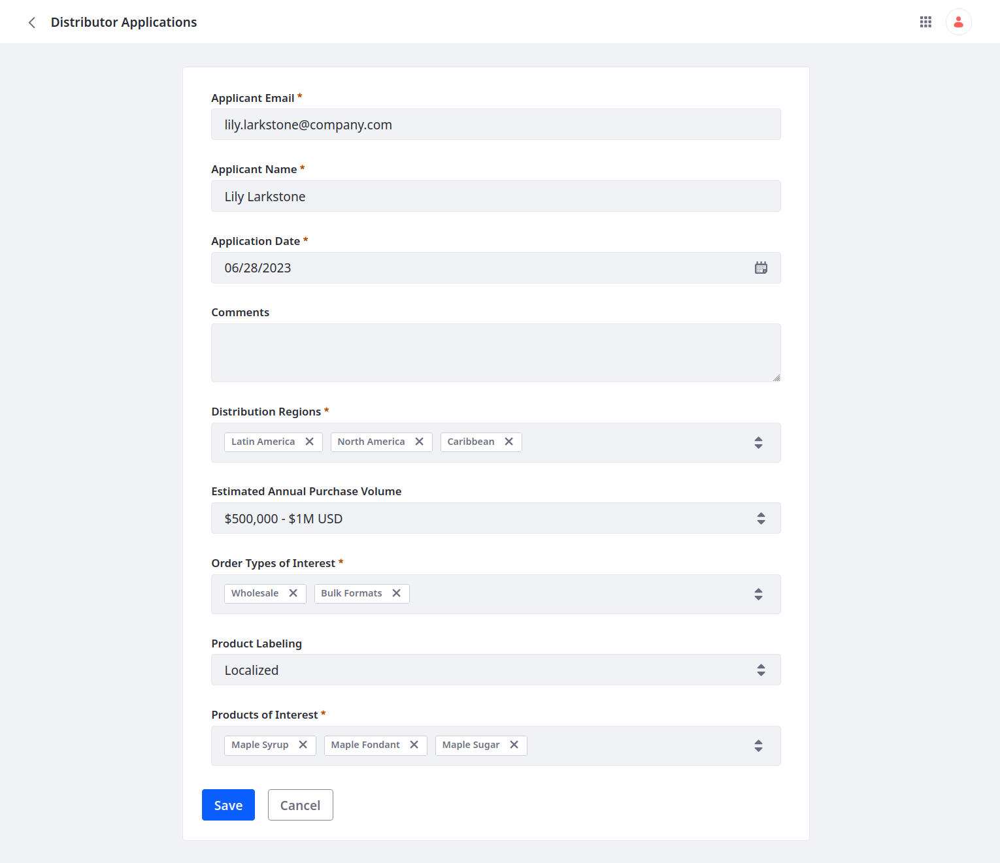
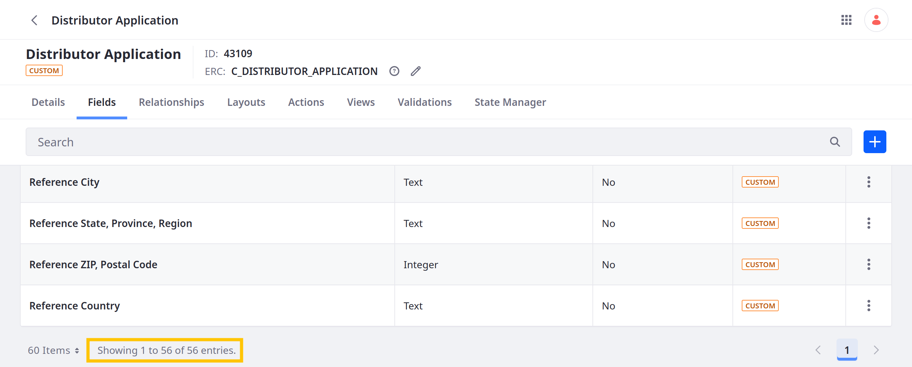

# Defining Attributes

Attributes are specific pieces of information you want to store for entities, such as text and numeric values. With Liferay, this involves adding [data fields](https://learn.liferay.com/en/w/dxp/building-applications/objects/creating-and-managing-objects/fields) to an object definition and creating [picklists](https://learn.liferay.com/en/w/dxp/building-applications/objects/picklists) for use as single-select or multi-select fields. <!--REFINE-->

<!-- Diagram? -->

## Exercise: Adding Attributes to the Distributor Application

Delectable Bonsai needs to collect business information for verifying each applicant's identity and credit. These details are necessary for Know Your Customer (KYC) best practice and compliance with Anti-Money Laundering (AML) laws. Additionally, they want to collect information that can help them assess the relative value of each prospective distributor. For example, if the company is working to reach a specific region, they can give applications from that region higher priority.

First, use Picklists to create predefined lists of string values. Then, add these fields to the Distributor Application object along with other custom fields. <!--REFINE-->

<!-- Before adding fields directly to the object definition, create picklists for any single-select or multi-select fields we want to include. Once created, we can add fields to the Distributor Application object. -->

### Adding Picklists for Distributor Application

With Liferay picklists, you can define lists of string values that you can use for single-select and multiselect fields. <!--predetermines options for users creating entries--> Delectable Bonsai needs these picklists for their Distributor Application:

* Business Types
* Distribution Regions
* Distribution Channels
* Order Types
* Product Types
* Annual Purchase Volumes
* Product Labels



The following steps first cover how to create the Business Types list via the Liferay UI. Then, they cover how to create the remaining picklists using the `headless-admin-list-type` REST APIs. <!--REFINE-->

```{tip}
Using Picklist APIs, you can add lists and items with pre-configured ERCs and localized names in one step. If you're working with multiple lists, this method is far more efficient than manually creating lists through the UI. <!--REFINE-->
```

#### Creating Picklists via the Picklists UI

1. Open the *Global Menu* (  ), go to the *Control Panel* tab, and click *Picklists*.

1. Click the *Add* button (  ).

1. For name, enter Business Types.

1. Click *Save*.

1. Begin editing the picklist.

1. Click the *Add* button (  ) to add these items to the picklist:

   | Name                 | Key                   |
   |:---------------------|:----------------------|
   | Independent Business | `independentBusiness` |
   | Franchise            | `franchise`           |
   | Other                | `other`               |

1. Edit each item and set their ERCs to these values:

   | External Reference Code              |
   |:-------------------------------------|
   | `BUSINESS_TYPE_INDEPENDENT_BUSINESS` |
   | `BUSINESS_TYPE_FRANCHISE`            |
   | `BUSINESS_TYPE_OTHER`                |

   

1. Change the Picklist's ERC to `LIST_BUSINESS_TYPES`.

   

1. Click *Save*.

You can now use the picklist to create a single-select or multi-select field in the Distributor Application object.

#### Creating Picklists via REST APIs

1. Download and unzip the [Defining Attributes](./liferay-p6k3.zip) resources.

   ```bash
   curl https://learn.liferay.com/courses/latest/en/application-development/modeling-data-structures/defining-attributes/liferay-p6k3.zip -O
   ```

   ```bash
   unzip liferay-p6k3.zip
   ```

   This ZIP file includes shell scripts for creating the remaining picklists using the `headless-admin-list-type` REST APIs.

   Each POST command uses the following schema for creating lists with their items:

   ```json
   {
     "externalReferenceCode": "[LIST_ERC]",
     "listTypeEntries": [
       {
         "externalReferenceCode": "[ITEM_ERC]",
         "key": "[itemKey]",
         "name": "[Item Name]",
         "name_i18n": {
           "en-US": "[Localized English Item Name]"
           },
         "type": ""
       }
     ],
     "name": "[List Name]",
     "name_i18n": {
       "en-US": "[Localized English List Name]"
     }
   }
   ```

1. Navigate to the `curl` folder in the `liferay-p6k3` folder.

   ```bash
   cd liferay-p6k3/curl
   ```

1. Run this script to create the Distribution Regions picklist:

   ```bash
   ./ListTypeDefinition_POST_DistributionRegions_ToInstance.sh
   ```

   **Picklist**

   | Name                 | External Reference Code     |
   |:---------------------|:----------------------------|
   | Distribution Regions | `LIST_DISTRIBUTION_REGIONS` |

   **Picklist Items**

   | Name               | Key              | External Reference Code   |
   |:-------------------|:-----------------|:--------------------------|
   | Latin America      | `latinAmerica`   | `REGION_LATIN_AMERICA`    |
   | Caribbean          | `caribbean`      | `REGION_CARIBBEAN`        |
   | Eastern Europe     | `easternEurope`  | `REGION_EASTERN_EUROPE`   |
   | Western Europe     | `westernEurope`  | `REGION_WESTERN_EUROPE`   |
   | Middle East        | `middleEast`     | `REGION_MIDDLE_EAST`      |
   | Africa             | `africa`         | `REGION_AFRICA`           |
   | Central Asia       | `centralAsia`    | `REGION_CENTRAL_ASIA`     |
   | Asia & Pacific Rim | `asiaPacificRim` | `REGION_ASIA_PACIFIC_RIM` |
   | India              | `india`          | `REGION_INDIA`            |
   | North America      | `northAmerica`   | `REGION_NORTH_AMERICA`    |

1. Run this script to create the Distribution Channels picklist:

   ```bash
   ./ListTypeDefinition_POST_DistributionChannels_ToInstance.sh
   ```

   **Picklist**

   | Name                  | External Reference Code      |
   |:----------------------|:-----------------------------|
   | Distribution Channels | `LIST_DISTRIBUTION_CHANNELS` |

   **Picklist Items**

   | Name                          | Key              | External Reference Code   |
   |:------------------------------|:-----------------|:--------------------------|
   | Distribute to Other Retailers | `otherRetailers` | `CHANNEL_OTHER_RETAILERS` |
   | Sell Through Own Retail       | `ownRetail`      | `CHANNEL_OWN_RETAIL`      |
   | E-Commerce                    | `eCommerce`      | `CHANNEL_E_COMMERCE`      |

1. Run this script to create the Order Types picklist:

   ```bash
   ./ListTypeDefinition_POST_OrderTypes_ToInstance.sh
   ```

   **Picklist**

   | Name        | External Reference Code |
   |:------------|:------------------------|
   | Order Types | `LIST_ORDER_TYPES`      |

   **Picklist Items**

   | Name             | Key               | External Reference Code       |
   |:-----------------|:------------------|:------------------------------|
   | Wholesale        | `wholesale`       | `ORDER_TYPE_WHOLESALE`        |
   | Private Labeling | `privateLabeling` | `ORDER_TYPE_PRIVATE_LABELING` |
   | Bulk Formats     | `bulkFormats`     | `ORDER_TYPE_BULK_FORMATS`     |
   | Not Sure         | `notSure`         | `ORDER_TYPE_NOT_SURE`         |

1. Run this script to create the Product Types picklist:

   ```bash
   ./ListTypeDefinition_POST_ProductTypes_ToInstance.sh
   ```

   **Picklist**

   | Name          | External Reference Code |
   |:--------------|:------------------------|
   | Product Types | `LIST_PRODUCT_TYPES`    |

   **Picklist Items**

   | Name                | Key                  | External Reference Code            |
   |:--------------------|:---------------------|:-----------------------------------|
   | Maple Syrup         | `mapleSyrup`         | `PRODUCT_TYPE_MAPLE_SYRUP`         |
   | Organic Maple Syrup | `organicMapleSyrup`  | `PRODUCT_TYPE_ORGANIC_MAPLE_SYRUP` |
   | Maple Butter        | `mapleButter`        | `PRODUCT_TYPE_MAPLE_BUTTER`        |
   | Maple Sugar         | `mapleSugar`         | `PRODUCT_TYPE_MAPLE_SUGAR`         |
   | Maple Fondant       | `mapleFondant`       | `PRODUCT_TYPE_MAPLE_FONDANT`       |
   | Maple Jelly         | `mapleJelly`         | `PRODUCT_TYPE_MAPLE_JELLY`         |
   | Trees               | `trees`              | `PRODUCT_TYPE_TREES`               |
   | Saplings            | `saplings`           | `PRODUCT_TYPE_SAPLINGS`            |
   | Educational Content | `educationalContent` | `PRODUCT_TYPE_EDUCATIONAL_CONTENT` |
   | Other               | `other`              | `PRODUCT_TYPE_OTHER`               |

1. Run this script to create the Annual Purchase Volumes picklist:

   ```bash
   ./ListTypeDefinition_POST_AnnualPurchaseVolumes_ToInstance.sh
   ```

   **Picklist**

   | Name                    | External Reference Code        |
   |:------------------------|:-------------------------------|
   | Annual Purchase Volumes | `LIST_ANNUAL_PURCHASE_VOLUMES` |

   **Picklist Items**

   | Name                   | Key          | External Reference Code |
   |:-----------------------|:-------------|:------------------------|
   | $50,000 - 100,000 USD  | `firstTier`  | `VOLUME_FIRST_TIER`     |
   | $200,000 - 500,000 USD | `secondTier` | `VOLUME_SECOND_TIER`    |
   | $500,000 - 1M USD      | `thirdTier`  | `VOLUME_THIRD_TIER`     |
   | $1M+ USD               | `fourthTier` | `VOLUME_FOURTH_TIER`    |

1. Run this script to create the Product Labels picklist:

   ```bash
   ./ListTypeDefinition_POST_ProductLabels_ToInstance.sh
   ```

   **Picklist**

   | Name           | External Reference Code |
   |:---------------|:------------------------|
   | Product Labels | `LIST_PRODUCT_LABELS`   |

   **Picklist Items**

   | Name        | Key          | External Reference Code |
   |:------------|:-------------|:------------------------|
   | Standard US | `standardUS` | `LABEL_STANDARD_US`     |
   | Localized   | `localized`  | `LABEL_LOCALIZED`       |

You can now use these picklists to create single-select and multi-select fields in the Distributor Application object.

### Adding Fields to the Distributor Application Object

With Object [data fields](https://learn.liferay.com/en/w/dxp/building-applications/objects/creating-and-managing-objects/fields), you can store and manage specific types of information in your application. <!-- Fields are data definitions that represent database columns and store different [types of values](#field-types-ui-reference). --> Delectable Bonsai needs fields for collecting applicant, contact, business, bank, and credit information.

The following steps first cover how to add fields via the Liferay UI. Then, they cover how to create the remaining fields using the `object-admin` REST APIs. <!--REFINE-->


<!-- After adding a field, you can access additional configuration options. For example, you can determine whether the field is searchable. -->

#### Adding Fields via the Objects UI

1. Open the *Global Menu* (  ), go to the *Control Panel* tab, and click *Objects*.

1. Begin editing the Distributor Application object and go to the *Fields* tab.

1. Click the *Add* button (), enter these details, and click *Save*:

   | Field                     | Value            |
   |:--------------------------|:-----------------|
   | Label                     | Applicant Email  |
   | Field Name                | `applicantEmail` |
   | Type                      | Text             |
   | Mandatory                 | True             |
   | Accept Unique Values Only | True             |

1. Add an Application Date field:

   | Field      | Value             |
   |:-----------|:------------------|
   | Label      | Application Date  |
   | Field Name | `applicationDate` |
   | Type       | Date              |
   | Mandatory  | True              |

1. Add a Comments field:

   | Field      | Value      |
   |:-----------|:-----------|
   | Label      | Comments   |
   | Field Name | `comments` |
   | Type       | Long Text  |
   | Mandatory  | False      |

1. Add a Distribution Regions field:

   | Field      | Value                 |
   |:-----------|:----------------------|
   | Label      | Distribution Regions  |
   | Field Name | `distributionRegions` |
   | Type       | Multiselect Picklist  |
   | Picklist   | Distribution Regions  |
   | Mandatory  | True                  |

1. Add a Products of Interest field:

   | Field      | Value                |
   |:-----------|:---------------------|
   | Label      | Products of Interest |
   | Field Name | `productsOfInterest` |
   | Type       | Multiselect Picklist |
   | Picklist   | Product Types        |
   | Mandatory  | True                 |

1. Add an Order Types of Interest field:

   | Field      | Value                   |
   |:-----------|:------------------------|
   | Label      | Order Types of Interest |
   | Field Name | `orderTypesOfInterest`  |
   | Type       | Multiselect Picklist    |
   | Picklist   | Order Types             |
   | Mandatory  | True                    |

1. Add a Product Labeling field:

   | Field         | Value             |
   |:--------------|:------------------|
   | Label         | Product Labeling  |
   | Field Name    | `productLabeling` |
   | Type          | Picklist          |
   | Picklist      | Product Labels    |
   | Mandatory     | False             |
   | Mark as State | False             |

1. Add a Product Labeling field:

   | Field         | Value             |
   |:--------------|:------------------|
   | Label         | Product Labeling  |
   | Field Name    | `productLabeling` |
   | Type          | Picklist          |
   | Picklist      | Product Labels    |
   | Mandatory     | False             |
   | Mark as State | False             |

Each saved field is immediately added to the published object. If you navigate to the Distributor Application, you can begin adding entries that include these fields. When you do, the fields are organized alphabetically.



Once created, the default table view displays a scrolling table that includes all new fields as well. <!--REFINE-->


Delectable Bonsai can use these fields to collect general details for assessing the value of each applicant. However, they need to collect additional information to follow KYC policies and comply with AML laws. To add these fields, use the `object-admin` REST APIs.

#### Adding Fields via REST APIs

1. Navigate to the `liferay-p6k3/curl` folder. The provided ZIP includes shell scripts for creating the remaining fields.

   Each script includes multiple curl commands that call the `object-admin` service using the POST method. <!--See [Using Object Field APIs]() for more information on the schema for each field type.-->

1. Run this script to create fields for storing contact information:

   ```bash
   ./ObjectField_POST_ContactInformation_ByExternalReferenceCode.sh
   ```

   | Field Name                   | Type    |
   |:-----------------------------|:--------|
   | `primaryContactName`        | Text    |
   | `primaryContactTitle`       | Text    |
   | `primaryContactEmail`       | Text    |
   | `primaryContactPhoneNumber` | Integer |

1. Run this script to create fields for storing business information:

   ```bash
   ./ObjectField_POST_BusinessDetails_ByExternalReferenceCode.sh
   ```

   | Field Name                     | Type                 |
   |:-------------------------------|:---------------------|
   | `businessName`                 | Text                 |
   | `businessWebsite`              | Text                 |
   | `businessType`                 | Picklist             |
   | `businessEstablishedDate`      | Date                 |
   | `businessEmployeeNumber`       | Integer              |
   | `businessAnnualRevenue`        | Precision Decimal    |
   | `businessDistributionChannels` | Multiselect Picklist |
   | `businessOtherBrandsOffered`   | Long Text            |
   | `businessPhoneNumber`          | Integer              |
   | `businessAddressLineOne`       | Text                 |
   | `businessAddressLineTwo`       | Text                 |
   | `businessCity`                 | Text                 |
   | `businessStateProvinceRegion`  | Text                 |
   | `businessZipPostalCode`        | Integer              |
   | `businessCountry`              | Text                 |
   | `businessLicenseNumber`        | Integer              |
   | `businessResaleNumber`         | Integer              |
   | `businessTaxIDNumber`          | Integer              |
   | `businessLicense`              | Attachment           |
   | `businessProofOfInsurance`     | Attachment           |

1. Run this script to create fields for storing the business's bank details:

   ```bash
   ./ObjectField_POST_BankDetails_ByExternalReferenceCode.sh
   ```

   | Field Name                | Type    |
   |:--------------------------|:--------|
   | `bankName`                | Text    |
   | `bankAccountNumber`       | Text    |
   | `bankPhoneNumber`         | Integer |
   | `bankAddressLineOne`      | Text    |
   | `bankAddressLineTwo`      | Text    |
   | `bankCity`                | Text    |
   | `bankStateProvinceRegion` | Text    |
   | `bankZIPPostalCode`       | Integer |
   | `bankCountry`             | Text    |

1. Run this script to create fields for storing the business's credit references:

   ```bash
   ./ObjectField_POST_CreditReferences_ByExternalReferenceCode.sh
   ```

   | Field Name                              | Type    |
   |:----------------------------------------|:--------|
   | `creditReferenceOneSupplierName`        | Text    |
   | `creditReferenceOneAccountNumber`       | Text    |
   | `creditReferenceOnePhoneNumber`         | Integer |
   | `creditReferenceOneAddressLineOne`      | Text    |
   | `creditReferenceOneAddressLineTwo`      | Text    |
   | `creditReferenceOneCity`                | Text    |
   | `creditReferenceOneStateProvinceRegion` | Text    |
   | `creditReferenceOneZIPPostalCode`       | Integer |
   | `creditReferenceOneCountry`             | Text    |
   | `creditReferenceTwoSupplierName`        | Text    |
   | `creditReferenceTwoAccountNumber`       | Text    |
   | `creditReferenceTwoPhoneNumber`         | Integer |
   | `creditReferenceTwoAddressLineOne`      | Text    |
   | `creditReferenceTwoAddressLineTwo`      | Text    |
   | `creditReferenceTwoCity`                | Text    |
   | `creditReferenceTwoStateProvinceRegion` | Text    |
   | `creditReferenceTwoZIPPostalCode`       | Integer |
   | `creditReferenceTwoCountry`             | Text    |

Once finished, the Distributor Application object should have 65 fields. <!--FINISH-->



These fields can help Delectable Bonsai collect the data they need for __, KYC policies, and complying with AML laws. However, presently, none of the fields have validations. Doesn't ensure the integrity of input data. Also, there are now so many fields that using the default view and layout is unmanageable.<!--FINISH-->

In the next module, we will add validations to these fields. Then, in the third module, we will develop a custom UI for creating and viewing entries.<!--FINISH-->

But first, we must explore the concept of relationships and __. <!--FINISH-->

## Relevant Concepts

* [Picklists](https://learn.liferay.com/en/w/dxp/building-applications/objects/picklists)
* [Fields](https://learn.liferay.com/en/w/dxp/building-applications/objects/creating-and-managing-objects/fields)
