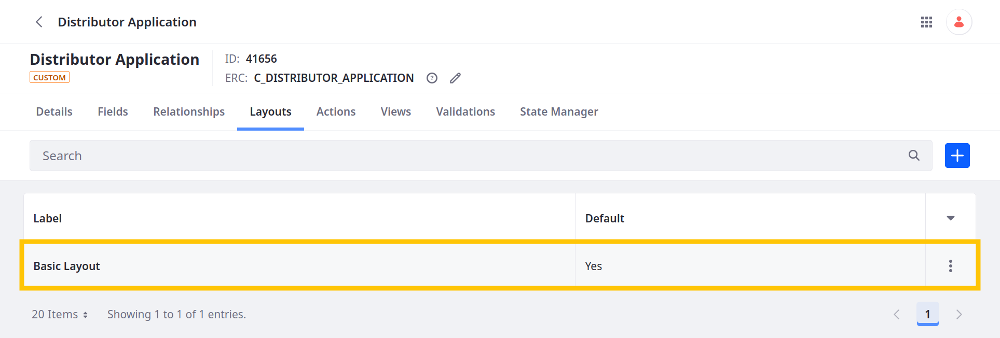
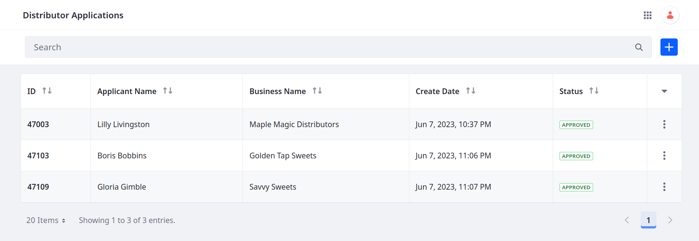

# Adding a Basic Layout and View

An object's default layout and view include all fields and displays them alphabetically. With over 50 fields, the default user interfaces for the Distributor Application object are no longer viable for creating and displaying entries. While subsequent lessons cover how to design user interfaces using Liferay's page builder features, use these cURL scripts to create a custom view and layout for demonstration purposes: <!--Refine-->

1. Download and unzip the resources for [this exercise](./liferay-t7z2.zip).

   ```bash
   curl https://learn.liferay.com/courses/latest/en/application-development/modeling-data-structures/defining-attributes/adding-a-basic-layout-and-view/liferay-t7z2.zip -O
   ```

   ```bash
   unzip liferay-t7z2.zip
   ```

   This ZIP file includes shell scripts that use the `object-admin` REST APIs to add a layout and view to the Distributor Application object.

1. Navigate to `liferay-t7z2/curl`.

   ```bash
   cd liferay-t7z2/curl
   ```

1. Run this script to create the layout:

   ```bash
   ./ObjectLayout_POST_BasicLayout_ByExternalReferenceCode.sh
   ```

   

1. Create the view:

   ```bash
   ./ObjectView_POST_BasicView_ByExternalReferenceCode.sh
   ```

   

1. Practice creating entries in the Distributor Application object to verify the object is using the new layout and view.

   The layout includes two tabs and organizes the fields into collapsible blocks. <!--You can access the second tab after creating an entry.-->

   

   The view defines a table with five columns.

   

<!-- Transition -->

Presently, none of the fields include validations to ensure the integrity of application data. But before adding validations, we must explore the concept of relationships when modeling data structures.

Next: [Defining Relationships](./defining-relationships.md)
