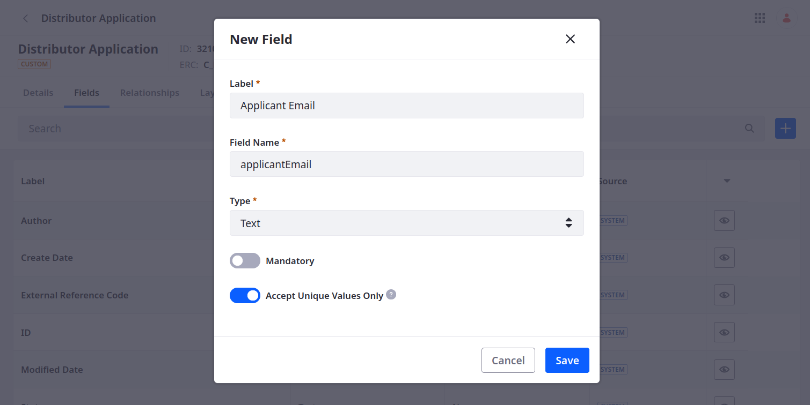
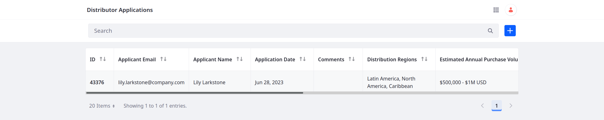

# Adding Fields to the Distributor Application Object

Object [data fields](https://learn.liferay.com/en/w/dxp/building-applications/objects/creating-and-managing-objects/fields) store specific types of information that you want to use and manage in your application. Delectable Bonsai needs to add fields to the Distributor Application object for collecting applicant, contact, business, bank, and reference information.

The following steps first cover how to add fields via the Liferay UI. Then, they cover how to create the remaining fields using the `object-admin` REST APIs.

## Adding Fields via the Objects UI

1. Open the *Global Menu* (  ), go to the *Control Panel* tab, and click *Objects*.

1. Begin editing the Distributor Application object and go to the *Fields* tab.

1. Click *Add* (), enter these details, and click *Save*:

   | Field                     | Value            |
   |:--------------------------|:-----------------|
   | Label                     | Applicant Email  |
   | Field Name                | `applicantEmail` |
   | Type                      | Text             |
   | Mandatory                 | False            |
   | Accept Unique Values Only | True             |

1. Add an Application Approved Date field: <!--TASK: Update imgs for changed field name. Also, later make read-only for some users, and editable for others.-->

   | Field      | Value                     |
   |:-----------|:--------------------------|
   | Label      | Application Approved Date |
   | Field Name | `applicationApprovedDate` |
   | Type       | Date                      |
   | Mandatory  | False                     |

1. Add a Distribution Regions field:

   | Field      | Value                 |
   |:-----------|:----------------------|
   | Label      | Distribution Regions  |
   | Field Name | `distributionRegions` |
   | Type       | Multiselect Picklist  |
   | Picklist   | Distribution Regions  |
   | Mandatory  | False                 |

1. Add a Products of Interest field:

   | Field      | Value                |
   |:-----------|:---------------------|
   | Label      | Products of Interest |
   | Field Name | `productsOfInterest` |
   | Type       | Multiselect Picklist |
   | Picklist   | Product Types        |
   | Mandatory  | False                |

1. Add an Order Types of Interest field:

   | Field      | Value                   |
   |:-----------|:------------------------|
   | Label      | Order Types of Interest |
   | Field Name | `orderTypesOfInterest`  |
   | Type       | Multiselect Picklist    |
   | Picklist   | Order Types             |
   | Mandatory  | False                   |

1. Add a Product Labeling field:

   | Field         | Value             |
   |:--------------|:------------------|
   | Label         | Product Labeling  |
   | Field Name    | `productLabeling` |
   | Type          | Picklist          |
   | Picklist      | Product Labels    |
   | Mandatory     | False             |
   | Mark as State | False             |

1. Add an Estimated Annual Purchase Volume field:

   | Field         | Value                            |
   |:--------------|:---------------------------------|
   | Label         | Estimated Annual Purchase Volume |
   | Field Name    | `estimatedAnnualPurchaseVolume`  |
   | Type          | Picklist                         |
   | Picklist      | Annual Purchase Volumes          |
   | Mandatory     | False                            |
   | Mark as State | False                            |

1. Add a Comments field:

   | Field      | Value      |
   |:-----------|:-----------|
   | Label      | Comments   |
   | Field Name | `comments` |
   | Type       | Long Text  |
   | Mandatory  | False      |

```{tip}
After creating a data field, you cannot change whether it is mandatory. Since requirements can change, making fields optional provides more flexibility over time. In such cases, you can use validations and logic in frontend components to require specific fields.
```

Each saved field is immediately added to the published object. If you navigate to the Distributor Application, you can begin adding entries that include these fields. When you do, the default layout includes all fields and organizes them alphabetically.



The default table view in the object's application page also includes the new fields and organizes them alphabetically, though beginning with the `id` field.



Delectable Bonsai can use these fields to collect general details for assessing the value of each applicant. However, they need to collect additional information to follow KYC policies and comply with AML laws. To add these fields, use the provided shell scripts to call the `object-admin` REST APIs.

## Adding Fields via REST APIs

1. Download and unzip the resources for [this exercise](./liferay-p6k3.zip).

   ```bash
   curl https://learn.liferay.com/courses/latest/en/application-development/modeling-data-structures/defining-attributes/adding-fields-to-the-distributor-application-object/liferay-p6k3.zip -O
   ```

   ```bash
   unzip liferay-p6k3.zip
   ```

   This ZIP file includes shell scripts for creating the remaining fields using the `object-admin` REST APIs.

1. Navigate to `liferay-p6k3/curl`.

   ```bash
   cd liferay-p6k3/curl
   ```

1. Run this script to create fields for storing contact information:

   ```bash
   ./ObjectField_POST_ContactInformation_ByExternalReferenceCode.sh
   ```

   | Field Name                  | Type |
   |:----------------------------|:-----|
   | `primaryContactName`        | Text |
   | `primaryContactTitle`       | Text |
   | `primaryContactEmail`       | Text |
   | `primaryContactPhoneNumber` | Text |

1. Create fields for storing business information:

   ```bash
   ./ObjectField_POST_BusinessDetails_ByExternalReferenceCode.sh
   ```

   | Field Name                     | Type                 |
   |:-------------------------------|:---------------------|
   | `businessName`                 | Text                 |
   | `businessWebsite`              | Text                 |
   | `businessType`                 | Picklist             |
   | `businessEstablishedDate`      | Date                 |
   | `businessEmployeeNumber`       | Integer              |
   | `businessAnnualRevenue`        | Text                 |
   | `businessDistributionChannels` | Multiselect Picklist |
   | `businessOtherBrandsOffered`   | Long Text            |
   | `businessPhoneNumber`          | Text                 |
   | `businessAddressLineOne`       | Text                 |
   | `businessAddressLineTwo`       | Text                 |
   | `businessCity`                 | Text                 |
   | `businessStateProvinceRegion`  | Text                 |
   | `businessZipPostalCode`        | Text                 |
   | `businessCountry`              | Text                 |
   | `businessLicenseNumber`        | Text                 |
   | `businessResaleNumber`         | Text                 |
   | `businessTaxIDNumber`          | Text                 |
   | `businessLicense`              | Attachment           |
   | `businessProofOfInsurance`     | Attachment           |

1. Create fields for storing the business's bank details:

   ```bash
   ./ObjectField_POST_BankDetails_ByExternalReferenceCode.sh
   ```

   | Field Name                | Type |
   |:--------------------------|:-----|
   | `bankName`                | Text |
   | `bankAccountNumber`       | Text |
   | `bankPhoneNumber`         | Text |
   | `bankAddressLineOne`      | Text |
   | `bankAddressLineTwo`      | Text |
   | `bankCity`                | Text |
   | `bankStateProvinceRegion` | Text |
   | `bankZIPPostalCode`       | Text |
   | `bankCountry`             | Text |

1. Create fields for receiving business reference details:

   ```bash
   ./ObjectField_POST_BusinessReference_ByExternalReferenceCode.sh
   ```

   | Field Name                     | Type |
   |:-------------------------------|:-----|
   | `referenceSupplierName`        | Text |
   | `referencePhoneNumber`         | Text |
   | `referenceAddressLineOne`      | Text |
   | `referenceAddressLineTwo`      | Text |
   | `referenceCity`                | Text |
   | `referenceStateProvinceRegion` | Text |
   | `referenceZIPPostalCode`       | Text |
   | `referenceCountry`             | Text |

Once finished, the Distributor Application object should have 56 fields. These fields can help Delectable Bonsai collect the data they need for evaluating and vetting each applicant in compliance with KYC policies and AML laws.


<!-- Transition -->

Next: [Adding a Basic Layout and View](./adding-a-basic-layout-and-view.md)

## Relevant Concepts

* [Fields](https://learn.liferay.com/en/w/dxp/building-applications/objects/creating-and-managing-objects/fields)
* [Adding Fields to Objects](https://learn.liferay.com/w/dxp/building-applications/objects/creating-and-managing-objects/fields/adding-fields-to-objects)
