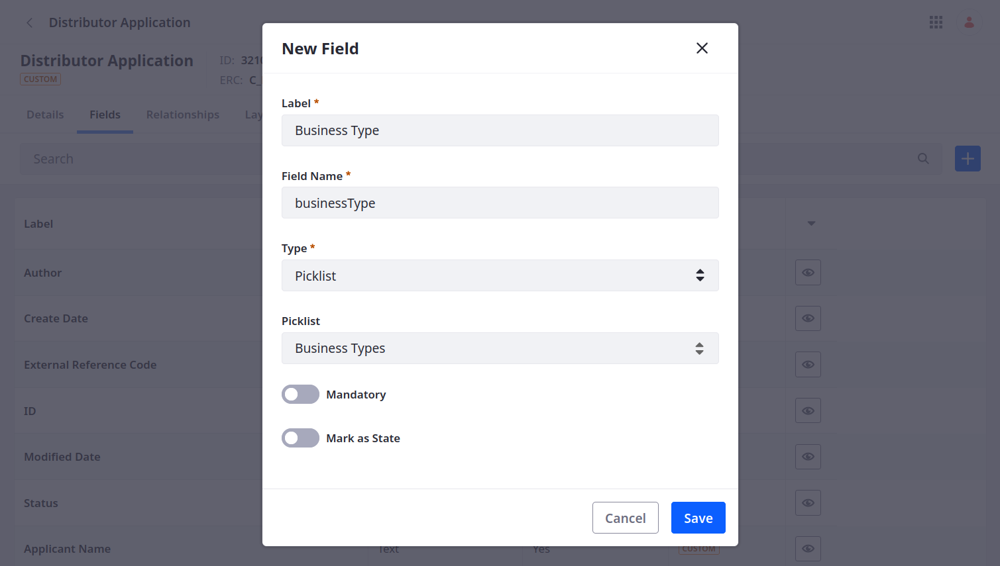

# Adding Picklist Fields to the Object

Adding picklist fields to the Distributor Application object follows the same process as any other field type, though they have some additional configuration options.

1. Open the *Global Menu* (  ), go to the *Control Panel* tab, and click *Objects*.

1. Begin editing the Distributor Application object and go to the *Fields* tab.

1. Click *Add* (), enter these details, and click *Save*:

   | Field         | Value          |
   |:--------------|:---------------|
   | Label         | Business Type  |
   | Field Name    | `businessType` |
   | Type          | Picklist       |
   | Picklist      | Business Types |
   | Mandatory     | False          |
   | Mark as State | False          |

    <!--UPDATE IMG-->

1. Add a Distribution Regions field:

   | Field      | Value                 |
   |:-----------|:----------------------|
   | Label      | Distribution Regions  |
   | Field Name | `distributionRegions` |
   | Type       | Multiselect Picklist  |
   | Picklist   | Distribution Regions  |
   | Mandatory  | False                 |

1. Add a Business Distribution Channels field:

   | Field      | Value                          |
   |:-----------|:-------------------------------|
   | Label      | Business Distribution Channels |
   | Field Name | `businessDistributionChannels` |
   | Type       | Multiselect Picklist           |
   | Picklist   | Distribution Channels          |
   | Mandatory  | False                          |

1. Add an Order Types of Interest field:

   | Field      | Value                   |
   |:-----------|:------------------------|
   | Label      | Order Types of Interest |
   | Field Name | `orderTypesOfInterest`  |
   | Type       | Multiselect Picklist    |
   | Picklist   | Order Types             |
   | Mandatory  | False                   |

1. Add a Products of Interest field:

   | Field      | Value                |
   |:-----------|:---------------------|
   | Label      | Products of Interest |
   | Field Name | `productsOfInterest` |
   | Type       | Multiselect Picklist |
   | Picklist   | Product Types        |
   | Mandatory  | False                |

1. Add an Estimated Annual Purchase Volume field:

   | Field         | Value                            |
   |:--------------|:---------------------------------|
   | Label         | Estimated Annual Purchase Volume |
   | Field Name    | `estimatedAnnualPurchaseVolume`  |
   | Type          | Picklist                         |
   | Picklist      | Annual Purchase Volumes          |
   | Mandatory     | False                            |
   | Mark as State | False                            |

1. Add a Product Labeling field:

   | Field         | Value             |
   |:--------------|:------------------|
   | Label         | Product Labeling  |
   | Field Name    | `productLabeling` |
   | Type          | Picklist          |
   | Picklist      | Product Labels    |
   | Mandatory     | False             |
   | Mark as State | False             |

   

Now when users fill out a distributor application, they can select from predefined options for each field. Delectable Bonsai can then use these data points to assess the value of each business opportunity.

With over 50 fields, the current user interfaces for Distributor Application are no longer viable for creating and displaying entries. This is because the default layout and view include every object field and display them alphabetically. Before forward with modeling data structures, add a custom layout and view to Distributor Application.

<!-- Move the above paragraph to the beginning of the next step. -Rich -->

Next: [Adding a Custom Layout and View to Distributor Application](./adding-a-custom-layout-and-view-to-distributor-application.md)
