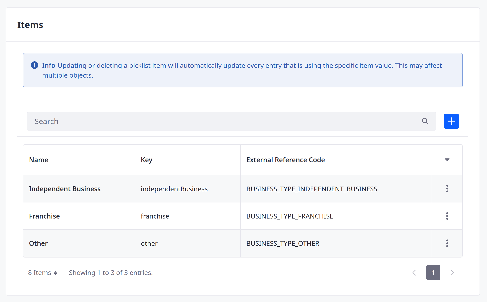

# Adding Picklists for Distributor Applications

With Liferay Picklists, you can define lists of string values that you can use for single-select and multiselect object fields. Delectable Bonsai needs these lists for the Distributor Application object:

* Business Types
* Distribution Regions
* Distribution Channels
* Order Types
* Product Types
* Annual Purchase Volumes
* Product Labels


The following steps first cover how to create the Business Types list via the Liferay UI. Then, they cover how to create the remaining picklists using the `headless-admin-list-type` REST APIs.

```{tip}
Using Picklist APIs, you can add lists and items with pre-configured ERCs and localized names in one step. If you're working with multiple lists, this method is far more efficient than manually creating them through the UI.
```

## Creating Picklists via the Picklists UI

1. Open the *Global Menu* (  ), go to the *Control Panel* tab, and click *Picklists*.

1. Click *Add* (  ), enter Business Types for name, and click *Save*.

1. Begin editing the picklist.

1. Click *Add* (  ) to add these items to the picklist:

   | Name                 | Key                   |
   |:---------------------|:----------------------|
   | Independent Business | `independentBusiness` |
   | Franchise            | `franchise`           |
   | Other                | `other`               |

1. Edit each item and set their ERCs to these values:

   | External Reference Code              |
   |:-------------------------------------|
   | `BUSINESS_TYPE_INDEPENDENT_BUSINESS` |
   | `BUSINESS_TYPE_FRANCHISE`            |
   | `BUSINESS_TYPE_OTHER`                |

   

1. Change the Picklist's ERC to `LIST_BUSINESS_TYPES`.

   

1. Click *Save*.

You can now use the picklist to create a single-select or multi-select field in the Distributor Application object. But first, create the remaining picklists using REST APIs.

## Creating Picklists via REST APIs

1. Download and unzip the resources for [this exercise](./liferay-r5w2.zip).

   ```bash
   curl https://learn.liferay.com/courses/latest/en/application-development/modeling-data-structures/defining-attributes/adding-picklists-for-distributor-applications/liferay-r5w2.zip -O
   ```

   ```bash
   unzip liferay-r5w2.zip
   ```

   This ZIP file includes shell scripts for creating the remaining picklists using the `headless-admin-list-type` REST APIs.

   Each POST command uses the following schema for creating lists with their items:

   ```json
   {
     "externalReferenceCode": "[LIST_ERC]",
     "listTypeEntries": [
       {
         "externalReferenceCode": "[ITEM_ERC]",
         "key": "[itemKey]",
         "name": "[Item Name]",
         "name_i18n": {
           "en-US": "[Localized English Item Name]"
           },
         "type": ""
       }
     ],
     "name": "[List Name]",
     "name_i18n": {
       "en-US": "[Localized English List Name]"
     }
   }
   ```

1. Navigate to the `curl` folder in the `liferay-r5w2` folder.

   ```bash
   cd liferay-r5w2/curl
   ```

1. Run this script to create the Distribution Regions picklist:

   ```bash
   ./ListTypeDefinition_POST_DistributionRegions_ToInstance.sh
   ```

   **Picklist**

   | Name                 | External Reference Code     |
   |:---------------------|:----------------------------|
   | Distribution Regions | `LIST_DISTRIBUTION_REGIONS` |

   **Picklist Items**

   | Name               | Key              | External Reference Code   |
   |:-------------------|:-----------------|:--------------------------|
   | Latin America      | `latinAmerica`   | `REGION_LATIN_AMERICA`    |
   | Caribbean          | `caribbean`      | `REGION_CARIBBEAN`        |
   | Eastern Europe     | `easternEurope`  | `REGION_EASTERN_EUROPE`   |
   | Western Europe     | `westernEurope`  | `REGION_WESTERN_EUROPE`   |
   | Middle East        | `middleEast`     | `REGION_MIDDLE_EAST`      |
   | Africa             | `africa`         | `REGION_AFRICA`           |
   | Central Asia       | `centralAsia`    | `REGION_CENTRAL_ASIA`     |
   | Asia & Pacific Rim | `asiaPacificRim` | `REGION_ASIA_PACIFIC_RIM` |
   | India              | `india`          | `REGION_INDIA`            |
   | North America      | `northAmerica`   | `REGION_NORTH_AMERICA`    |

1. Create the Distribution Channels picklist:

   ```bash
   ./ListTypeDefinition_POST_DistributionChannels_ToInstance.sh
   ```

   **Picklist**

   | Name                  | External Reference Code      |
   |:----------------------|:-----------------------------|
   | Distribution Channels | `LIST_DISTRIBUTION_CHANNELS` |

   **Picklist Items**

   | Name                          | Key              | External Reference Code   |
   |:------------------------------|:-----------------|:--------------------------|
   | Distribute to Other Retailers | `otherRetailers` | `CHANNEL_OTHER_RETAILERS` |
   | Sell Through Own Retail       | `ownRetail`      | `CHANNEL_OWN_RETAIL`      |
   | E-Commerce                    | `eCommerce`      | `CHANNEL_E_COMMERCE`      |

1. Create the Order Types picklist:

   ```bash
   ./ListTypeDefinition_POST_OrderTypes_ToInstance.sh
   ```

   **Picklist**

   | Name        | External Reference Code |
   |:------------|:------------------------|
   | Order Types | `LIST_ORDER_TYPES`      |

   **Picklist Items**

   | Name             | Key               | External Reference Code       |
   |:-----------------|:------------------|:------------------------------|
   | Wholesale        | `wholesale`       | `ORDER_TYPE_WHOLESALE`        |
   | Private Labeling | `privateLabeling` | `ORDER_TYPE_PRIVATE_LABELING` |
   | Bulk Formats     | `bulkFormats`     | `ORDER_TYPE_BULK_FORMATS`     |
   | Not Sure         | `notSure`         | `ORDER_TYPE_NOT_SURE`         |

1. Create the Product Types picklist:

   ```bash
   ./ListTypeDefinition_POST_ProductTypes_ToInstance.sh
   ```

   **Picklist**

   | Name          | External Reference Code |
   |:--------------|:------------------------|
   | Product Types | `LIST_PRODUCT_TYPES`    |

   **Picklist Items**

   | Name                | Key                  | External Reference Code            |
   |:--------------------|:---------------------|:-----------------------------------|
   | Maple Syrup         | `mapleSyrup`         | `PRODUCT_TYPE_MAPLE_SYRUP`         |
   | Organic Maple Syrup | `organicMapleSyrup`  | `PRODUCT_TYPE_ORGANIC_MAPLE_SYRUP` |
   | Maple Butter        | `mapleButter`        | `PRODUCT_TYPE_MAPLE_BUTTER`        |
   | Maple Sugar         | `mapleSugar`         | `PRODUCT_TYPE_MAPLE_SUGAR`         |
   | Maple Fondant       | `mapleFondant`       | `PRODUCT_TYPE_MAPLE_FONDANT`       |
   | Maple Jelly         | `mapleJelly`         | `PRODUCT_TYPE_MAPLE_JELLY`         |
   | Trees               | `trees`              | `PRODUCT_TYPE_TREES`               |
   | Saplings            | `saplings`           | `PRODUCT_TYPE_SAPLINGS`            |
   | Educational Content | `educationalContent` | `PRODUCT_TYPE_EDUCATIONAL_CONTENT` |
   | Other               | `other`              | `PRODUCT_TYPE_OTHER`               |

1. Create the Annual Purchase Volumes picklist:

   ```bash
   ./ListTypeDefinition_POST_AnnualPurchaseVolumes_ToInstance.sh
   ```

   **Picklist**

   | Name                    | External Reference Code        |
   |:------------------------|:-------------------------------|
   | Annual Purchase Volumes | `LIST_ANNUAL_PURCHASE_VOLUMES` |

   **Picklist Items**

   | Name                   | Key          | External Reference Code |
   |:-----------------------|:-------------|:------------------------|
   | $50,000 - 100,000 USD  | `firstTier`  | `VOLUME_FIRST_TIER`     |
   | $200,000 - 500,000 USD | `secondTier` | `VOLUME_SECOND_TIER`    |
   | $500,000 - 1M USD      | `thirdTier`  | `VOLUME_THIRD_TIER`     |
   | $1M+ USD               | `fourthTier` | `VOLUME_FOURTH_TIER`    |

1. Create the Product Labels picklist:

   ```bash
   ./ListTypeDefinition_POST_ProductLabels_ToInstance.sh
   ```

   **Picklist**

   | Name           | External Reference Code |
   |:---------------|:------------------------|
   | Product Labels | `LIST_PRODUCT_LABELS`   |

   **Picklist Items**

   | Name        | Key          | External Reference Code |
   |:------------|:-------------|:------------------------|
   | Standard US | `standardUS` | `LABEL_STANDARD_US`     |
   | Localized   | `localized`  | `LABEL_LOCALIZED`       |

You can now use these picklists to create single-select and multi-select fields in the Distributor Application object.

Next: [Adding Fields](./adding-fields.md)

## Relevant Concepts

* [Picklists](https://learn.liferay.com/en/w/dxp/building-applications/objects/picklists)
* [Picklists API Basics](https://learn.liferay.com/en/w/dxp/building-applications/objects/picklists/picklists-api-basics)
