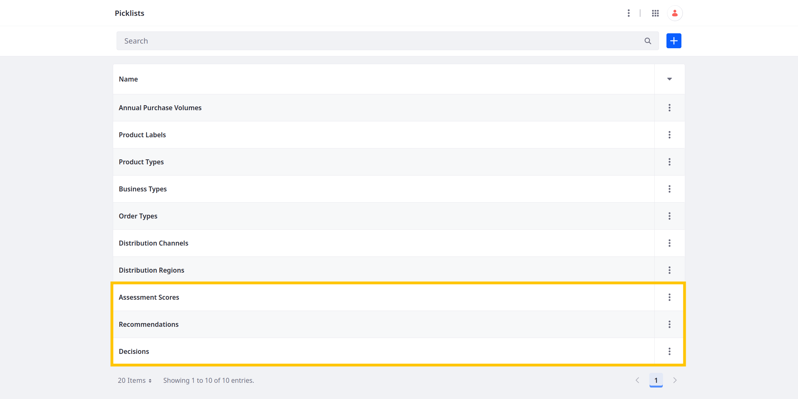
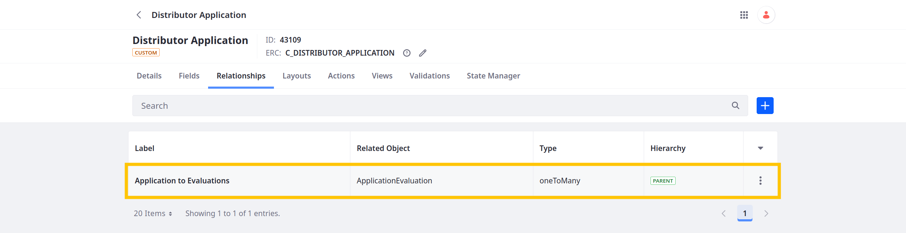

# Defining Relationships

Defining relationships is key to creating data models that accurately represent real-world entities and their interactions. Using relationships, developers can determine how data is organized and connected within a system to better capture entity associations and dependencies. This is integral for implementing robust business logic and efficient data management strategies.

<!-- Diagram? -->

For example, consider an e-commerce scenario with Customer and Order entities. You can use a one-to-many relationship to associate individual customers with multiple orders to better track and retrieve a customer's order information. Similarly, in a scenario with Book and Author entities, you can use a many-to-many relationship to associate individual books with multiple authors and vice versa.

With Liferay, you can define one-to-many and many-to-many relationships directly within the Objects application. These relationships add fields or tables to object definitions for relating their entries with one another. This way you can access entry data in different application contexts.

<!-- Paradigm Shift? -->

Delectable Bonsai needs a way to store evaluation notes for each application they receive. To do this, they need to create an Application Evaluation object and relate the Distributor Application to it in a one-to-many relationship. This way, reviewers can document their comments and feedback throughout the application process.

## Adding the Application Evaluation Object

1. Download and unzip the resources for [Defining Relationships](./liferay-w1m9.zip).

   ```bash
   curl https://learn.liferay.com/courses/latest/en/application-development/modeling-data-structures/defining-relationships/liferay-w1m9.zip -O
   ```

   ```bash
   unzip liferay-w1m9.zip
   ```

   This ZIP file includes two shell scripts with cURL commands that call the `headless-admin-list-type` and `object-admin` APIs.

1. Run this command to create three picklists for the Application Evaluation object:

   ```bash
   ./ListTypeDefinition_POST_ToInstance.sh
   ```

1. Verify these picklists were added:

   * Assessment Scores

   * Recommendations

   * Decisions

   

1. Run this command to create the Application Evaluation object definition with six custom fields.

   ```bash
   ./ObjectDefinition_POST_ToInstance.sh
   ```

1. Verify the definition was added with these fields:

   * Assessment Score

   * Attachment

   * Decision

   * Interview Notes

   * Recommendation Comments

   * Recommendations

   

1. Go to the *Details* tab.

1. Click *Publish*.

Delectable Bonsai's evaluation team can use this object to store notes on prospective distributors. However, the current implementation does not provide a way for them to link their notes to a specific distributor application. Linking entries requires a relationship between the Distributor Application and Application Evaluation definitions.

## Adding a Relationship Between the Object Definitions

1. Open the *Global Menu* (  ), go to the *Control Panel* tab, and click *Objects*.

1. Begin editing the Distributor Application object and go to the *Relationships* tab.

1. Click the *Add* button () and enter these details:

   | Field  | Value                      |
   |:-------|:---------------------------|
   | Label  | Application to Evaluations |
   | Name   | `applicationToEvaluations` |
   | Type   | One to Many                |
   | Object | Application Evaluation     |

1. Click *Save*.

   

This adds a relationship table to the Distributor Application object and a relationship field to the Application Evaluation object.

Liferay also adds dedicated [relationship REST endpoints](https://learn.liferay.com/en/w/dxp/building-applications/objects/understanding-object-integrations/headless-framework-integration#relationship-rest-apis) to both object definitions for relating and disassociating entries via APIs.

Using the `applicationToEvaluations` relationship, users can relate each evaluation to an application, and each application to multiple evaluations.

<!--FINISH:
Next, practice relating object entries.

## Relating Object Entries

The process for relating entries via the Liferay UI depends on the type of relationship defined. To relate entries using the relationship table, you need a custom form for displaying the table. By contrast, relationships fields appear automatically in the object's default layout alongside other fields.

### Via the Liferay UI

### Via REST APIs

-->

<!-- TASK: Add a lesson transition; note that tables do not appear in the UI by default; developing a custom UI will be covered in module three; but explain we're first going to add business logic to it. -->

Next: [Implementing Business Logic](../implementing-business-logic.md)

## Relevant Concepts

* [Relationships](https://learn.liferay.com/en/w/dxp/building-applications/objects/creating-and-managing-objects/relationships)
* [Relationship REST APIs](https://learn.liferay.com/en/w/dxp/building-applications/objects/understanding-object-integrations/headless-framework-integration#relationship-rest-apis)
* [Using Relationship REST APIs](https://learn.liferay.com/en/w/dxp/building-applications/objects/objects-tutorials/using-apis/using-relationship-rest-apis)
