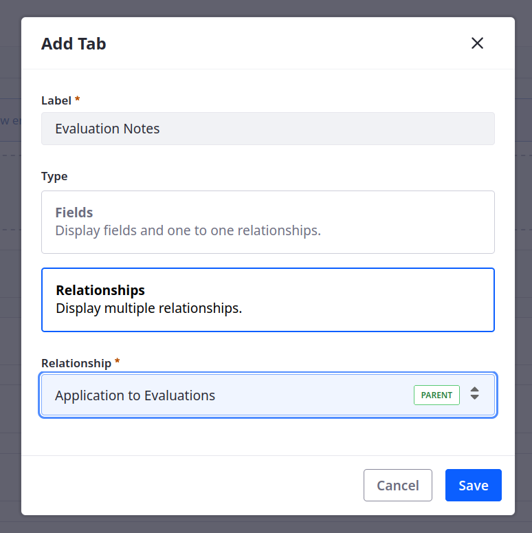
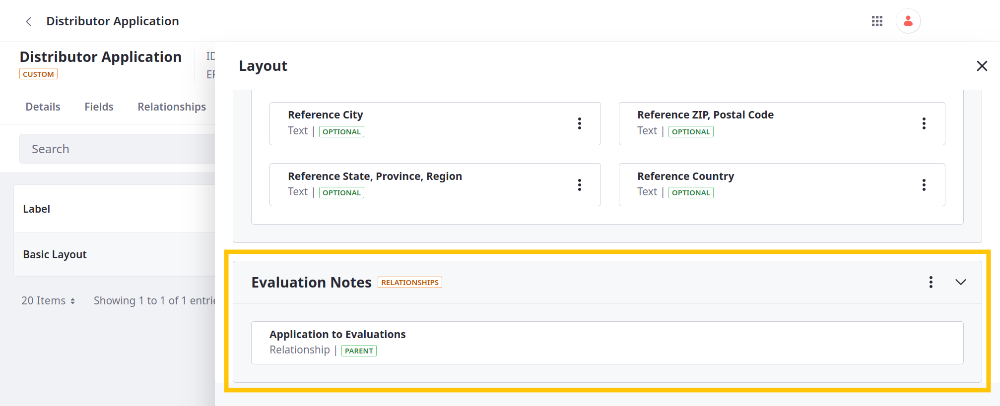
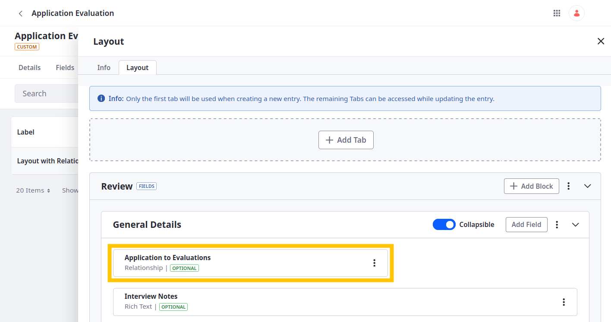

# Defining Relationships

Defining relationships is key to creating data models that accurately represent real-world entities and their interactions. Using relationships, developers can determine how data is organized and connected within a system to better capture entity associations and dependencies. With Liferay, you can define one-to-many and many-to-many relationships between object definitions. These relationships add fields or tables to object definitions for relating their entries with one another so you can access entry data in different application contexts.

<!--TASK:  -->

Currently, the Distributor Application object does not have any relationships with other objects. However, Delectable Bonsai needs a way to store evaluation notes for each application they receive. <!--REFINE-->

To do this, they need to create an Application Evaluation object and relate the Distributor Application to it in a one-to-many relationship. This way, reviewers can document their comments and feedback throughout the application process.

## Adding the Application Evaluation Object

1. Download and unzip the resources for [this exercise](./liferay-w1m9.zip).

   ```bash
   curl https://learn.liferay.com/courses/latest/en/application-development/modeling-data-structures/defining-relationships/liferay-w1m9.zip -O
   ```

   ```bash
   unzip liferay-w1m9.zip
   ```

   This ZIP file includes two shell scripts with cURL commands that call the `headless-admin-list-type` and `object-admin` APIs.

1. Navigate to the `curl` folder in the `liferay-w1m9` folder.

   ```bash
   cd liferay-w1m9/curl
   ```

1. Run this command to create three picklists for the Application Evaluation object:

   ```bash
   ./ListTypeDefinition_POST_ToInstance.sh
   ```

1. Verify these picklists were added:

   * Assessment Scores

   * Recommendations

   * Decisions

   

1. Create the Application Evaluation object definition with six custom fields, as well as a basic custom view and layout.

   ```bash
   ./ObjectDefinition_POST_ToInstance.sh
   ```

1. Verify the definition was added with these fields:

   * Assessment Score

   * Attachment

   * Decision

   * Interview Notes

   * Recommendation Comments

   * Recommendations

   

1. Go to the *Details* tab.

1. Click *Publish*.

Great! Delectable Bonsai's evaluation team can use this object to store notes on prospective distributors.

However, the current implementation does not provide a way for them to link their notes to specific applications. Next, define a relationship between the object definitions so you can link their entries.

## Adding a Relationship Between the Object Definitions

1. Begin editing the Distributor Application object.

1. Go to the *Relationships* tab.

1. Click *Add* () and enter these details:

   | Field  | Value                      |
   |:-------|:---------------------------|
   | Label  | Application to Evaluations |
   | Name   | `applicationToEvaluations` |
   | Type   | One to Many                |
   | Object | Application Evaluation     |

1. Click *Save*.

   

This adds a relationship table to the Distributor Application object and a relationship field to the Application Evaluation object. Relationships fields appear automatically in the object's default layout alongside other fields, though you must add it manually to custom layouts and forms. For relationship tables, you must manually add a relationship tab to your object's custom layout.

Liferay also adds dedicated [relationship REST endpoints](https://learn.liferay.com/en/w/dxp/building-applications/objects/understanding-object-integrations/headless-framework-integration#relationship-rest-apis) to both object definitions for relating and disassociating entries via APIs.

Using the `applicationToEvaluations` relationship, users can relate each evaluation to an application, and each application to multiple evaluations.

Next, practice relating object entries.

## Relating Entries via the Liferay UI

<!-- Should configure the title field for Distributor Application : Business Name, or Applicant Name -->

### Adding the Relationship Table to Distributor Application's Layout

1. While editing the Distributor Application object, go to the *Layouts* tab and begin editing the layout.

1. In the Info tab, rename the layout to Layout with Relationship Table.

   

1. Go to the *Layout* tab.

1. Click *Add Tab*, enter these details, and click *Save*.

   | Field | Value |
   |:---|:---|
   | Label | Evaluation Notes |
   | Type | Relationship |
   | Relationship | Application to Evaluations |

   

1. Verify the relationship tab appears at the bottom of the layout.

   

### Adding the Relationship Field to Application Evaluation's Layout and View

1. While editing the Application Evaluation object, go to the *Layouts* tab.

1. Run this script in the `liferay-w1m9/curl` folder to create a new default layout for Application Evaluations:

   ```bash
   ./ObjectLayout_POST_LayoutWithRelationship_ByExternalReferenceCode.sh
   ```

1. Verify the new layout appears and includes the relationship field.

   

1. Go to the *Views* tab.

1. Run this script in the `liferay-w1m9/curl` folder to create a new default view for Application Evaluations:

   ```bash
   ./ObjectView_POST_ViewWithRelationship_ByExternalReferenceCode.sh
   ```

1. Verify the new view appears and includes the relationship field.

   

<!-- ## Relating Object Entries via REST APIs -->

<!-- TASK: Add a lesson transition; note that tables do not appear in the UI by default; developing a custom UI will be covered in module three; but explain we're first going to add business logic to it. -->

Next: [Implementing Business Logic](../implementing-business-logic.md)

## Relevant Concepts

* [Relationships](https://learn.liferay.com/en/w/dxp/building-applications/objects/creating-and-managing-objects/relationships)
* [Relationship REST APIs](https://learn.liferay.com/en/w/dxp/building-applications/objects/understanding-object-integrations/headless-framework-integration#relationship-rest-apis)
* [Using Relationship REST APIs](https://learn.liferay.com/en/w/dxp/building-applications/objects/objects-tutorials/using-apis/using-relationship-rest-apis)
