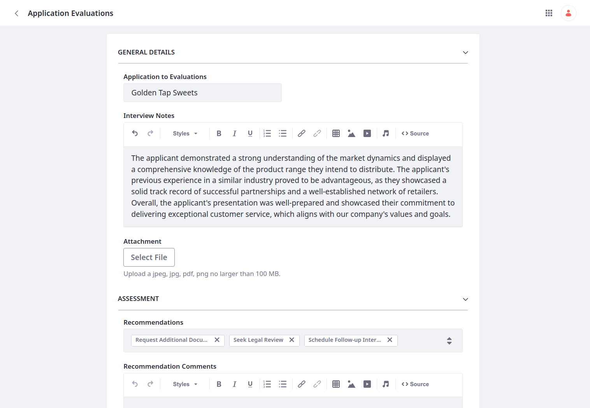
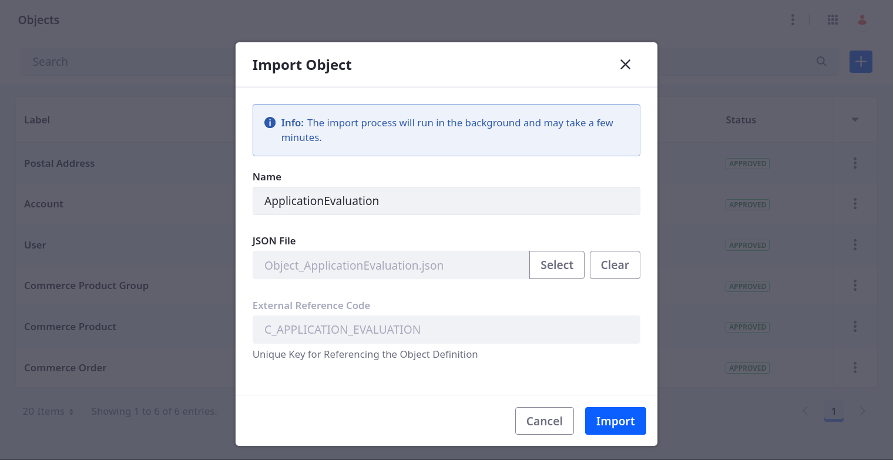
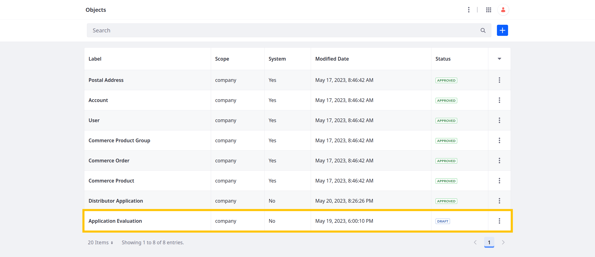

# Setting Up the Application Evaluation Object

Business development managers must consolidate assessments of prospective applicants. To achieve this, Delectable Bonsai team members created an Application Evaluation object in a separate environment. To migrate this object to the development environment, they exported it as a JSON file.

Here you'll import the Application Evaluation object into your Liferay instance. But first, create the object's picklists using the `headless-admin-list-type` REST APIs.

## Creating the Picklists

The Application Evaluation object requires these picklists: Assessment Scores, Recommendations, and Decisions.

1. Download and unzip the resources for [this exercise](./liferay-w1m9.zip):

   ```bash
   curl https://learn.liferay.com/courses/latest/en/application-development/modeling-data-structures/defining-relationships/setting-up-the-application-evaluation-object/liferay-w1m9.zip -O
   ```

   ```bash
   unzip liferay-w1m9.zip
   ```

1. Navigate to the `curl` folder in the `liferay-w1m9` folder:

   ```bash
   cd liferay-w1m9/curl
   ```

1. Run this command to create three picklists for the Application Evaluation object:

   ```bash
   ./ListTypeDefinition_POST_ToInstance.sh
   ```

1. Verify the picklists appear.

   

With the picklists in place, you can import the Application Evaluation object.

## Importing the Application Evaluation Object

1. Download the Application Evaluation JSON file:

   ```bash
   curl https://learn.liferay.com/courses/latest/en/application-development/modeling-data-structures/defining-relationships/setting-up-the-application-evaluation-object/Object_ApplicationEvaluation.json -O
   ```

   This file includes the object's basic schema, including general configurations and custom fields.

1. Open the *Global Menu* (  ), go to the *Control Panel* tab, and click *Objects*.

1. Click *Actions* (  ) in the Application Bar and select *Import*.

1. Enter these details and click *Import*

   | Field | Value |
   | :--- | :--- |
   | Name | `ApplicationEvaluation` |
   | JSON File | `Object_ApplicationEvaluation.json` |

   

1. Begin editing the object definition.

   

1. Verify the object includes these custom fields:

   * Business Name
   * Assessment Score
   * Attachment
   * Decision
   * Interview Notes
   * Recommendation Comments
   * Recommendations

   

1. Go to the *Details* tab.

1. Click *Publish*.

Great! Delectable Bonsai can use this object to store notes on prospective distributors.

Now you can define a relationship between the Distributor Application and Application Evaluation objects so you can link their entries.

Next: [Adding a Relationship Between the Object Definitions](./adding-a-relationship-between-the-object-definitions.md)
