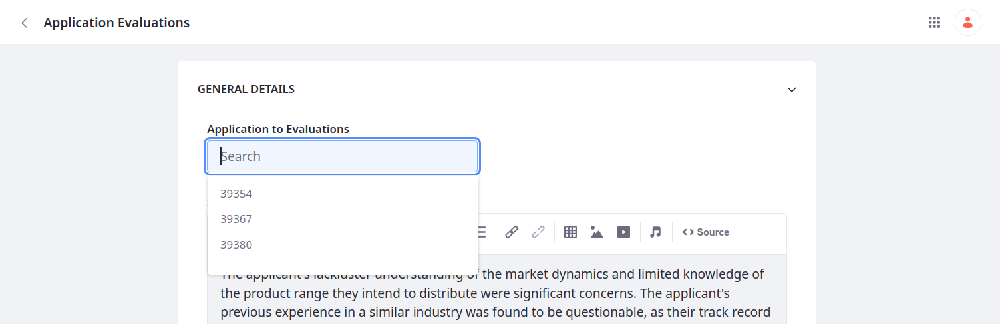
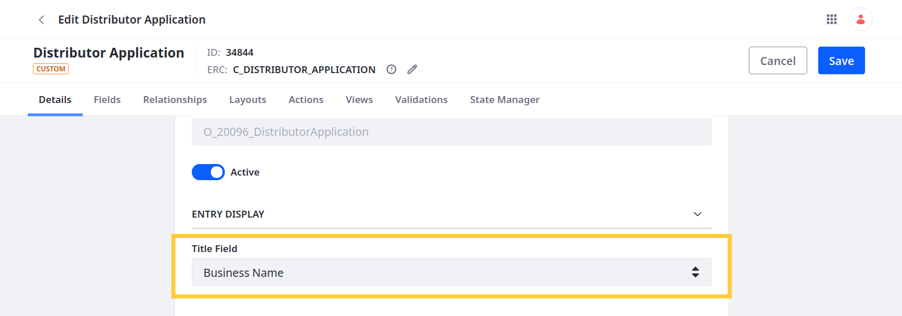
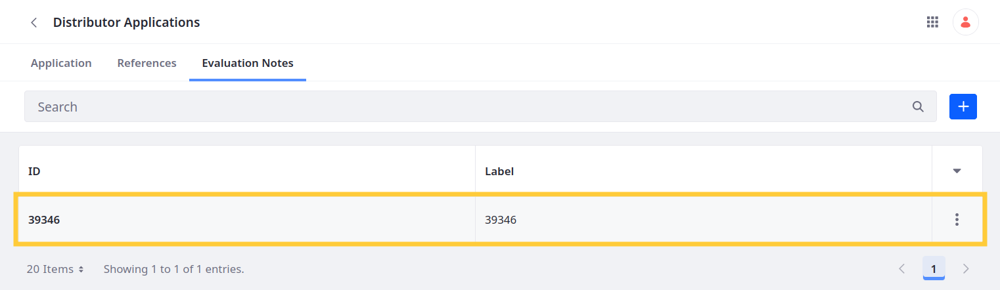

# Relating Object Entries

After defining an object relationship, you can relate entries in two ways: the Liferay UI or relationship REST APIs. Here you'll practice relating evaluations and applications via the UI.

## Adding Test Data

1. Download and unzip the resources for [this exercise](./liferay-g2n9.zip):

   ```bash
   curl https://learn.liferay.com/courses/latest/en/application-development/modeling-data-structures/relating-object-entries/liferay-g2n9.zip -O
   ```

   ```bash
   unzip liferay-g2n9.zip
   ```

   This includes two scripts for creating application and evaluation entries.

1. Navigate to the `curl` folder in the `liferay-g2n9` folder:

   ```bash
   cd liferay-g2n9/curl
   ```

1. Run this command to create three entries for the Distributor Application object:

   ```bash
   ./DistributorApplication_POST_Batch.sh
   ```

1. Verify the entries appear in Distributor Applications:

   

1. Run this command to create three entries for the Application Evaluation object:

   ```bash
   ./ApplicationEvaluation_POST_Batch.sh
   ```

1. Verify the entries appear in Application Evaluations:

   

Now, relate these entries.

## Relating Entries

1. Begin editing an Application Evaluation entry.

1. Select a value for the Application to Evaluations field. Available options for the relationship field include all applications you have permission to view.

   

   By default, application entries are identified by their IDs.

1. Open Objects and begin editing the Distributor Application definition.

1. Set the Title Field to *Business Name* and click *Save*. This determines the field used to identify object entries in relationship fields.

   

1. Return to Application Evaluations and begin editing an entry.

1. Select a value for the Application to Evaluations field. Notice that applications are now identified using the business name field.

   

1. Open Distributor Applications and begin editing an entry.

1. Go to the *Evaluation Notes* tab.

1. Click *Add* () and select from existing application evaluations.

   

   The relationship table uses the ID and title field to identify each related evaluation.

   

1. Update the title field for the Application Evaluation definition to *Author*.

1. Return to Distributor Applications and notice that the relationship table now uses the ID and Author fields to identify related evaluations.

   

## Conclusion

Congratulations! You have successfully modeled the necessary data structures for Delectable Bonsai's distributor onboarding flow. Now you can start incorporating the business logic necessary for bringing your application to life, such as workflows, validations, notifications. You'll do this in the next module.

Module Two: [Implementing Business Logic](../implementing-business-logic.md)

## Relevant Concepts

* [Relationship REST APIs](https://learn.liferay.com/en/w/dxp/building-applications/objects/understanding-object-integrations/headless-framework-integration#relationship-rest-apis)
* [Using Relationship REST APIs](https://learn.liferay.com/en/w/dxp/building-applications/objects/objects-tutorials/using-apis/using-relationship-rest-apis)
