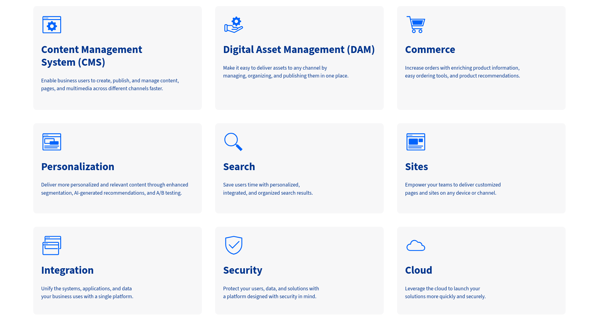

---
toc:
- ./building-enterprise-websites-with-liferay/module-1-getting-started-with-clarity.md
- ./building-enterprise-websites-with-liferay/module-2-deploying-liferay.md
- ./building-enterprise-websites-with-liferay/module-3-developer-setup.md
- ./building-enterprise-websites-with-liferay/module-4-security-and-identity-management.md
- ./building-enterprise-websites-with-liferay/module-5-site-building.md
- ./building-enterprise-websites-with-liferay/module-6-content-authoring-and-management.md
- ./building-enterprise-websites-with-liferay/module-7-analytics-and-personalization.md
- ./building-enterprise-websites-with-liferay/module-8-headless-apis.md
- ./building-enterprise-websites-with-liferay/module-9-search.md
- ./building-enterprise-websites-with-liferay/module-10-customizing-liferay-dxp.md
- ./building-enterprise-websites-with-liferay/conclusion.md
uuid: 28bfc1dd-8a55-4377-aa3a-e5fdd9da55fb
---
# Building Enterprise Websites with Liferay

In today's digital market, businesses need to provide users with engaging, personalized online experiences that distinguish their brand and drive conversions. However, web design systems can be overly complex and require extensive technical knowledge to implement designs and custom solutions. Furthermore, without a unified platform, tools and systems can quickly proliferate, leading to data silos, security vulnerabilities, performance issues, and integration challenges.

Liferay DXP provides a comprehensive environment for business teams and developers to efficiently build enterprise websites at scale. With low-code capabilities and a user-friendly editor, Liferay's flexible platform simplifies and optimizes site development. You can also leverage Liferay to unify your technical infrastructure and enable seamless integration with existing systems.

<!--TASK: Replace temp img.-->

In this course you’ll learn how to build enterprise websites with Liferay following best practices. While this course primarily focuses on the needs of Enterprise Websites, many of the following capabilities and use cases also apply to other solutions. Programming knowledge is not needed, but an understanding of HTML, CSS, Javascript, and templating languages like FreeMarker would be helpful.

This course provides the knowledge needed to

* Plan and implement Enterprise Websites with Liferay DXP

* Map design and business requirements to Liferay features and capabilities

* Leverage out-of-the-box features to ease maintenance and shorten time to market

* Compare feature options, understand their benefits, and decide when to use them

* Identify when and how to extend Liferay beyond out-of-the-box features

* Use Liferay provided resources to find answers and learn more

Given the breadth and depth of Liferay features and configurations, it is impossible to cover every detail necessary for building a production ready website. However, this course will equip you with the knowledge and skills necessary to tackle real-world problems and create solutions with Liferay.

To bridge the gap between theory and practice, this course will lead you through building an enterprise marketing website for a fictional company, Clarity Vision Solutions. Before diving into the technical aspects of Liferay DXP, we'll introduce Clarity and outline what you'll be building. <!--TASK: improve rigid transition-->

Up First: [Module 1: Getting Started with Clarity](./building-enterprise-websites-with-liferay/module-1-getting-started-with-clarity.md)
