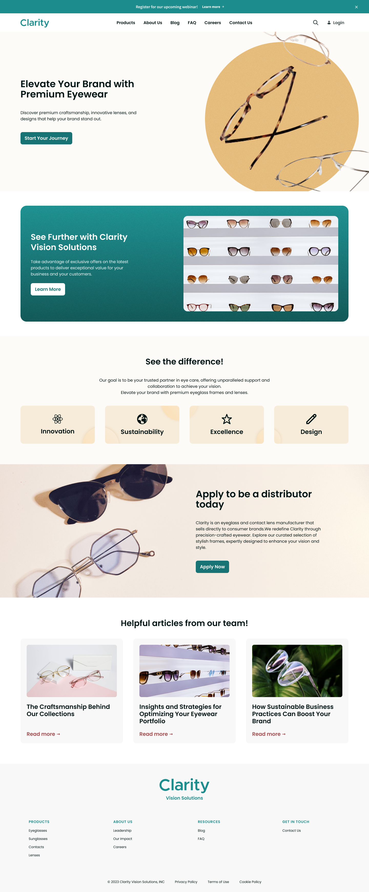

# Building Clarity on Liferay
<!--TASK: Confirm that abstract works on learn-->
!!! abstract
    In this course you'll build an enterprise marketing website for Clarity following both business and IT personas.

Throughout this course, we will build an enterprise marketing website for Clarity Vision Solutions. This site is designed to increase brand awareness, showcase their products, and convert visitors to customers.

Here we'll review the site's designs and the personas we'll follow throughout our journey.

## Enterprise Website Designs

Clarity's website development team has produced this site map for their initiative:

This provides a blueprint for Clarity's website. Each page plays a specific role, from showcasing innovative products (e.g., Products) to highlighting the company's core values (e.g., About Us).

To help us transform this blueprint into a vibrant and engaging online experience, Clarity's design team has produced these mockups for each page in Figma. Before moving on to the next module, take some time to look over these designs and get an idea of what you'll be building.

<!-- TASK: Add EMBED -->

## Clarity Personas

While building this solution, we'll follow these Clarity personas as they contribute according to their various roles:

### IT Personas

**IT Manager**: Ensures efficient operation of IT infrastructure, aligning technology strategy with organizational goals.

**Web Developer**: Designs, builds, and maintains Clarity's website, ensuring functionality, security, and performance.

### Business Personas

**Marketing Content Manager**: Develops and executes content strategies to attract and engage visitors, driving brand awareness and conversions.

**Marketing Content Contributor**: Creates high-quality content like blog posts and product descriptions, supporting marketing initiatives.

**HR Content Contributor**: Develops and maintains career page content and job descriptions, attracting and informing potential candidates.

## Conclusion

Congratulations! You've completed Module 1 - Getting Started with Clarity.

Now that we've learn about Clarity and how Liferay can help them overcome their obstacles, let's move on to the next module!

Up Next: [Module 2 - Developer Setup](../module-2-developer-setup.md)
