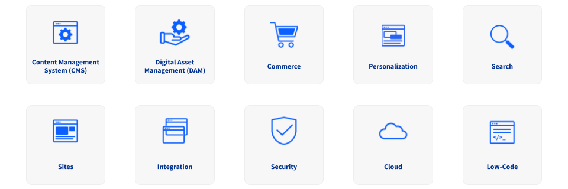

# The Liferay Solution

!!! abstract
    Liferay can centralize and simplify Clarity's IT infrastructure and empower business team members so they can deliver on their critical success factors.

Liferay DXP provides a complete enterprise-grade platform for building integrated and engaging websites at scale. With it, Clarity can unify their complex technical infrastructure, integrate their systems, and empower non-technical team members. This can help reduce costs and improve time-to-market. <!--ALT: Liferay DXP has many core capabilities that will make it easier for Clarity to create and maintain effective solutions while reducing costs. When paired with Liferay's enterprise-grade cloud infrastructure, Clarity can centralize and simplify their systems to empower their teams.-->

Here we'll briefly explore some of Liferay's core capabilities that can help Clarity deliver on their critical success factors.

## Content Management System (CMS)

Liferay's user-friendly CMS empowers Clarity's business users to create, publish, and manage content, pages, and multimedia across different channels faster. With it, Clarity can streamline their content lifecycle management, improve website maintenance, and enable agile responses to market shifts. By avoiding the obstacles of complex design interfaces, Clarity can better achieve widespread adoption of Liferay across their departments.

<!--TASK: Insert img  -->

## Digital Asset Management (DAM)

With Liferay's DAM features, Clarity can break down silos and centralize asset management. This can help boost team productivity, ensure seamless delivery of assets, and maintain consistency across their sites.

<!--TASK: Insert img  -->

## Commerce

Liferay provides Clarity with robust product management features for maintaining detailed product information. And since Commerce is integrated with Liferay's asset and site design features, Clarity can quickly showcase up-to-date product information across their websites.

<!--TASK: Insert img  -->

## Personalization

Clarity can deliver more personalized and relevant content to users by leveraging Liferay's enhanced segmentation, AI-generated recommendations, and A/B testing. By personalizing content and pages based on user attributes, behaviors, and preferences, Clarity can build deeper connections with their audiences.

<!--TASK: Insert img  -->

## Search

Liferay's faceted and federated search capabilities can help Clarity's users find the information they need faster. Clarity can also prioritize search results based on relevance and ranking, using factors like keyword match, popularity, recency, and user behavior.

<!--TASK: Insert img  -->

## Sites

Using Liferay's visual page editor, Clarity's business teams can compose and preview web pages without coding. Additionally, with flexible features like reusable page fragments, style books, and versioning, Clarity's websites can maintain a cohesive brand identity while adapting and growing alongside their business. To better engage their global audiences, they can also localize experiences and use Liferay's native analytics tools to track and measure content and page performance. Liferay's page audit tool can also help Clarity ensure their pages are optimized for search engine indexing, visibility, and accessibility. <!--ADD? "Clarity can also improve their SEO, maintaining URL integrity and customizing metadata and tags."-->

<!--TASK: Insert img  -->

## Integration

Liferay can consolidate and unify Clarity's systems, applications, and data in a single platform. This eliminates silos, simplifies data flow, and streamlines operations. With Liferay's integration features, Clarity can gain a holistic view of their business and better focus on strategic initiatives.

<!--TASK: Insert img  -->

## Security

With Liferay's robust user identity management, granular access controls, and more, Clarity can ensure that only the right users can access their data and tools. This can help Clarity minimize vulnerabilities, reduce the risk of data breaches, and comply with global data protection regulations. <!--ADD? multi-factor authentication, Lightweight Directory Access Protocol (LDAP), data sanitation-->

<!--TASK: Insert img  -->

## Cloud

Liferay offers a complete, enterprise-grade cloud infrastructure for optimizing Liferay DXP environments. With it, Clarity can simplify their IT infrastructure and administration while ensuring consistent performance and uptime. <!--MENTION? accommodate increased traffic, data, and functionality at scale. --> Also, Liferay's cloud infrastructure is secure by design, adhering to industry best practices and holding leading security certifications.

<!--TASK: Insert img  -->

## Low-Code

Liferay's low-code capabilities and extensions empower Clarity to adapt the platform to their needs without incurring the overhead that usually comes with custom applications. Clarity can define data structures, implement business logic, and design intuitive user interfaces without needing to write a single line of code.

<!--TASK: Insert img  -->

## Conclusion

Liferay DXP's core capabilities make it easier for Clarity to create and maintain effective solutions while reducing costs. When paired with Liferay's enterprise-grade cloud infrastructure, Clarity can centralize and simplify their systems to empower their teams.

Now that you've learned about how Liferay can help Clarity deliver on their critical success factors and overcome their obstacles, let's explore the enterprise website you'll be building throughout this course.

Next Up: [Building Clarity on Liferay](./building-clarity-on-liferay.md)
