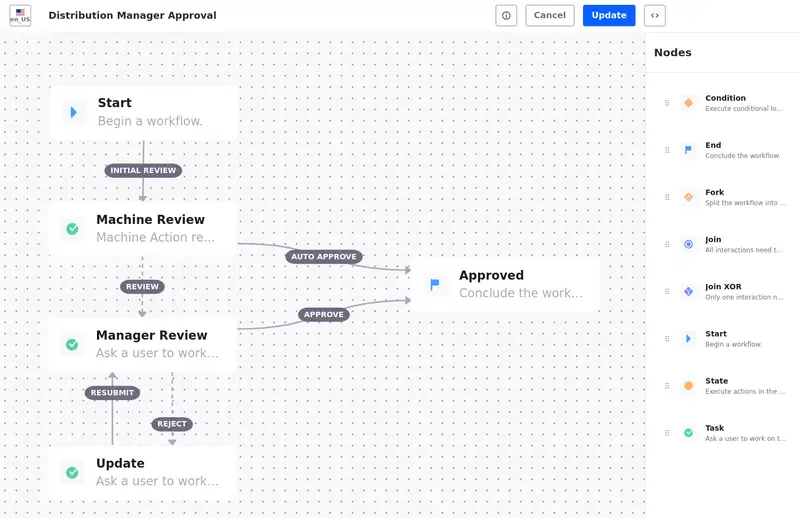

# Building Custom Solutions with Objects

<!--TASK: Fix image numbering-->

Objects are the foundation of building low-code solutions with Liferay. With objects, you can model data structures and implement business logic for those structures without writing a single line of code. When created, each object fully integrates with Liferay's core frameworks to create a unified experience across the platform. This means you can leverage Liferay's out-of-the-box capabilities like workflows, notifications, permissions, Headless APIs, and data mapping with objects, so that your custom solutions feel native to the Liferay experience. Objects not only reduce development time and effort significantly, but also empower non-technical business users to actively participate in the development process. Furthermore, because objects also work hand-in-hand with client extensions, you don't sacrifice any of the flexibility that you expect in a modern developer tool.

<!--[TODO: Update with Design ticket] IMAGE: Diagram showing how Objects fit into the Liferay ecosystem and integrate with the various core frameworks -- headless APIs, Job Scheduler, Workflows, Forms, etc. -->

In this article, we discuss best practices for working with Liferay Objects, first for modeling data structures and then for implementing business logic, in the context of Clarity's custom solution for onboarding distributors. You will apply these concepts later on as you complete exercises for setting up the distributor solution.

## Modeling Data Structures

The first step in building a custom solution is to model its data structures. This requires some brainstorming about the types of data entities you want to store, as well as their attributes and relationships.

### Identifying Data Entities

Clarity must store and manage two types of data entities for their distributor onboarding flow:

* Applications submitted by prospective distributors (Distributor Applications)
* Internal evaluations of these applications (Application Evaluations)

You can model each of these data entities as *object definitions*. An object definition is a blueprint that defines the structure and properties of the data stored by your solution. Each object definition includes a standard set of system fields along with configuration options for modifying general details, behavior, data scope, and available actions. Once you publish an object definition, Liferay creates a database table for storing the definition's *entries*.

!!! note "Object Definition vs. Object Entry"
    Object definitions specify types of data entities, while object entries are instances of those data entities.

After determining the types of entities required for their solution, Clarity can start adding attributes to the object definitions.

### Adding Attributes

Attributes represent database columns storing specific data types for object definitions (e.g., text, numbers, and files). You define attributes by adding [fields](https://learn.liferay.com/en/w/dxp/building-applications/objects/creating-and-managing-objects/fields) to an object. Additionally, you can create [picklists](https://learn.liferay.com/w/dxp/liferay-development/objects/picklists) and use them with objects to provide users with predefined single-select and multi-select fields.

<!--TASK: Introduce picklists.-->

For Clarity's use case, each Distributor Application entry should store the necessary business information for verifying each applicant's identity and credit for Know Your Customer (KYC) best practices and compliance with Anti-Money Laundering (AML) laws. As such, the Distributor Application object contains fields for collecting both applicant information (e.g., name and phone number) and business details (e.g., license and proof of insurance). Additionally, Clarity wants to assess the relative value of each prospective distributor. So they've added picklist fields to collect the following information:

* Annual Purchase Volume
* Business Type
* Distribution Channels
* Distribution Regions
* Order Types
* Product Labels
* Product Types

The second object needed for this use case is the Application Evaluation. Clarity employees would use this object to evaluate incoming distributor applications, so it should store notes and recommendations made during the review process. The Application Evaluation object definition contains the following custom fields:

* Assessment Score (picklist)
* Attachment (file)
* Business Name (text)
* Decision (picklist)
* Interview Notes (text)
* Recommendations (picklist)
* Recommendation Comments (text)

<!--TASK: Maybe reevaluate how this information is presented. It feels strange to list only the picklists for distributor application while listing all of the fields for the application evaluation object.-->

### Defining Relationships

Defining relationships between your data models ensures that they represent real-world entities accurately. Relationships determine how data is connected in your solution and capture entity interactions and dependencies. You can define one-to-many and many-to-many relationships between object definitions in Liferay. These relationships add fields or tables to each object so that you can access entry data in different object contexts.

One-to-many relationships enable users to relate a single entity of type A to multiple entities of type B. For example, if you were to model a university organization, the University object definition would have a one-to-many relationship with the Student object definition. Each university has multiple students, while each student only has one university.

On the other hand, many-to-many relationships enable users to relate multiple entities of type A to multiples entities of type B, and vice versa. In the university example, you could implement a many-to-many relationship between the Student object and the Professor object, because each student can have multiple professors and each professor can have multiple students.

For Clarity's solution, a single distributor application can have multiple evaluations related to it, but each evaluation can only relate to a single application. So they have added a one-to-many relationship between the Distributor Application (one) and Application Evaluation (many) objects.

<!--TODO: Image above should probably have multiple Application Evaluations to better visualize the one-to-many relationship-->

Once you've defined the relationship between object definitions, you can relate individual entries to one another through the Liferay UI or relationship REST APIs.

## Implementing Business Logic

Business logic refers to the rules and processes that determine how a solution behaves within Liferay DXP. Implementing business logic effectively can streamline operations, improve efficiency, and promote consistency across your organization. Here we'll explore how Clarity can leverage Liferay's features to add business logic to their distributor onboarding solution.

### Validating Fields

Data integrity is crucial for effective business operations. With Liferay, you can set object validations to enforce rules on user input to prevent errors and ensure your application is collecting the data you want. This minimizes the need for manual corrections and makes your data more consistent and reliable (e.g., valid email formats and phone number patterns).

When using validations, you can select from out-of-the-box options or define your own through the UI. For advanced use cases, you can also use the Object Validation Rule client extension. Once defined, Liferay checks field values on entry submission and displays an error message for invalid input.

<!--TASK:  -->

### Managing Data Access

Managing access to data with account membership and role permissions is critical for data privacy and security. Since Liferay Objects are integrated with the permissions framework, you can use roles and permissions to manage access to Distributor Applications and Application Evaluations. This helps Clarity ensure that only authenticated users can submit applications and a limited number of employees can review submissions.

<!--TASK:  -->

User roles do not come with objects permissions by default, so you must manually grant access to objects and their entries. When you deploy Clarity's distributor onboarding solution in a later exercise, you will also assign the appropriate permissions to the business role for reviewing applications.

### Defining Workflows

Workflows are approval processes for data entities in your solution. You can create custom workflows to improve task visibility, eliminate bottlenecks in business processes, and reduce the time and resources required to complete tasks.

In addition to workflows, you can use picklists to define custom state fields with their own flow. This is helpful when you need to assign multiple states to an object entry at the same time. For example, Clarity wants to track the evaluation state of applications independently from their workflow status. To implement this, Clarity leveraged Liferay picklists with objects to define custom states for entries. They then defined a flow for valid state field transitions in the *State Manager* tab.

| Current State | Next State                           |
|---------------|--------------------------------------|
| Open          | Under Review, Withdrawn              |
| Under Review  | Approved, Denied, Withdrawn, On Hold |
| Approved      | Under Review                         |
| Denied        | Under Review                         |
| Withdrawn     | Open                                 |
| On Hold       | Open, Under Review                   |

After setting this up, Clarity can use the field with validations and actions to add business logic for different states. They also can use the field alongside workflow statuses to define more complex review and approval processes. In a later exercise, you'll finish setting up Clarity's workflow for Distributor Applications.

### Automating Notifications

Notifications improve visibility in your application by providing real-time updates to users and system administrators for object events. This involves creating notification templates and then using those templates with object actions. The template provides the notification content and design, while the object action determines the trigger and conditions for sending the notification (e.g., at object creation, at object update).

<!--TASK: -->

Currently, Clarity's onboarding solution includes three automated notifications that inform applicants when their applications are received, approved, or rejected. In a later exercise, you'll add another notification for informing Clarity's business development team of new submissions.

## Conclusion

Congratulations! You've learned about best practices for modeling data structures and implementing business logic with Liferay Objects. Now you can apply this knowledge by completing some exercises for Clarity's custom distributor solution.

Next Up: [Setting Up Clarity's Distributor Solution](./setting-up-claritys-distributor-solution.md)

## Additional Resources

* [Objects](https://learn.liferay.com/w/dxp/liferay-development/objects)
* [Picklists](https://learn.liferay.com/w/dxp/liferay-development/objects/picklists)
* [Liferay Workspace](https://learn.liferay.com/web/guest/w/dxp/building-applications/tooling/liferay-workspace)
* [Client Extensions](https://learn.liferay.com/w/dxp/liferay-development/building-applications/client-extensions)
* [Deploying Client Extensions](https://learn.liferay.com/w/dxp/building-applications/client-extensions/working-with-client-extensions#deploying-to-your-liferay-instance)
