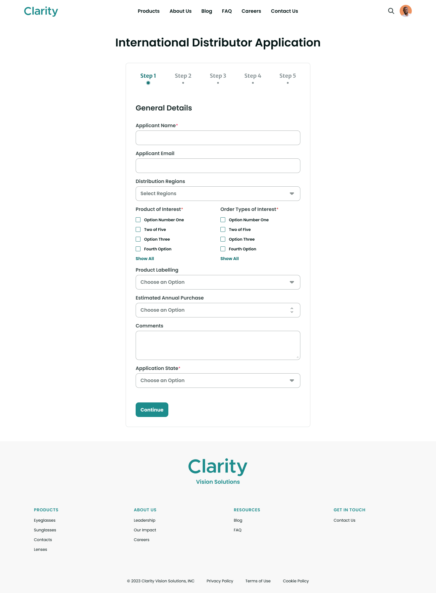
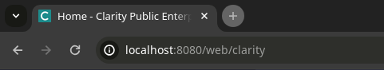
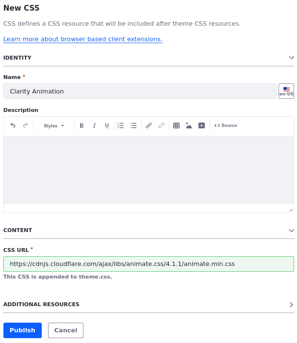
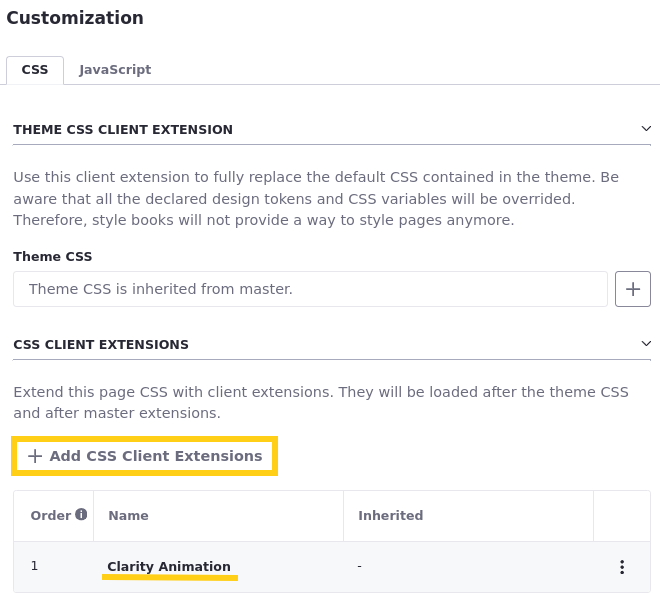
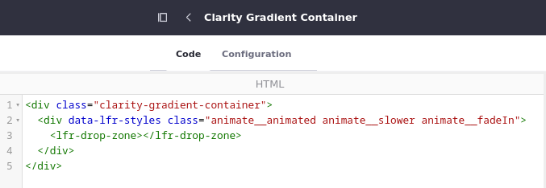
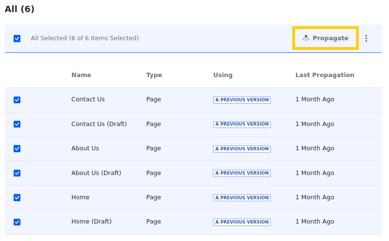

# Customizing Clarity's Front End

<!--TASK: Create a separate conceptual article for Client Extensions-->

In Module 3, we introduced client extensions in the context of your developer setup with Liferay. Here, we recap the traits that make client extensions so powerful and then guide you through exercises where you will apply client extensions in a custom solution for Clarity.

Client extensions have transformed Liferay customization. Unlike OSGi plugins, their predecessors, which were woven into the Liferay portal fabric, client extensions operate independently, interacting with the platform via well-defined APIs. This decoupling ensures that custom solutions remain intact even as the platform undergoes updates, significantly reducing maintenance overhead. On the other hand, a buggy or broken client extension won't disrupt Liferay's core out-of-the-box functionality. 

Because client extensions are both language and framework agnostic, they free developers from the constraints of Liferay's technology stack and accelerate the development cycle. Client extensions can be deployed across various Liferay environments, from SaaS to PaaS to self-hosted, without requiring significant modifications. 

Beyond development efficiency, client extensions contribute to improved application performance and scalability. By selectively applying extensions to specific pages or components, organizations can optimize resource utilization and enhance user experience. Client extensions make customization more agile, adaptable, and future-proof. Their ability to coexist with out-of-the-box features solidifies client extensions as the preferred method for building custom solutions with Liferay.

There are four types of client extensions you can implement with Liferay:

- Frontend client extensions provide resources that affect Liferay's presentation layer.
- Batch client extensions provide data entities to your Liferay instance via headless batch endpoints.
- Microservice client extensions are external applications that execute actions triggered by events in your Liferay instance.
- Configuration client extensions configure settings for your Liferay instance.

In this article, you will work with several frontend client extensions that customize Clarity's appearance. Later in this module, you will use batch and microservice client extensions to set up a custom solution for Clarity.

## Exercise: Modifying a Theme Client Extension
<!--Exercise 20a-->

Client Extensions separate customizations from the Liferay core. This helps simplify updates while freeing you to use your desired technologies and deployment models. As seen previously, the theme CSS client extension provides a way to override the current theme's CSS files. Here you'll update the client extension provided in the training workspace and deploy your changes as Walter Douglas.

To do this,

1. Sign in as Walter Douglas.

   * Email: `walter.douglas@clarityvisionsolutions.com`
   * Password: `learn`

1. In the Clarity Public Enterprise Website, go to the Home page.

   Note that Clarity's "See the Difference" banner uses a beige background (i.e., `#FCFBF8`). Let's make a change to Clarity's theme CSS client extension to update it.

   

1. Navigate to the `[repository-folder]/exercises/lesson-20/` folder, open the `layout-background-color.scss` file, and copy its contents.

   This file contains styling for overwriting the background color for the `.lfr-layout-structure-item-container` CSS class.

1. Navigate to the `[repository-folder]/client-extensions/liferay-clarity-theme-css` folder, open the `src/css/_custom.scss` file, paste the copied CSS style into it, and save your changes.

1. Open a new terminal window, navigate to the `[repository-folder]/client-extensions/liferay-clarity-theme-css` folder, and run this command to build and deploy the theme client extension:

   ```bash
   blade gw clean deploy
   ```

   Or use Gradle Wrapper:

   ```bash
   ../../gradlew clean deploy
   ```

1. Verify the command executes successfully.

1. If necessary, log out of the Clarity portal. It may also be necessary to clear the cache in the browser if this change is not reflected automatically.

1. Verify the background of the container is now gray:

   

   **Tip**: When making changes to theme CSS values, you may need to clear your browser's cache to see your changes.

1. Now that you have seen how you can modify CSS styles using a theme client extension, remove the styling change just made from the `_custom.scss` file.

Next you'll learn how to use client extensions to update the site's favicon.

## Exercise: Deploying a Client Extension for Favicon
<!--Exercise 20b-->

In a previous exercise, you set the site favicon manually via the Liferay UI. With client extensions, you can streamline updates to your site by deploying the favicon along with your other frontend client extensions. Here you'll use a client extension to update Clarity's favicon as Walter Douglas.

To do this,

1. Open a new terminal window and go to the `liferay-clarity-theme-favicon` folder in your local copy of the training workspace (i.e., `enablement-bootcamp-clarity/client-extensions/liferay-clarity-theme-favicon`)

1. Run this command to build and deploy the client extension:

   ```bash
   blade gw clean deploy
   ```

   Or use Gradle Wrapper:

   ```bash
   ../../gradlew clean deploy
   ```

1. Verify the command executes successfully.

1. Open the *Site Menu* (), expand *Site Builder*, and select *Pages*.

1. Click *Actions* () in the Application Bar and select *Configuration*.

1. In the Design tab, click *Select Favicon* ().

1. In the modal window, go to the *Client Extension* tab and select *Liferay Clarity Theme Favicon*.

1. Click *Save*.

1. Go to the Home page and verify the page's favicon was updated.

   

## Exercise: Creating a New CSS Client Extension
<!--Exercise 20c-->

Liferay provides the CSS client extension for adding a single CSS resource to site pages. Here you'll create one of these client extensions using an external cdnjs URL as Walter Douglas user.

To do this,

1. Open the *Global Menu* (), go to the  *Applications* tab, and click *Client Extensions*.

1. Click *Add* () and select *Add CSS*.

1. For name, enter `Clarity Animation`.

1. For CSS URL, enter `https://cdnjs.cloudflare.com/ajax/libs/animate.css/4.1.1/animate.min.css`.

   

1. Click *Publish*.

1. Go to the *Home* page in the Clarity Public Enterprise Website.

1. Click *Configure Page* () and select the *Design* tab.

1. Scroll down and click *Add CSS Client Extensions*.

1. Choose *Clarity Animation* and click *Add*.

   

1. Scroll down and click *Save*.

   This saves the page as a draft. For the changes to take effect, you must publish the page.

1. Return to the Home page, click *Edit* (), and click *Publish*.

1. Open the *Site Menu* (), expand *Design*, and click *Fragments*.

1. Under Fragment Sets, click *Clarity Components*.

1. Select the *Clarity Gradient Container* fragment to begin editing it.

1. In your file browser, navigate to the `[repository-folder]/exercises/lesson-20/` folder, open the `clarityanimation.html` file, and copy its content into the fragment's HTML field.

   This adds three CSS animation classes to the fragment from the from the `animate.css` library on [cdnjs](https://cdnjs.cloudflare.com/ajax/libs/animate.css/4.1.1/animate.min.css) (i.e., `animate__animated`, `animate__slower`, and `animate__fadeIn`).

   

1. Click *Publish*.

   Now that you've updated the fragment, you can propagate these changes to existing instances of the fragment in site pages.

1. Click *Actions* () for the Clarity Gradient Container fragment, and select *View Usages*.

1. Check all boxes and click *Propagate*.

   

   Now, all fragments used throughout the site are updated with the new CSS classes.

1. Go to the Home Page and confirm the animation works.

   The animation now plays every time you refresh or navigate to the Home page.

   

## Conclusion

Congratulations! You have modified, deployed, and created your own frontend client extensions to change Clarity's appearance. Next, we'll dive into objects and how you can use them together with client extensions to customize Liferay even further.

Next Up: [Building Custom Solutions with Objects](./building-custom-solutions-with-objects.md)