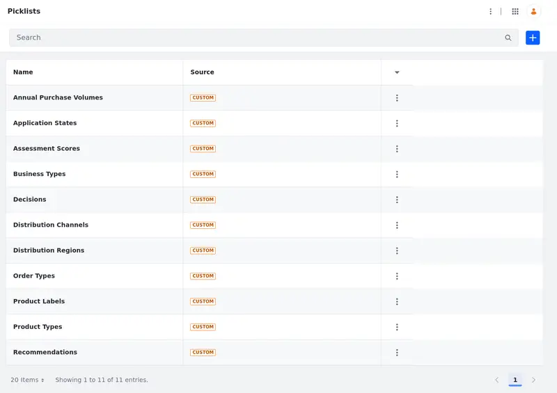
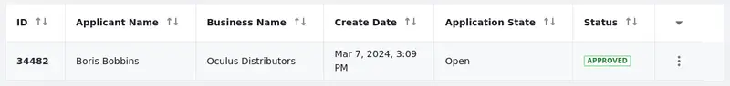
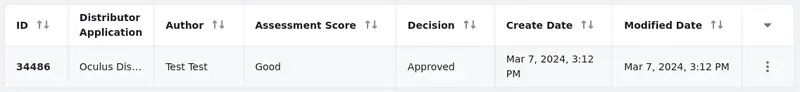

# Deploying the Application

The Distributor Application solution incorporates several Liferay features, such as [Objects](https://learn.liferay.com/w/dxp/building-applications/objects), [Picklists](https://learn.liferay.com/w/dxp/building-applications/objects/picklists), and [Workflows](https://learn.liferay.com/w/dxp/process-automation/workflow/). It also utilizes page builder features to [build dynamic and responsive user interfaces](https://learn.liferay.com/w/dxp/site-building/creating-pages), [design forms](https://learn.liferay.com/w/dxp/process-automation/forms/creating-and-managing-forms), [display object data](https://learn.liferay.com/w/dxp/building-applications/objects/displaying-object-entries), and more.

For the purpose of this course, we will deploy the application using [Client Extensions](https://learn.liferay.com/w/dxp/building-applications/client-extensions), which are stored in Clarity's prebuilt [Liferay Workspace](https://learn.liferay.com/web/guest/w/dxp/building-applications/tooling/liferay-workspace). Some portions of the application are already configured in the prebuilt solution; you will complete other parts yourself as you progress through this module.

In this article, you'll learn how to:

* Install and use Clarity's preconfigured Liferay Workspace.
* Build and deploy Client Extensions.
* Configure the solution in Liferay's UI.

## Downloading the Solution's Materials

Follow these steps to install the prebuilt Clarity workspace:

1. Download and unzip the workspace in a folder of your choice using these commands:

   ```bash
   curl <!-- TODO: Insert Nexus Clarity Workspace link for download -->
   ```

   ```bash
   unzip <!-- TODO: Insert zip file name -->
   ```

1. After extracting the workspace, go into the `client-extensions` folder.

   ```bash
   cd [workspace-root]/client-extensions/
   ```

1. Build the Client Extensions projects:

   ```bash
   ../gradlew clean build
   ```

The compiled `.zip` files are created in each project's `dist/` folder.<!--IMAGE: screenshot/example of directory--> Client Extensions are deployed by placing these archives in the correct location of your running Liferay instance.

## Deploying the Picklists

Picklists are predefined lists of string values that determine options in single-select and multiple-select fields. Clarity uses Picklists to collect information by making the distributor applicants select from predefined options.

The predefined picklists for Clarity's solution can be implemented by following these steps:

1. Go to the `liferay-clarity-picklists-batch` folder.

   ```bash
   cd liferay-clarity-picklists-batch/
   ```

Depending on which deployment option you're using for Liferay (SaaS or Self-Hosted only), the steps to deploy the Client Extension will be different.

### Deploying to Liferay SaaS

In order to deploy Client Extensions to your SaaS environment, you'll use the Liferay Cloud CLI tool you installed in [Module 2](../module-2-developer-setup/liferay-workspace.md#prerequisites).

!!! note
    The tool must be configured with Liferay Cloud Platform's remote URL (`liferay.cloud`). It also needs to be authenticated with your platform account. See [Configuring the CLI Remote](https://learn.liferay.com/en/w/liferay-cloud/reference/command-line-tool#configuring-the-cli-remote) for more information and run the `lcp login` command to authenticate the tool.

1. Deploy the compiled Client Extension file in the project's `dist/` folder with this command:

   ```bash
   lcp deploy --ext [path-to-zip-file]
   ```

1. When prompted, choose the project environment where the extension will be deployed.

   

1. After the deployment finishes, open the [Cloud Console](https://console.liferay.cloud/) and go into the chosen project environment's Services menu. Make sure the `liferayclaritypicklistsbatch`'s service status shows `ready`.

1. Finally, go into your Liferay instance, go to _Global Menu_ () &rarr; _Control Panel_ &rarr; _Picklists_. Once the menu opens, confirm that all picklists display.

   

### Deploying to Liferay Self-Hosted

If you self-host your Liferay installation, copy the `.zip` file from the project's `dist/` into the server's `[Liferay Home]/osgi/client-extensions/` folder.

You can check your console for the following message to confirm the bundle was deployed successfully:

```log
2024-03-05 19:49:09.667 INFO  [fileinstall-directory-watcher][BundleStartStopLogger:68] STARTED liferayclaritypicklistsbatch_7.4.13 [1526]
```

After the server finishes processing the Client Extension, go into your Liferay instance, navigate to _Global Menu_ () &rarr; _Control Panel_ &rarr; _Picklists_. Once the menu opens, all picklists should appear.

## Deploying the Objects

### Exercise 1

The prebuilt solution uses two Liferay objects, the Distributor Application object and the Application Evaluation object. You will learn more about these objects and how they are configured in the following sections. For now, we'll just deploy them to your Liferay instance with the same method you used to deploy the picklists.

Go to the `liferay-clarity-objects-batch/` directory and repeat the steps from the [previous section](#deploying-the-picklists).

### Bonus Exercise

If you completed Exercise 1 successfully, you can now interact with the deployed objects. Let's create and review a Distributor Application entry.

1. Navigate to _Global Menu_ () &rarr; _Control Panel_. Notice that two new options appear under Object: Application Evaluations and Distributor Applications.

   

1. Open _Distributor Applications_.

1. Click _Add_ () to create a new Distributor Application entry.

1. Fill out the form with any information, then click _Save_.

1. Return to the Distributor Applications menu and check your created entry.

   

Now that you've created an entry for the Distributor Applications object, you can check how the review process works.

1. Go to _Global Menu_ () &rarr; _Control Panel_ &rarr; _Application Evaluations_.

1. Click _Add_ () to create a new Application Evaluation entry.

1. In the Application to Evaluations field, select the application entry's Business Name to relate this evaluation to it.

1. Fill out the review form as you prefer, then click _Save_.

1. Return to the Application Evaluations menu and check the created review entry.

   

An evaluation entry is automatically assigned to the application. You can confirm this relationship between them by navigating to _Global Menu_ () &rarr; _Control Panel_ &rarr; _Distributor Applications_, selecting an entry, and going to the _Evaluation Notes_ tab.

   

Now that you've deployed the main parts of the solution, let's move on. The following sections will guide you through the features of the solution and some of the decisions Clarity had to make in designing it.

Up Next: [Modeling Data Structures](./modeling-data-structures.md)

## Additional Resources

* [Objects](https://learn.liferay.com/en/w/dxp/building-applications/objects)
* [Picklists](https://learn.liferay.com/w/dxp/building-applications/objects/picklists)
* [Liferay Workspace](https://learn.liferay.com/web/guest/w/dxp/building-applications/tooling/liferay-workspace)
* [Client Extensions](https://learn.liferay.com/w/dxp/building-applications/client-extensions)
* [Deploying Client Extensions](https://learn.liferay.com/w/dxp/building-applications/client-extensions/working-with-client-extensions#deploying-to-your-liferay-instance)
