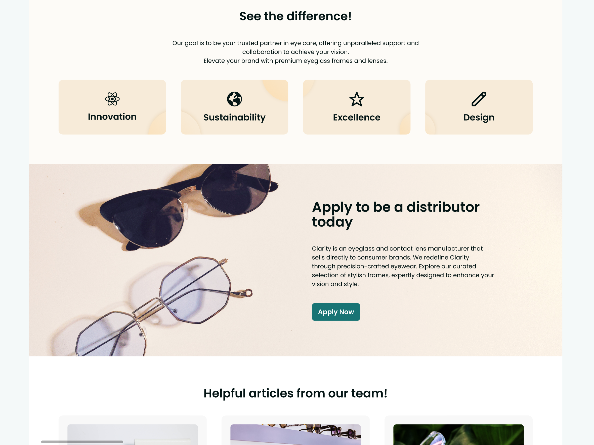
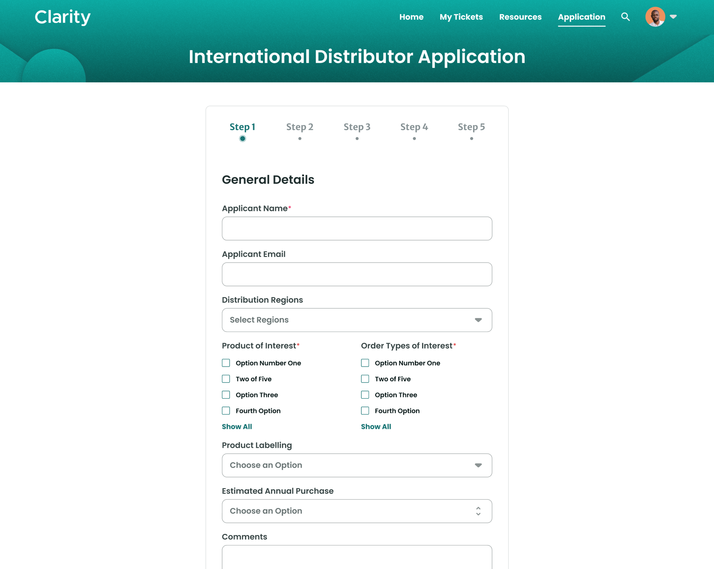
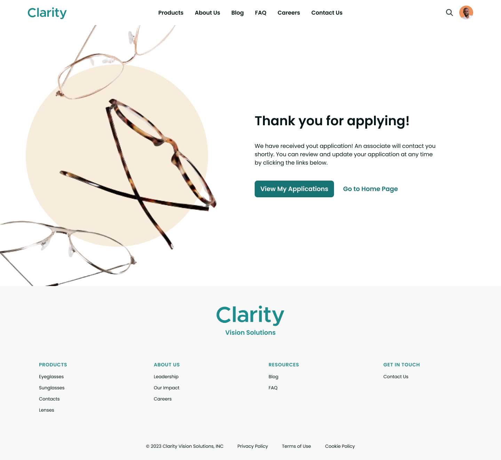
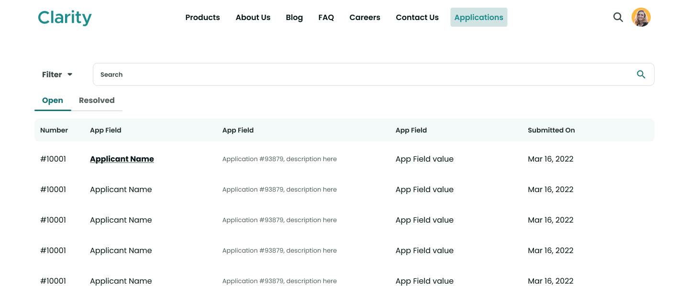

# Designing User Interfaces

Liferay gives you the tools for creating dynamic and responsive user interfaces for your custom applications. You can use page builder features like fragments and widgets in site pages to design forms, display object data, and more. In this way, you can create a seamless site experience for your users.

Originally, Clarity's distributor application solution used standard object layouts and views. While these are serviceable for administrative users, they have limited customization options. Since Clarity wants to integrate the application with their enterprise marketing website, they have used the tools above to design these custom pages:

## Start Application Page

## Application Submission Page

## Success Page

## Application Overview Page

## Application Details Page

While the distributor application previously existed as a separate entity, these new pages unify the application with the rest of the Clarity experience.

This concludes *Module 10: Building Applications*.