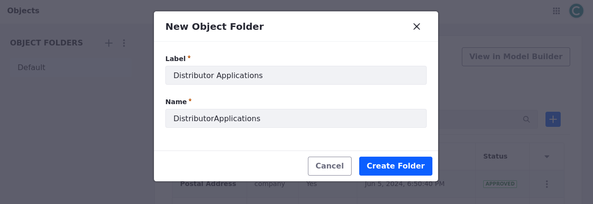
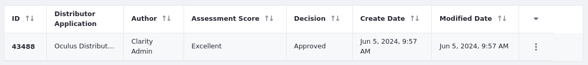
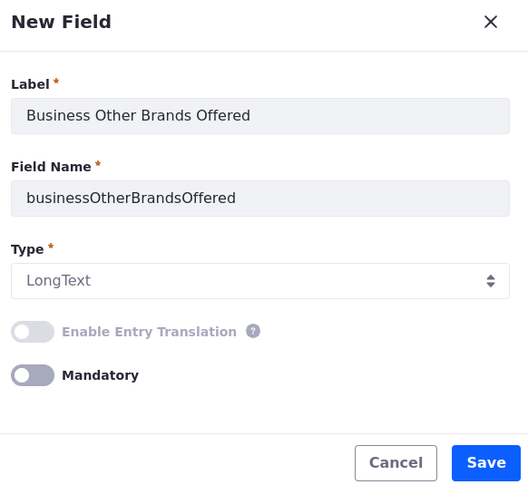
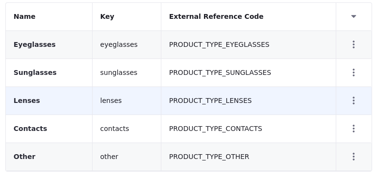

# Setting Up Clarity's Distributor Solution

Clarity's development team has been working on implementing their distributor onboarding solution. In addition to using objects and client extensions, they have also leveraged page builder features to design a dynamic, responsive user interface for their custom application. 

While most parts of the solution are complete, some features remain unfinished. In the following exercises, you will

* Set up and deploy the pre-built solution with a batch client extension.
* Test the solution by creating Distributor Application and Application Evaluation entries.
* Add additional fields and picklist items to the Distributor Application object.
* Assign the appropriate permissions to the Distributor Application object.

These exercises demonstrate the powerful functionality and granular control you can achieve by using objects and client extensions together.

## Exercise: Setting Up and Deploying the Distributor Application
<!--Exercise 20d-->

The training workspace includes a batch client extension for quickly setting up two object definitions and their related picklists. The specific process for deploying client extensions depends on your Liferay hosting model (i.e., Self-Hosted, PaaS, or SaaS). However, in all cases, you must add the compiled `.zip` file to the Liferay server's `[Liferay Home]/osgi/client-extensions/` folder. Here you'll deploy the batch client extensions and explore what they include as the Clarity Admin user.

1. In your training workspace, go to the `[repository-root]/client-extensions/liferay-clarity-batch/` folder.

1. Run this command to build and deploy the client extension:

   ```bash
   blade gw clean deploy
   ```

   Or use Gradle Wrapper:

   ```bash
   ../../gradlew clean deploy
   ```

1. Verify the command executes successfully.

   Two new object definitions and their picklists were added to your Liferay instance. Let's explore them.

1. While logged in as the Clarity Admin user, open the *Global Menu* (), go to the *Control Panel* tab, and click *Picklists*.

   Picklists are predefined lists of items that you can use for single select and multi-select fields in object definitions. Here are picklists imported by the batch client extension:

   * D4B8 Annual Purchase Volumes
   * D4B8 Application States
   * D4B8 Assessment Scores
   * D4B8 Business Types
   * D4B8 Decisions
   * D4B8 Distribution Channels
   * D4B8 Distribution Regions
   * D4B8 Order Types
   * D4B8 Product Labels
   * D4B8 Product Types
   * D4B8 Recommendations

   

1. Open the *Global Menu* (), go to *Control Panel*, and click *Objects*.

   Here you'll see two new object definitions imported by the batch client extension:

   * D4B8 Distributor Application
   * D4B8 Application Evaluation

   

   As we're adding more object definitions, let's add a folder for organizing our objects and place the D4B8 objects into it.

1. Click *Add* () for Object Folders.

1. For label, enter `Distributor Applications`.

1. Click *Create Folder*.

   

1. Click *View in Model Builder*.

   The Objects Model Builder is a graphical interface that displays each object definition as a card and visualizes relationships between them. With it, you can create, manage, and extend data models in the Objects application and quickly configure definitions, fields, and relationships.

1. In the left side panel, click *Actions* () for D4B8 Distributor Application and select *Move to Current Folder*.

   

1. Repeat this step for D4B8 Application Evaluation.

1. Drag and and drop the cards to reposition them and better see their relationship.

## Exercise: Testing the Distributor Application
<!--Exercise 20e-->

In the following lessons, you'll learn more about these objects and how they're configured. Here you'll create and review a Distributor Application entry as the Clarity Admin user.

To do this,

1. Sign in as the Clarity Admin user.

   * Email: `admin@clarityvisionsolutions.com`
   * Password: `learn`

1. Open the *Global Menu* () and go to the *Control Panel* tab. Both D4B8 Application Evaluations and D4B8 Distributor Applications should appear in the Object category.

   

1. Open *D4B8 Distributor Applications*.

1. Click *Add* () to create an entry.

1. Fill out the required fields and click *Save*.

   **Note**: You must enter a business name. We'll use this value with client extensions in a later exercise.

1. Return to the Distributor Applications overview page and verify your entry appears in the table.

   

   Now you can create an evaluation for this entry.

1. Open the *Global Menu* (), go to the *Control Panel* tab, and click *D4B8 Application Evaluations*.

1. Click *Add D4B8 Application Evaluation* to create an evaluation for the application.

   <!--TASK: Why isn't this `*Add* ()`-->

1. In the Application to Evaluations field, select the application you created. It is identified by the Business Name field.

   <!--TASK: Update the definition to use the Business Name instead of the ID.-->

1. Fill out the evaluation form and click *Save*.

1. Return to the Application Evaluations overview page and verify the entry appears in the table.

   

   This evaluation is automatically related to the selected application. You can confirm these entries are related by returning to *Distributor Applications* overview page, selecting the application, and going to the *Evaluation Notes* tab.

   

## Exercise: Adding Fields to the Distributor Applications Object
<!--Exercise 20f-->

The Distributor Applications object already contains a bunch of custom fields, but Clarity needs one for applicants to list other brands they offer. Here you'll add a field to the Distributor Applications Object as the Clarity Admin user.

To do this,

1. Open the *Global Menu* (), go to the *Control Panel* tab, and click *Objects*.

1. Click the *Distributor Applications* folder.

1. Click *View in Model Builder*.

1. Look for the *D4B8 Distributor Application* object, click *Add Field or Relationship*, then select *Add Field*.

1. Enter these values and click *Save*:

   | Field                    | Value                         |
   |:-------------------------|:------------------------------|
   | Label                    | Business Other Brands Offered |
   | Field Name               | `businessOtherBrandsOffered`  |
   | Type                     | Long Text                     |
   | Enable Entry Translation | False                         |
   | Mandatory                | False                         |

   

Each saved field is added immediately to the object and automatically appears in its default layout when creating entries. However, the Distributor Application object has a custom layout that must be modified to include the new field.

To add the field to the object's layout,

1. Click *Actions* () for D4B8 Distributor Application and select *Edit in Page View*.

1. When prompted, select *Open Page View*.

1. Go to the *Layouts* tab and click *Application Layout*.

1. Go to the *Layout* tab.

1. Find the Business Details block and click *Add Field*.

   

1. Select *Business Other Brands Offered* as an option, choose the single column box for the field size, and click *Save*.

   

1. Click *Save* at the bottom of the panel.

Now the new field appears in the layout when creating entries.

## Exercise: Adding Picklist Items
<!--Exercise 20g-->

Clarity uses picklists to create predefined options for the applicants to choose from. Currently, the Product Types picklist is empty and does not include any options. Here you'll add items to the picklist as the Clarity Admin user.

To do this,

1. Open the *Global Menu* (), go to the *Control Panel* tab, and click *Picklists*

1. Select *D4B8 Product Types*.

1. Click *Add*  and create these items:

   | Name       | Key        |
   |:-----------|:-----------|
   | Eyeglasses | eyeglasses |
   | Sunglasses | sunglasses |
   | Lenses     | lenses     |
   | Contacts   | contacts   |
   | Other      | other      |

1. Click each item and replace their External Reference Code with these values:

   | Name       | External Reference Code |
   |:-----------|:------------------------|
   | Eyeglasses | PRODUCT_TYPE_EYEGLASSES |
   | Sunglasses | PRODUCT_TYPE_SUNGLASSES |
   | Lenses     | PRODUCT_TYPE_LENSES     |
   | Contacts   | PRODUCT_TYPE_CONTACTS   |
   | Other      | PRODUCT_TYPE_OTHER      |

   

1. Click *Save*.

Once saved, the Distributor Application's `Products of Interest` custom field is updated with the selected picklist values. This allows applicants to choose their desired products from the updated list.

<!--TASK: Improve; this is the first time we've mentioned Products of Interest.-->

## Exercise: Assigning Object Permissions
<!--Exercise 20h-->

Clarity wants to allow all authenticated users to submit distributor applications. Here you'll grant the default *User* role permission to access Distributor Applications and add entries as the Clarity Admin user.

To do this,

1. Open the *Global Menu* (), go to the *Control Panel* tab, and click *Roles*.

1. Select the *User* role and go to the *Define Permissions* tab.

1. In the left menu, go to *Control Panel* &rarr; *Object* &rarr; *D4B8 Distributor Applications*.

1. Add these permissions:

   | Permission                                                             |
   |:-----------------------------------------------------------------------|
   | Application Permissions: View                                          |
   | Resource Permissions > D4B8 Distributor Applications: Add Object Entry |
   | Resource Permissions > D4B8 Distributor Application: Delete            |
   | Resource Permissions > D4B8 Distributor Application: Update            |

   <!--TASK: Confirm whether the delete and update permissions are necessary. I suspect they are not necessary, since entry creators are assigned the entry 'owner' role, which allows them to update for delete the entry.-->

   

1. Click *Save*.

1. Verify the User role has the desired permissions.

   

   Clarity also wants to allow members of their business development team to review all applications and fill out evaluations. To achieve this, let's grant the Business Development Manager role the necessary permissions.

1. Return to the *Roles* overview page and select *D4B8 Business Development Manager*.

1. Go to the *Define Permissions* tab.

1. In the left menu, go to *Control Panel* &rarr; *Object* &rarr; *D4B8 Distributor Applications*.

1. Add these permissions, and click *Save*:

   * D4B8 Distributor Applications

     | Permission                                                  |
     |-------------------------------------------------------------|
     | Application Permissions: Access in Control Panel            |
     | Application Permissions: View                               |
     | Resource Permissions > D4B8 Distributor Application: Update |
     | Resource Permissions > D4B8 Distributor Application: View   |

   * D4B8 Application Evaluations

     | Permission                                                            |
     |-----------------------------------------------------------------------|
     | Application Permissions: Access in Control Panel                      |
     | Application Permissions: View                                         |
     | Resource Permissions > D4B8 Application Evaluations: Add Object Entry |
     | Resource Permissions > D4B8 Application Evaluation: Add Discussion    |
     | Resource Permissions > D4B8 Application Evaluation: Delete            |
     | Resource Permissions > D4B8 Application Evaluation: Delete Discussion |
     | Resource Permissions > D4B8 Application Evaluation: Update            |
     | Resource Permissions > D4B8 Application Evaluation: Update Discussion |
     | Resource Permissions > D4B8 Application Evaluation: View              |

   

1. For test purposes, go to the *Assignees* tab and assign this role to Harper Roberts.

Great! Now Clarity can make sure the business development team's manager can view submitted applications, create evaluations, and approve or deny applications. Next, let's finish setting up Clarity's workflow.

## Conclusion

Congratulations! You've deployed and tested Clarity's custom solution, modified its objects, and assigned them the appropriate permissions. Next, let's add some more business logic to fully integrate the solution with the Liferay platform.

Next Up: [Adding Business Logic to Clarity's Solution](./adding-business-logic-to-claritys-solution.md).

## Additional Resources

* [Objects](https://learn.liferay.com/en/w/dxp/building-applications/objects)
* [Picklists](https://learn.liferay.com/w/dxp/liferay-development/objects/picklists)
* [Creating and Managing Objects](https://learn.liferay.com/web/guest/w/dxp/building-applications/objects/creating-and-managing-objects)
* [Object Fields](https://learn.liferay.com/web/guest/w/dxp/building-applications/objects/creating-and-managing-objects/fields)
* [Object Relationships](https://learn.liferay.com/web/guest/w/dxp/building-applications/objects/creating-and-managing-objects/relationships)
