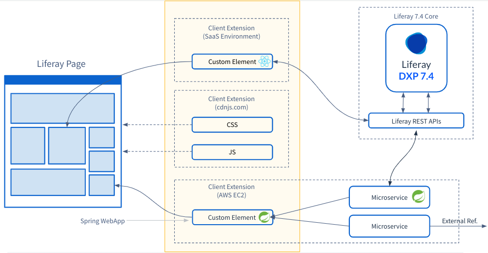

# Understanding Liferay Customization

Liferay DXP is a robust platform for customizing digital experiences. While traditional development approaches involve extensive coding and deployment, Liferay introduces two key features for streamlining the customization process: objects and client extensions.

Objects provide a low-code approach to modeling data structures and implementing business logic that integrates seamlessly with Liferay's core functionalities. Client extensions, on the other hand, have a modular, adaptable architecture that lives outside of Liferay, giving practitioners the ultimate flexibility to customize Liferay with their preferred tools. By using objects together with client extensions, organizations can develop solutions that align with their business requirements while maintaining a consistent user experience.

## Objects

With objects, you can define the schema of your data models with specific attributes, create relationships between objects, and implement logic to determine how objects should behave. You can use objects to iterate rapidly without the need to write or deploy code, which translates directly to increased business agility. Liferay comes with a centralized interface to define, manage, and store application data from custom structures, so that you can provide end users with tailored, streamlined experiences.

<!--TASK: Add Diagram-->

One of the true strengths of objects is their integration with Liferay's core frameworks and functionalities, such as permissions, security, workflows, and more. You can govern objects with workflows, secure them with Liferay's permissions framework, and display them with fragments, templates, and widgets. This integration creates a cohesive user experience where your custom-built solutions feel and act like native parts of the Liferay platform. Also Liferay automatically generates headless APIs for custom objects, enabling you to connect and synchronize your objects with external systems. 

Objects are just as suitable for simpler use cases like forms, as they are for more complex solutions like the distributor application you'll work on later in this module. As such, Objects is one of the most versatile and powerful features in the Liferay toolkit and a critical part of custom solutions. Not only can you achieve faster time to value, but any Liferay practitioner can maintain your solution, eliminating the reliance on technical developer resources. 

## Client Extensions

Client extensions transform Liferay customization, whether Liferay SaaS, PaaS, or Self-Hosted. Unlike custom OSGi plugins that are woven into the Liferay portal fabric, client extensions operate independently, interacting with the platform via well-defined APIs. This decoupling ensures that custom solutions remain intact even as the platform undergoes updates, significantly reducing maintenance overhead. On the other hand, a buggy or broken client extension won't disrupt Liferay's core out-of-the-box functionality. Additionally, since client extensions are language and framework agnostic, they free developers to use their preferred technologies and follow their own development cycle.

Beyond development efficiency, client extensions improve application performance and scalability. By selectively applying extensions to specific pages or components, organizations can optimize resource utilization and enhance user experience. Client extensions make customization more agile, adaptable, and future-proof. Their ability to coexist with out-of-the-box features solidifies client extensions as the preferred method for building custom solutions with Liferay.

There are four types of client extensions you can implement with Liferay:

* Frontend client extensions provide resources that affect Liferay's presentation layer.
* Batch client extensions provide data entities to your Liferay instance via headless batch endpoints.
* Microservice client extensions are external applications that execute actions triggered by events in your Liferay instance.
* Configuration client extensions configure settings for your Liferay instance.

<!-- TASK: Add Diagram-->

As you progress through this module, you'll employ several different types of client extensions to customize the Clarity solution.

## Conclusion

Congratulations! You have learned about customizing Liferay with objects and client extensions. While they are powerful on their own, both features benefit from being used together in custom solutions. You can leverage the fully integrated nature of objects along with the flexibility of client extensions to achieve faster time-to-market, reduce development costs, and deliver exceptional digital experiences. 

Up Next: [Customizing Clarity's Front End](./customizing-claritys-front-end.md)

## Additional Resources

See official documentation to learn more about Liferay's customization features:

* [Objects](https://learn.liferay.com/w/dxp/liferay-development/objects)
* [Client Extensions](https://learn.liferay.com/web/guest/w/dxp/liferay-development/client-extensions)
