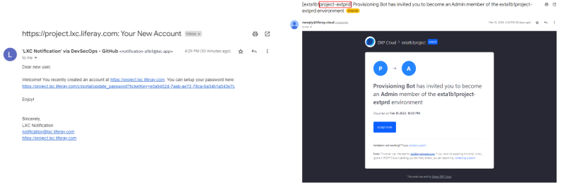

# Liferay SaaS Provisioning

After learning about the benefits of Liferay DXP and the value of Liferay SaaS, Clarity Vision Solutions has signed up for a Liferay SaaS account. In this lesson we will review the Liferay SaaS onboarding process and what you can expect when starting with Liferay SaaS.

## Initial Contact

Liferay SaaS provisioning begins with an initial outreach by a Liferay provisioning team. The team will collect information from you about:

* Desired Liferay project name
* Desired data server location 
* Who to include in the Liferay environment email invitation

Once the provisioning team has this information, they will prepare your Liferay SaaS environments.

## Invitations

Next, you will receive a welcome email for the production (`PRD`) Liferay DXP environment and a welcome email for the test (`UAT`) environment. You will be asked to set a new password upon clicking on the link in the emails. Once logged in, you can begin creating and inviting other users.

You will also receive two additional emails, generated from Liferay Cloud. These are for the PRD and UAT Extension environments, which are provided for deploying customizations (client extensions). Click *Accept Invite* to gain access to the Liferay Cloud console for each environment. Note that if this is your first time using the Liferay cloud console, you'll need to create an account. From the console, you can invite other team members to your environment.

## The Basics

Once you have logged in to your Liferay DXP environment, you have access to almost all of the out-of-the-box features to create sites, pages, fragments, web content, products, and more. After login, Clarity can immediately start building with Liferay DXP. They can begin [navigating Liferay](https://learn.liferay.com/w/dxp/getting-started/navigating-dxp) and using it for their business.

Note, to ensure the security and privacy of individual tenants, certain DXP features are not accessible. For a comprehensive breakdown of feature availability within Liferay SaaS, check the [Liferay SaaS Compatibility Matrix](https://learn.liferay.com/w/liferay-cloud/reference/liferay-saas-compatibility-matrix).

## The Cloud Administration Console

The Liferay cloud console is both the place to deploy your client extensions, as well as the place to monitor your client extensions. Clarity can log in to the cloud console and monitor activities of any of their custom client extensions.

The metrics and information available in the cloud console include:

| Metrics    | Information                                                                     |
|:-----------|:--------------------------------------------------------------------------------|
| Overview   | A dashboard view of your services, latest deployments, activities, and alerts.  |
| Services   | Any custom services (i.e., client extensions) that are deployed.                |
| Network    | Relevant specifications of your extensions.                                        |
| Activities | A list of any extension or user activities.                                     |
| Logs       | Area to access logs for your extensions                                         |
| Monitoring | CPU and memory metrics of your extensions.                                      |
| Team       | List of current members who can access the console.                             |
| Settings   | Relevant extension environment information.                                     |

Congratulations! You've completed Module 2: Deploying Liferay.

Up Next: [Module 4 - Identity Management and SSO](../module-4-identity-management-and-sso.md)
