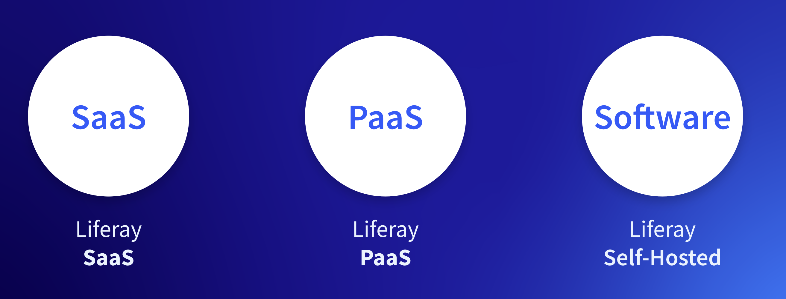
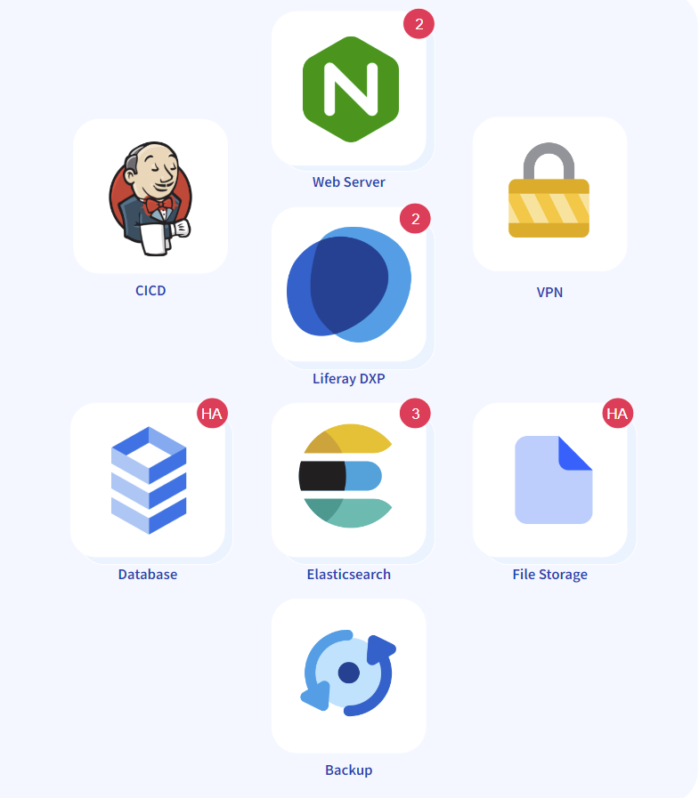

# Liferay Deployment Options

Liferay SaaS, Liferay PaaS, and Liferay Self-Hosted are available as different deployment options.

At a high level:

* Liferay SaaS - All installation, maintenance, upgrades, etc. are handled by Liferay.
* Liferay PaaS - Have Liferay manage your cloud infrastructure while keeping control over your database, file storage, backups, etc.
* Liferay Self-Hosted - Have full control and ownership of all aspects of deployment and maintenance of Liferay.

## Liferay SaaS

In Liferay SaaS, the cloud infrastructure and Liferay DXP application is managed for you, so you can focus on what matters to your business. Your work is primarily with Liferay's out-of-the-box features. Custom development is still available through [client extensions](https://learn.liferay.com/w/dxp/building-applications/client-extensions).

### Deployment Overview

After your Liferay SaaS account is provisioned, you will receive an email invitation to your new administrator account. Log in to your Liferay DXP instance to immediately start using Liferay.

You will also receive an email invitation to your Liferay extension environment. These environments are provided for deploying custom services (i.e. client extensions) that integrate with your Liferay instance.

Log in to the extension environment to manage your custom services.

### Upgrades

With Liferay SaaS, upgrades are managed for you. You can rest assured that your Liferay environment will be up-to-date with the latest releases.

## Liferay PaaS

Let Liferay handle the cloud infrastructure while you still keep control of your different web services. The setup and maintenance is all through the cloud console and your Liferay GitHub repository.

### Deployment Overview

After your Liferay PaaS account is provisioned, you will receive an email invitation to the Liferay cloud console. You will also receive an invitation to Liferay's `dxpcloud` GitHub repository. The GitHub repository contains templates to use for configuring Liferay and other services.

Use the Liferay cloud console and your GitHub repository to deploy and manage your Liferay application and other web services.

### Upgrades 

To upgrade in Liferay PaaS, perform upgrades locally on your database backup and file storage backup. Then upload the new backups in the Liferay cloud console.

## Liferay Self-Hosted

Deploy Liferay on any [supported application server](https://help.liferay.com/hc/en-us/articles/4411310034829-Liferay-DXP-7-4-Compatibility-Matrix#application-server). The Tomcat bundle includes the Apache Tomcat application server with Liferay pre-deployed. It is a quick and easy way to install and deploy Liferay.

### Deployment Overview

Download the latest Liferay Tomcat bundle to your environment. Set your `[Liferay_Home]` folder, configure your database, and start the bundle to deploy Liferay.

### Upgrades

To upgrade in Liferay Self-Hosted, simply download a new Tomcat bundle and point it to your `[Liferay_Home]` folder and connect it to your existing database. 

Next: [Liferay SaaS and Clarity](./liferay-saas-and-clarity.md)
