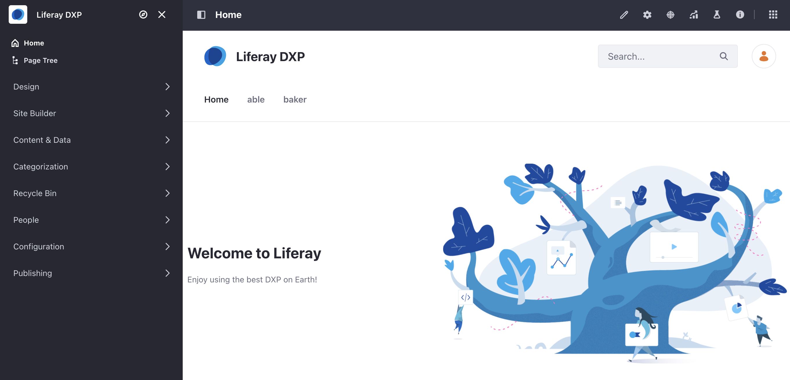
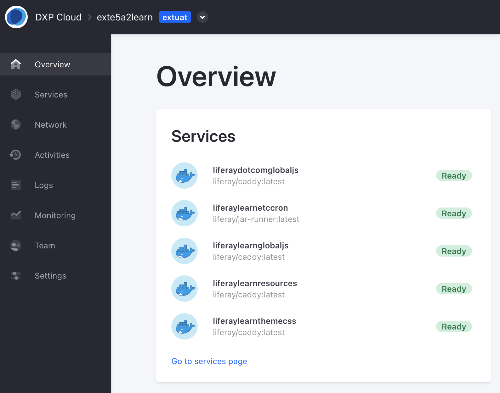

# Liferay SaaS Provisioning

After learning the benefits of Liferay DXP and the value of Liferay SaaS, Clarity Vision Solutions has signed up for a Liferay SaaS account. In this lesson we will review the Liferay SaaS onboarding process and what you can expect when starting with Liferay SaaS.

## Invitations

<!-- Please use: https://docs.google.com/presentation/d/1QZ-uVKOJnyg8T2WmOqhxChBlaPww6H7C_CnuPNPzdEA/edit#slide=id.g2b413a43341_0_357 and go over in detail what people can expect -->

Once your project is provisioned and your admin user on PRD and UAT is created, you'll receive a password update email for each Liferay DXP environment. After setting your own password, you can add other admin users.

You will also receive two additional emails, generated from Liferay Cloud. These are for the PRD and UAT Extension environments, which are provided for deploying custom services (client extensions). Click *Accept Invite* to gain access to the Liferay Cloud console for each environment. Note that if this your first time using Liferay Cloud console, you'll need to create an account first.

## The Basics

Liferay DXP serves as the foudational element of Liferay SaaS, providing a robust infrastructure for a multi-tenant environment. Once you have logged in, you will be able to use almost all of the out-of-the-box features you are used to with Liferay DXP. To ensure the security and privacy of individual tenants, certain DXP features are not accessible.

For a comprehensive breakdown of feature availability within Liferay SaaS, check [Liferay Experience Cloud Compatibility Matrix](https://help.liferay.com/hc/en-us/articles/17817489997325-Liferay-Experience-Cloud-Compatibility-Matrix).

## The Cloud Administration Console

Clarity can log in to the Liferay cloud console to see real-time metrics of the cloud infrastructure and monitor activities of the environment.

The metrics and information available in the cloud console include:

| Metrics    | Information                                                                     |
|:-----------|:--------------------------------------------------------------------------------|
| Overview   | A dashboard view of your services, latest deployments, activities, and alerts.  |
| Services   | Any custom services (i.e., client extensions) that are deployed.                |
| Network    | Relevant specifications for the cloud infrastructure.                           |
| Activities | A list of any environment, user, or service activities.                         |
| Logs       | Area to access application logs.                                                |
| Monitoring | Performance metrics of the application server.                                  |
| Team       | List of current members who can access the console.                             |
| Settings   | Relevant environment information.                                               |

Congratulations! You've completed Module 3 - Deploying Liferay.

[Back to Building Enterprise Websites with Liferay](../../building-enterprise-websites-with-liferay.md)
