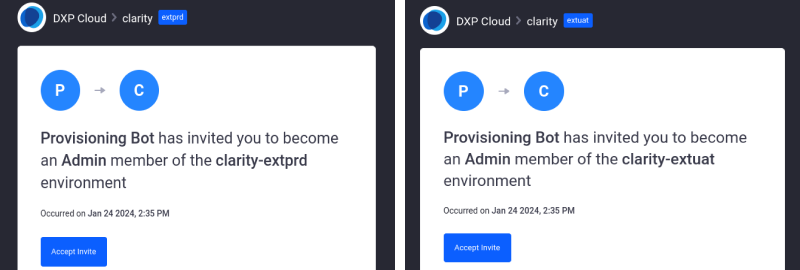
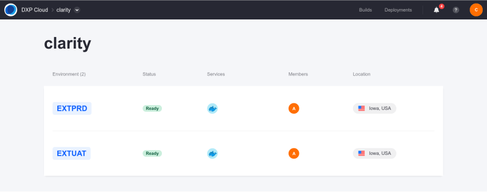

# Liferay Deployment Options

Liferay allows you to build, host, and manage your platform in an environment that best suits your business needs. It enables different deployment options and installation approaches based on the offering purchased. Here, we'll walk you through all three of them:

- [Liferay SaaS](#liferay-saas)
- [Liferay PaaS](#liferay-paas)
- [Liferay Self-Hosted](#liferay-self-hosted)

## Liferay SaaS

At a high level:

- Rely on Liferay to manage, host, and scale your Liferay application and infrastructure.

In Liferay SaaS, Liferay manages your cloud infrastructure and Liferay DXP application so you can focus on what matters to your business. Custom development is still available through [client extensions](https://learn.liferay.com/w/dxp/building-applications/client-extensions).

### Initial Setup

When your project is provisioned, you will receive:

- an email from **liferay.cloud** inviting you to set a password for your new administrator account on your Liferay DXP instance.
- an email invitation to the extension environments. Click on *Accept Invite* and you'll be redirected to the [Liferay Cloud console](https://console.liferay.cloud/) for login.



Log in to the cloud console to access your extension environments. These environments are provided for deploying custom services (i.e., client extensions) that integrate with your Liferay instance.



### Accessing the Provisioned GitHub Repository

New Liferay Cloud projects are provisioned a GitHub repository hosted in the `dxpcloud` organization. This repository contains the template for a Liferay Cloud development project. You'll receive access to your new project repository.

### Upgrades

With Liferay SaaS, upgrades are managed for you. You can rest assured that your Liferay environment will be up-to-date with the latest releases.

## Liferay PaaS

At a high level:

- Have Liferay manage your cloud infrastructure while you still have fine-tuned control over your database, file storage, backups, etc.

In Liferay PaaS, you let Liferay handle the cloud infrastructure for you so you can focus on maintaining your application.

Once your project is provisioned, you should receive a Liferay Cloud onboarding email along with email invitations for each purchased Liferay Cloud environment.

```{note}
If your invitation was for a single environment (such as `dev` or `uat`) instead of the whole project, only that environment appears in the list. Accept the invitation for all environments so you can have access to all of them.
```

A GitHub repository is also provisioned for you, as it is done with [Liferay SaaS](#accessing-the-provisioned-github-repository).

Unlike Liferay SaaS, to upgrade in Liferay PaaS, you'll perform upgrades locally on your database backup and file storage backup. Then, you'll upload it back up in the Liferay cloud console.

## Liferay Self-Hosted

At a high level:

- Have full control and ownership of all aspects of deployment and maintenance of Liferay.

Install Liferay DXP or Liferay Portal on any [supported application server](https://help.liferay.com/hc/en-us/articles/4411310034829-Liferay-DXP-7-4-Compatibility-Matrix#application-server). The Tomcat bundle includes the Apache Tomcat application server with Liferay DXP/Portal pre-deployed. It is a quick and easy way to install Liferay.

To download a Tomcat Bundle, go to [Help Center](https://customer.liferay.com/downloads) (subscription) or [Community Downloads](https://www.liferay.com/downloads-community). Set your `[Liferay_Home]` folder, configure your database, and start Liferay.

To upgrade, download a new Liferay Tomcat bundle and start up Liferay. Point the new version to your `[Liferay_Home]` folder and connect it to your existing database. Afterward, restart Liferay with the new version.
