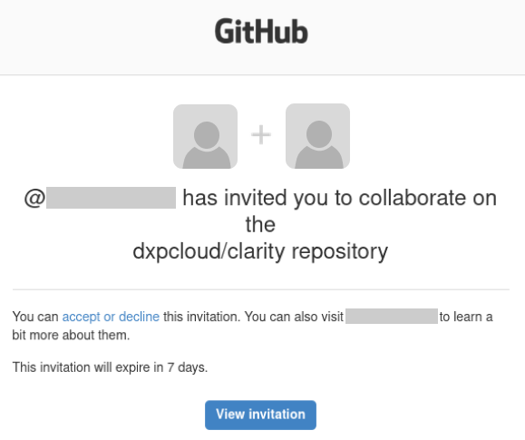

# Liferay PaaS

At a high level:

* Log in to the Liferay cloud console to manage your Liferay instance, database, and other services.
* Do upgrades on your database and file storage locally and upload them in the cloud console to upgrade Liferay versions.

The Liferay cloud console is the user interface to set up and configure your different services with the cloud infrastructure. Use the console to manage each of your environment's services, including the [web server](https://learn.liferay.com/w/liferay-cloud/platform-services/web-server-service) and [database](https://learn.liferay.com/w/liferay-cloud/platform-services/database-service/database-service).

## Initial Setup

Once your account is provisioned, you should receive a Liferay Cloud onboarding email along with email invitations for each purchased Liferay Cloud environment. The link takes you to the [Liferay Cloud console](https://console.liferay.cloud/) for login.


```{note}
If your invitation was for a single environment (such as `dev` or `uat`) instead of the whole project, only that environment appears in the list. Accept the invitation for all environments to make sure you have access to all of them.
```

### Accessing Your Liferay Cloud Console

Upon sign in, the console [https://console.liferay.cloud/projects](https://console.liferay.cloud/projects) shows a list of all the environments you can access.


From here, you can access and manage environments and deployments, as well as invite other team members.

### Accessing the Provisioned GitHub Repository

New Liferay Cloud projects are provisioned a GitHub repository hosted in the `dxpcloud` organization. This repository contains the template for a Liferay Cloud development project. To access your new project repository, accept the subsequent GitHub invitation.



## Upgrades

To upgrade in Liferay PaaS, perform upgrades locally on your database backup and file storage backup. Then upload it back up in the Liferay cloud console.

### Prepare for the Upgrade

1. Download the Liferay Tomcat bundle you wish to upgrade to. Choose a folder to extract the bundle to.

1. In the Liferay cloud console, click _Backups_. Click the _options_ icon of your latest backup and click _Download_.

1. On the download backup page, download the database and document library backup.

1. Extract the document library backup to the `[Liferay_Home]/data` folder of the Liferay bundle you extracted earlier.

### Extract and Import the Database

Open a command prompt at the location of the downloaded database backup (named `backup-db-<PROJECT_NAME>-prd-<BACKUP_ID>.gz`) and perform the following steps.

1. Extract the database backup:

   ```bash
   gzip -d DATABASE_NAME.gz
   ```

1. Log into the MySQL client on your local system:

   ```bash
   mysql -u root -ppassword
   ```

1. Create a database to import the data into, using the name of the file (minus the extension) as the database name:

   ```bash
   create database DATABASE_NAME;
   ```

1. Import the database from the extracted `.sql` dump:

   ```bash
   use DATABASE_NAME;
   ```

   ```bash
   source DATABASE_NAME.sql;
   ```

The database is now ready for upgrade.

### Perform the Upgrade

Use the upgrade tool to perform the upgrade:

1. In your Liferay bundle, navigate to `[LIFERAY_HOME]/tools/portal-tools-db-upgrade-client`. Run the following command:

   ```bash
   db_upgrade.sh -j "-Dfile.encoding=UTF-8 -Duser.timezone=GMT -Xmx2048m" -l "output.log"
   ```

1. The upgrade tool will prompt you for information about your installation. For example,

   ```bash
   Please enter your application server (tomcat):
   tomcat

   Please enter your application server directory (../../tomcat-9.0.17):

   Please enter your extra library directories (../../tomcat-9.0.17/bin):

   Please enter your global library directory (../../tomcat-9.0.17/lib):

   Please enter your portal directory (../../tomcat-9.0.17/webapps/ROOT):

   [ db2 mariadb mysql oracle postgresql sqlserver sybase ]
   Please enter your database (mysql):
   mysql

   Please enter your database host (localhost):

   (etc.)
   ```

1. Once you enter the required information, the upgrade tool will perform the upgrade. A message will appear after the upgrade is complete.

### Compress and Upload a New Backup

Compress the document library and upload it in the cloud console.

1. Open a command prompt within your `[LIFERAY_HOME]/data` folder.

1. Run the following command:

   ```bash
   tar -czvf volume.tgz document_library
   ```

Export and compress the upgraded database.

1. Run the following command:

   ```bash
   mysqldump -uroot -ppassword --databases --add-drop-database lportal | gzip -c | cat > database.gz
   ```

1. Compress the database:

   ```bash
   tar zcvf database.tgz database.gz
   ```

1. In the Liferay cloud console, click on _Backups_ in the left navigation. Click _Upload Backup_.

1. Select the compressed document library and database file and upload it as a new backup.

### Update Your Project's Liferay Version

Set the Liferay version to match your environment.

1. In your Liferay github repository, navigate to your `[ProjectID]/liferay/LCP.json` file and set the `image` property to match the Liferay bundle you used in the upgrade.

1. Navigate to your `[ProjectID]/liferay/gradle.properties` and set the `liferay.workspace.docker.image.liferay` property to match the Liferay bundle you used in the upgrade.

1. Deploy these changes with the updated versions.

1. Navigate back to your list of backups. Select the upgraded backup you uploaded. Click _Restore_ from the options menu.

1. Select the environment you wish to restore. Click _Restore to environment_. You have upgraded Liferay to the new version.
 