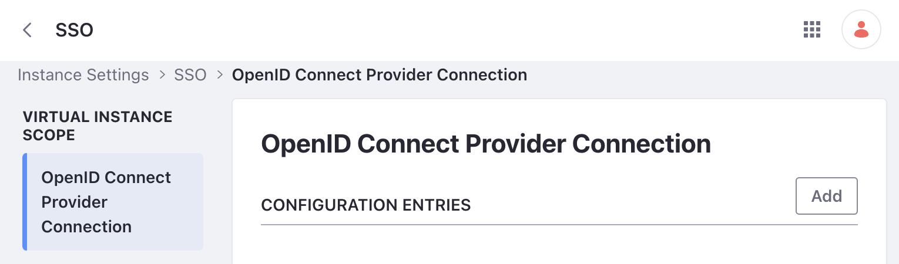
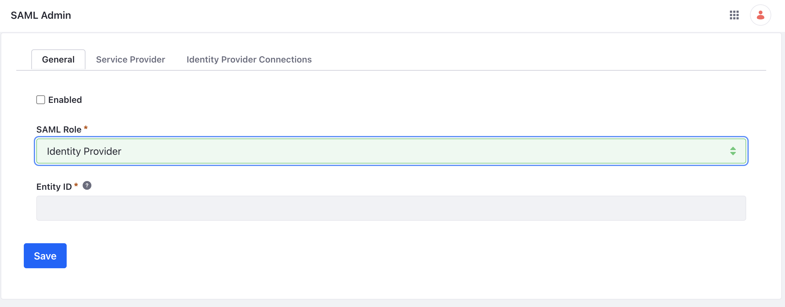
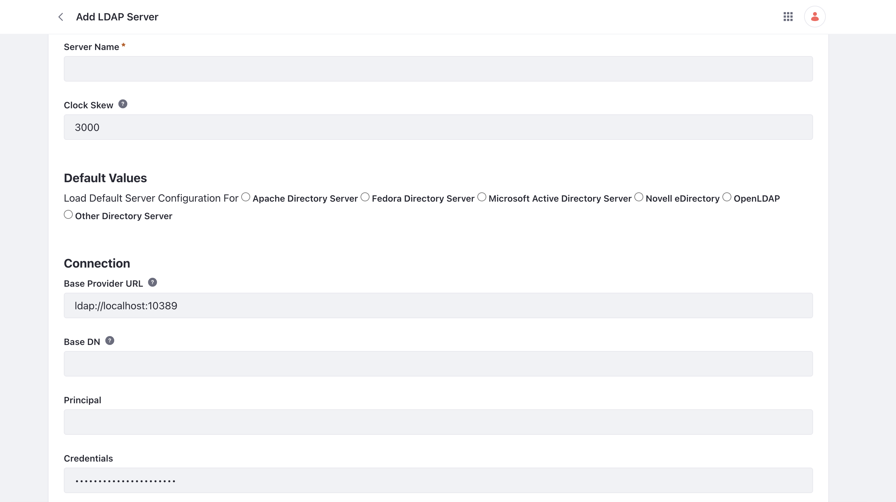

# Configuring SSO and IDP

Liferay supports different single sign-on standards such as OpenID Connect (OIDC) and Security Assertion Markup Language (SAML). As many companies have employees that need to log in to different onlines services, it makes sense to centralize identity management in one place. For Clarity, the administrators want to move to a single sign-on solution so that they don't have to actively manage separate logins for each online service they use.

Along with single sign-on, Clarity is also looking for a solution to manage user accounts in one central location. They have been using an on-premises Microsoft Active Directory, but as most things have moved to the cloud, they are looking for a user directory that is also cloud based.

## OpenID Connect

OpenID Connect (OIDC) is an identity protocol that is used to authenticate users. Many (OIDC) services (e.g. Google, Okta) can be configured to work together with Liferay. 

To use an OpenID Connect service, add a connection to the provider. This configuration is available under _Instance Settings_ &rarr; _SSO_ in Liferay. 

Note, you will need to furnish service specific details when configuring your provider connection. Specifically, you will need details such as your OpenID connect client id, client secret, and discovery endpoint.

After adding the connection, the enabled checkbox under the `OpenID Connect` configuration must be checked to start using the new OpenID Connect service. See [using OpenID Connect](https://learn.liferay.com/w/dxp/installation-and-upgrades/securing-liferay/configuring-sso/using-openid-connect) to learn more.

## SAML

The Security Assertion Markup Language (SAML) protocol is another type of single sign-on standard that is supported by Liferay. Instead of managing separate usernames and passwords just for Liferay, a service that provides SAML authentication can provide one login for many services. Many popular SAML authentication services can be integrated with Liferay. See [authenticating with SAML](https://learn.liferay.com/web/guest/w/dxp/installation-and-upgrades/securing-liferay/configuring-sso/authenticating-with-saml) to learn more.

To use a SAML authentication service, add a SAML identity provider (IdP) service to Liferay. This configuration is available under the _SAML Admin_ tool in Liferay.

Note that Liferay has built-in features to be able to serve as a identity provider (IdP) or a service provider (SP) depending on your business' needs.

See the next lesson, [Integrating Okta SSO](./integrating-okta-sso.md) to see detailed steps of how to integrate an Okta SSO service with Liferay. 

## User Directories

Clarity has been using a Microsoft Active Directory for the past few years to manage user access to different on-premise systems. But with the benefits that come with single sign-on (SSO) and the move towards cloud-based systems, Clarity needs to consider the different options available.

Liferay can support a traditional active directory if Clarity chooses to integrate their on-premise directory. To connect to an active directory, add the server to the Liferay settings. This configuration is available under _Instance Settings_ &rarr; _LDAP_.

Once the server is connected with Liferay, the enabled checkbox must be checked to start using the active directory. See [connecting to a user directory](https://learn.liferay.com/web/guest/w/dxp/users-and-permissions/connecting-to-a-user-directory) to learn more.

In the case of Clarity, they plan to integrate Okta's single sign-on service with Liferay. Therefore, their choice is between integrating their active directory with Okta or to ultimately move to utilizing Okta's universal directory for their identity management needs.

Next: [Integrating Okta SSO](./integrating-okta-sso.md)
