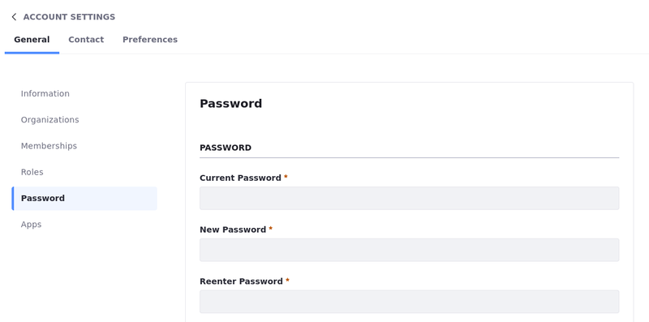
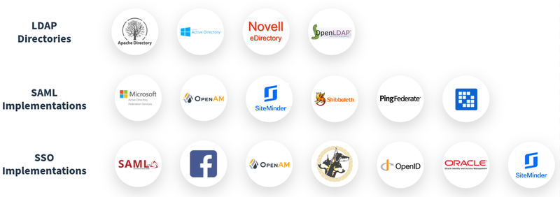

# Liferay Authentication

Before we talk about Clarity's users and how we will manage them, let's learn more about Liferay's Authentication story. First, let's talk about the initial Liferay DXP login.

## Initial Liferay DXP Login

First, visit your Liferay environment, whether that is at the URL that was sent to you in your Liferay SaaS / PaaS provisioning environment or your own self-hosted environment at `localhost:8080`. When you first visit it you are a guest user and are not authenticated to access Liferay. By default, users login to Liferay DXP using the Sign In widget, which uses the database to authenticate the user. We’ll have to use this method for our initial login, because we haven’t had an opportunity to make any configuration changes yet.

!!! Note
    If you are a Liferay SaaS customer, the initial login will be communicated to the initial administrator(s) during the provisioning process. If you are a Liferay PaaS or Self-Hosted user, then the default administrator email address is `test@liferay.com` and the default password is `test`. There are portal properties that can be used by Liferay PaaS and Self-Hosted customers that can change this default behavior, so if you’re in doubt, check with your Liferay administrator.

<!--

Your first order of business should be to change the password for your initially provisioned user. In case you are using Liferay PaaS or Self-Hosted, change the password for the `test@liferay.com`. Once you are logged in, follow these steps to change your user password:

1. Click the user avatar and navigate to Account Settings &rarr; Password.

1. Enter your Current Password and provide a new password.

-->

## Liferay Authentication Features

Out-of-the-box, Liferay includes a variety of user authentication and management features. This includes features like:

* [Configurable Password Policies](https://learn.liferay.com/web/guest/w/dxp/users-and-permissions/roles-and-permissions/configuring-a-password-policy)
* Support for multiple types of [multi-factor authentication](https://learn.liferay.com/web/guest/w/dxp/installation-and-upgrades/securing-liferay/multi-factor-authentication) schemes
* And more...

!!! important "Key Decision"
    While there is a lot of flexibility for using Liferay DXP as your primary identity management system and to handle user authentication, many organizations will already have existing IdM and SSO solutions in place. Furthermore, depending on scope and scale of the number of users expected to authenticate to Liferay, using a dedicated IdM and SSO solution can have performance benefits for your Liferay project.

Integrations with third party identity management and SSO solutions is straightforward with Liferay. Liferay supports standards such as LDAP, SAML, and others.

As we have already mentioned, Liferay DXP identity management and user authentication is very flexible, and for some use-cases, it might even make sense to stick with the default behavior and let Liferay manage identity and authentication. However, most prospective customers will already have some type of identity management and single sign-on solution in place, and Liferay can easily work with those solutions. In fact, nearly every element of the default authentication experience can be changed by an administrator.

For identity management, Liferay can easily be configured to integrate with popular LDAP directories such as Microsoft Active Directory or OpenLDAP. For authentication, you can configure a SSO connection to a range of popular SSO providers such as Okta, PingFederate, Siteminder and several others.

Now that you have an initial understanding of Liferay's flexible approach to identity management and authentication, let's dive into Clarity's specific use cases and requirements.

Next Up: [Managing Clarity Employees](./managing-clarity-employees.md)
