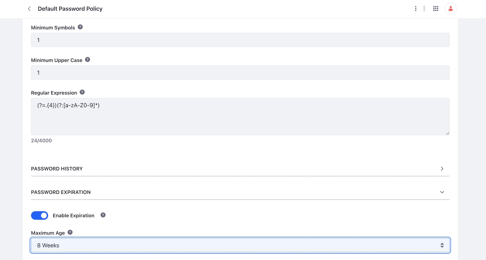
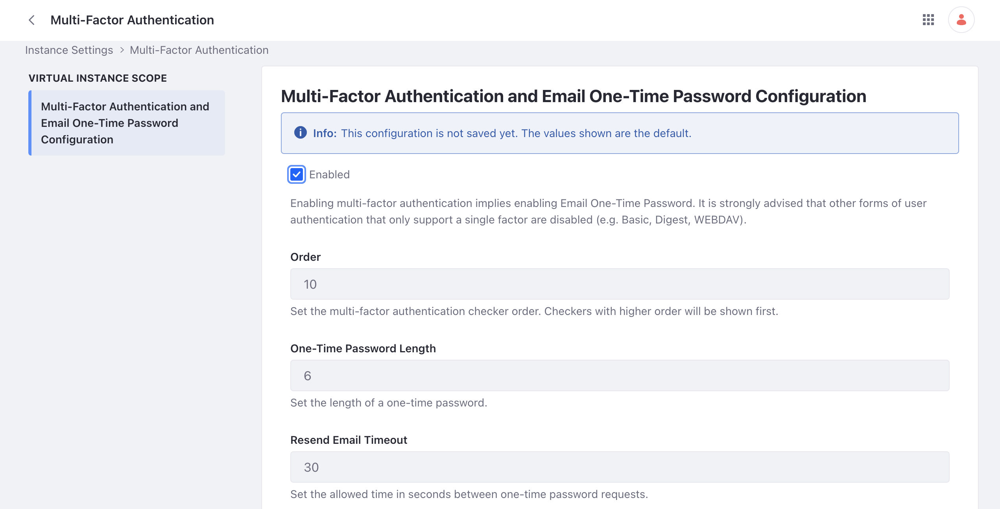

# Liferay Security Features

Clarity is all set up for authenticating its own team members through Okta, but they need to decide what to do for other visitors that come to their site that require login. Fortunately Liferay provides various security and identity management tools out-of-the-box. Clarity plans to require their B2B customers to login with strong passwords and multi-factor authentication.

## Configuring a Password Policy

Clarity understands the importance of requiring strong passwords to make user login secure. They want to increase password strength by adjusting the Liferay default password policy in two ways: requiring special characters and having password expirations. To modify the default password policy,

1. Navigate to _Control Panel_ &rarr; _Password Policies_. 

1. Click the options icon next to the default password policy and click _Edit_.

1. Under `Password Syntax Checking`, click the toggle to enable syntax checking and change the minimum symbols value from 0 to 1.

1. Under `Password Expiration`, click the toggle to enable expiration and set the maximum age to 8 weeks. 

   

1. Click _Save_ and the default password policy is updated.

Clarity can make further changes by creating custom password policies for different categories of users. For example, they can set one password policy for B2B customers and another password policy for retail distributors. See our documentation on [password policies](https://learn.liferay.com/w/dxp/users-and-permissions/roles-and-permissions/configuring-a-password-policy) to learn more.

## Enabling Multi-factor Authentication

Clarity also wants to require multi-factor authentication (MFA) for users. They want logins to be authenticated through an email one-time password. To enable this MFA,

1. Navigate to _Control Panel_ &rarr; _Instance Settings_. Click on _Multi-Factor Authentication_ under the security section.

1. Click the _Enabled_ checkbox and click _Save/Update_.

   

   The email one-time password is now enabled. When a user attempts to log in, a one-time passcode is sent to the user by email.

!!! note
   Make sure your [Liferay email service is correctly configured](https://learn.liferay.com/web/guest/w/dxp/installation-and-upgrades/setting-up-liferay/configuring-mail) so that you an receive the one-time passcode.

In addition to email one-time password, Liferay supports other types of MFA:

* [IP address checker](https://learn.liferay.com/w/dxp/installation-and-upgrades/securing-liferay/multi-factor-authentication/multi-factor-authentication-checkers#ip-address-mfa-checker) - set up which IP addresses are authorized to log in to Liferay
* [Time-based one-time password (OTP)](https://learn.liferay.com/web/guest/w/dxp/installation-and-upgrades/securing-liferay/multi-factor-authentication/multi-factor-authentication-checkers#time-based-one-time-password-mfa-checker) - Liferay provides a QR code to be scanned to configure a time-based password app like Google Authenticator
* [Fast Identity Online (FIDO) password](https://learn.liferay.com/w/dxp/installation-and-upgrades/securing-liferay/multi-factor-authentication/fast-identity-online-2) - users can utilize their FIDO compliant devices such as fingerprint readers or USB keys

See our documentation about [securing Liferay](https://learn.liferay.com/web/guest/w/dxp/installation-and-upgrades/securing-liferay) for a full explanation about each MFA option as well as the other security features that are available.

Congratulations! You've completed Module 4 - Identity Management and SSO.
