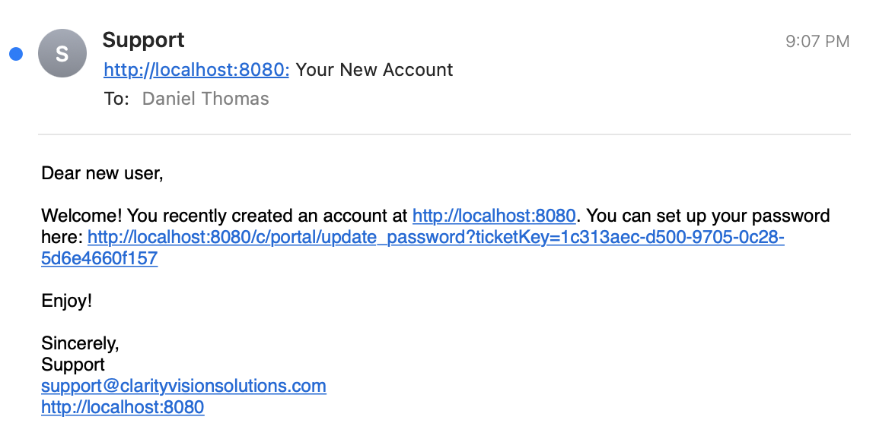

# Liferay Security Features

Clarity is all set up for authenticating its own team members through Okta, but they need to decide what to do for other visitors that come to their site that require login. Fortunately Liferay provides various identity management tools out-of-the-box for use.

!!! important
   Not all Liferay logins take place through an SSO service. Therefore, use Liferay's other tools to provide a secure way to onboard users and provide logins for them.

## Exercise 1: Preparing for New Liferay Logins

Clarity plans to create new user accounts for their B2B customers with Liferay's user management UI. As each user account is created, a welcome email is sent automatically by Liferay to the new user. But before creating user accounts, Clarity wants to increase login security by requiring strong passwords and requiring multi-factor authentication.

### Configuring a Password Policy

Strong password policies are an important part of keeping a system secure. Liferay comes with a default password policy, but it is highly recommended to customize the policy to increase the strength of login passwords. Some changes we can make are: increasing the password length and disabling dictionary words. To modify the default password policy,

1. Navigate to _Control Panel_ &rarr; _Password Policies_. 

2. Click the options icon next to the default password policy and click _Edit_.

3. Under `Password Syntax Checking`, click the toggle to enable syntax checking.

   

4. Toggle off _Allow Dictionary Words_ and disable dictionary words.

5. Change the minimum length from `6` to `8`.

6. Scroll down to the bottom and click _Save_.

Requiring a longer password length increases complexity and ideally decreases the threat of brute force attacks. [Banning common words](https://learn.microsoft.com/en-us/microsoft-365/admin/misc/password-policy-recommendations?view=o365-worldwide#successful-patterns) also appears to be good policy practice. See our documentation on [password policies](https://learn.liferay.com/w/dxp/users-and-permissions/roles-and-permissions/configuring-a-password-policy) to learn more.

### Enabling Multi-factor Authentication

In addition to setting strong password policies, it is highly recommended to use multi-factor authentication. Clarity wants to enable MFA to have user logins be authenticated through an email one-time password. To enable this MFA,

1. Navigate to _Control Panel_ &rarr; _Instance Settings_. Click on _Multi-Factor Authentication_ under the security section.

1. Click the _Enabled_ checkbox and click _Save/Update_.

   

   The email one-time password is now enabled. When a user attempts to log in, a one-time passcode is sent to the user by email.

   !!! note
   Make sure your [Liferay email service is correctly configured](https://learn.liferay.com/web/guest/w/dxp/installation-and-upgrades/setting-up-liferay/configuring-mail) so that you can receive the one-time passcode.

   In addition to email one-time password, Liferay supports other types of MFA:

   * [IP address checker](https://learn.liferay.com/w/dxp/installation-and-upgrades/securing-liferay/multi-factor-authentication/multi-factor-authentication-checkers#ip-address-mfa-checker) - set up which IP addresses are authorized to log in to Liferay
   * [Time-based one-time password (OTP)](https://learn.liferay.com/web/guest/w/dxp/installation-and-upgrades/securing-liferay/multi-factor-authentication/multi-factor-authentication-checkers#time-based-one-time-password-mfa-checker) - Liferay provides a QR code to be scanned to configure a time-based password app like Google Authenticator
   * [Fast Identity Online (FIDO) password](https://learn.liferay.com/w/dxp/installation-and-upgrades/securing-liferay/multi-factor-authentication/fast-identity-online-2) - users can utilize their FIDO compliant devices such as fingerprint readers or USB keys

Well done! Clarity is now ready to start adding their B2B customers. 

## Adding B2B Customers

The next module will cover B2B accounts in more depth, but for now, create a sample user to confirm the password policy and multi-factor authentication.

1. Navigate to _Control Panel_ &rarr; _Users and Organizations_. Click the add icon.

1. Create the following B2B customer account:

   - Screen Name: `daniel.thomas`
   - Email Address: `{your_email_address}`
   - First Name: `Daniel`
   - Last Name: `Thomas`

   Click _Save_.

1. An welcome email is sent by Liferay to Daniel. Note, make sure you set an email address you have access to. Click on the link to set a password.

   

1. In the set password page, try setting a few different passwords that fails the policy (e.g. a password shorter than 8 characters, or without any numbers or without any upper case letters). See that the passwords are not accepted. Set a password that complies with the policy.

1. MFA is not required during the initial setting of the password. Log out of the account and log back in. Note that the email MFA is now enforced.

   

   Click _Send_ to receive the one-time email password. Copy and paste the code from your email. Click _Submit_ and the user is now logged in.

Good job, you have verified the updated password policy and the email password MFA. 

!!! note
   MFA was enabled for demonstrating this exercise. Feel free to disable it as you continue this Liferay course.

To learn more, see our official documentation about [adding and managing users](https://learn.liferay.com/w/dxp/users-and-permissions/users/adding-and-managing-users). Also see our documentation about [securing Liferay](https://learn.liferay.com/web/guest/w/dxp/installation-and-upgrades/securing-liferay) for a full explanation about each MFA option as well as the other security features.

Congratulations! You've completed Module 4 - Identity Management and SSO.
