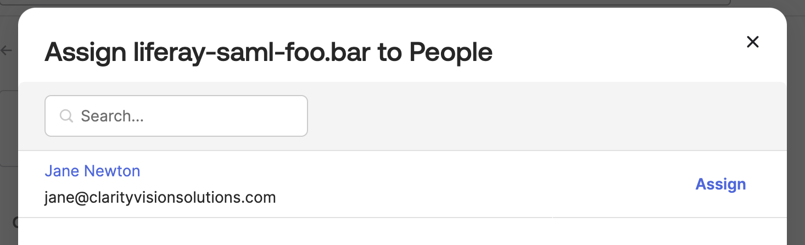
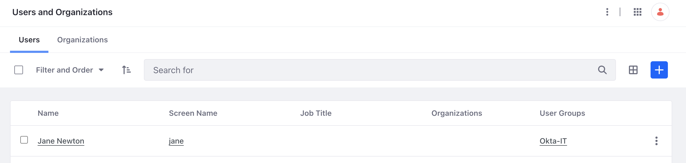

# Integrating Okta SSO

Clarity values having one login not only for Liferay, but for the other services they use. They aim to keep using Okta to maintain this unified login approach, aiming to save costs, minimize additional systems, and mitigate risks. Fortunately, Liferay supports a variety of single sign-on (SSO) standards, including OpenID Connect (OIDC) and Security Assertion Markup Language (SAML), making it straightforward to integrate with Okta. In addition to authentication, they can use Okta to serve as their identity provider (IdP) and sync all user identities with Liferay. Continue reading to see the basic steps to set up your Liferay DXP instance as the Service Provider (SP), and Okta as the Identity Provider (IdP).

!!! important
    Deciding how to bring in new users to Liferay is a key business decision. For Clarity's use case, we recommend provisioning and managing users through Okta instead of separately in Liferay.

## Okta Prerequisite

!!! note
    This tutorial requires you to have an existing Okta developer account to test with.

In your Okta developer account, create a new group called `Okta-IT`. Then create the following user:

| Field | Value |
|:--- |:--- |
| User type | Select `User` |
| First name | `Jane` |
| Last name | `Newton` |
| Username | `jane@clarityvisionsolutions.com` |
| Primary email | `jane@clarityvisionsolutions.com` |
| Groups | `Okta-IT` |
| Password | select `Set by admin` and input `LearnLiferay` as the password |
| User must change password on first login | unchecked |

## Okta Configuration

1. Log in to [Okta Dev](https://developer.okta.com/login/). In the left menu, click on _Applications_ under the applications sub-section. In the new page click _Create App Integration_.

1. Select `SAML 2.0` and click _Next_.

1. Enter `liferay-saml-{your.name}` as the app name and click next.

1. Enter the following fields:
    - Single sign-on URL: *http://[your_lifray_saas_environment]/c/portal/saml/acs*
    - Audience URI (SP Entity ID): *samlspdemo*
    - Name ID format: *EmailAddress*
    - Application username: *Email*

    

1. Add the following attribute statement:

    | Name | Name Format | Value |
    |:--- |:--- |:--- |
    | `screenName` | Unspecified | `user.firstName` |
    | `firstName` | Unspecified | `user.firstName` |
    | `lastName` | Unspecified | `user.lastName` |
    | `emailAddress` | Unspecified | `user.email` |

1. Add the following group attribute statement:

    | Name | Name Format | Filter | Value |
    |:--- |:--- |:--- |:--- |
    | `userGroup` | Unspecified | Starts with | `Okta` |
 
1. Click *Next* at the bottom of the page. Finally, click _Finish_ on the next page.

1. On the Sign On tab, confirm that Application username format is set to to Email.

1. Click *View SAML Setup Instructions* on the right side of the page. A new page will open.

    

1. Under the Optional heading, select and copy all the xml text. Paste the block of text into a new text file and save the file with the name `oktametadata.xml`.

1. Next, click on the _Assignments_ tab of your application. Click _Assign_ and select _Assign to People_. Click _Assign_ next to Jane Newton.

    

    In the next window, click _Save and Go Back_.

1. In the list of users, click _Assign_ for your own user account as well. Click _Save and Go Back_.

!!! note
    Make sure to assign yourself and provision your own user account so that you will still be able to log in as the Liferay administrator.

## Exercise 1: Configuring Liferay as a Service Provider

1. (Prerequisite) The Clarity sample site already comes with an `Okta-IT` user group. If you do not have the sample Clarity site, create a user group called `Okta-IT`. See our documentation about [user groups](https://learn.liferay.com/w/dxp/users-and-permissions/user-groups).

1. In Liferay, navigate to _Control Panel_ &rarr; _Security_ &rarr; _SAML Admin_.

1. Set the SAML Role to *Service Provider*, and Entity ID to *samlspdemo*. Click _Save_.

1. Click *Create Certificate* under the certificate and private key section. Input the following:
    - Enter the common name as `okta-saml`.
    - Scroll down to the bottom. Input the key password as `learn`.
    - Click *Save*.

``. Leave the default settings under the _Service Provider_ tab.

1. Click the _Identity Provider Connections_ tab. Click *Add Identity Provider* and set the following:
    1. Name: *okta*
    1. Enter the entity ID (found in xml file as `entityID`)
    1. Check the *Enabled* box
    1. Under the Metadata section, choose *Upload Metadata XML* and upload the `oktametadata.xml` file created previously
    1. Set *Name Identifier Format* to *Email Address*
    1. Enter the following attribute mappings under Basic User Fields:

        | User Field Expression | SAML Attribute |
        |:----------------------|:---------------|
        | emailAddress          | emailAddress   |
        | firstName             | firstName      |
        | lastName              | lastName       |
        | screenName            | screenName     |

    1. Click on *Save*

1. Go back to *General* tab and make sure the `Enabled` checkbox is checked. Click *Save*.

1. Log out of your Liferay instance and click *Sign In* in the top right corner. You are redirected to the Okta login page.

    

    Note, if you have previously logged in with Okta, you may need to try with your browser in incognito mode.

1. Input the user name `jane@clarityvisionsolutions.com` and the password `LearnLiferay`. You have successfully logged in as a Clarity team member.

1. Log out of the account and sign back in with your Liferay administrator account.

1. Navigate to _Control Panel_ &rarr; _Users and Organizations_. Verify that Jane Newton's account came into Liferay and that she was automatically assigned to the `Okta-IT` Liferay user group.

    

## Further Reading

See our documentation about [configuring single sign-on](https://learn.liferay.com/w/dxp/installation-and-upgrades/securing-liferay/configuring-sso) to learn about integrating other solutions such as OpenAM, OpenID Connect, CAS, and Kerberos.

In addition to a universal user directory like Okta, Liferay supports connecting traditional active directories. See [connecting a user directory](https://learn.liferay.com/w/dxp/users-and-permissions/connecting-to-a-user-directory/connecting-to-an-ldap-directory) to learn more.

Next: [Liferay Security Features](./liferay-security-features.md)
