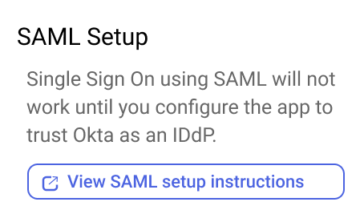

# Integrating Okta SSO

Liferay supports a variety of single sign-on (SSO) standards including OpenID Connect (OIDC) and Security Assertion Markup Language (SAML). Clarity wants to use Okta, a SAML based SSO service, together with Liferay. Clarity appreciates the convenience of having one login not only for Liferay, but for the other services they use. In addition to authentication, they can use Okta to serve as their identity provider (IdP) and sync all user identities with Liferay. Continue reading to see the basic steps to set up your Liferay DXP instance as the Service Provider (SP), and Okta as the Identity Provider (IdP).

!!! note
    This tutorial requires you to have an existing Okta developer account to test with.

## Okta Configuration

1. Log in to [Okta Dev](https://developer.okta.com/login/). In the left menu, click on _Applications_ under the applications sub-section. In the new page click _Create App Integration_. 

1. Select `SAML 2.0` and click _Next_.

1. Enter *liferaysaml* as the app name and click next.

1. Enter the following fields:
    - Single sign-on URL: *http://[your_lifray_saas_environment]/c/portal/saml/acs*
    - Audience URI (SP Entity ID): *samlspdemo*
    - Name ID format: *EmailAddress*
    - Application username: *Email*

    

1. Add the following attribute statement:
    - `screenName (Unspecified) = user.firstName`
    - `firstName (Unspecified) = user.firstName`
    - `lastName (Unspecified) = user.lastName`
    - `emailAddress (Unspecified) = user.email`

1. Click *Next* at the bottom of the page.  Finally, click _Finish_ on the next page.

1. On the Sign On tab, confirm that Application username format is set to to Email.

1. Click *View SAML Setup Instructions* on the right side of the page. A new page will open.

    

1. Under the Optional heading, select and copy all the xml text. Paste the block of text into a new text file and save the file with the name `oktametadata.xml`.

1. Navigate back to _Applications_ &rarr; _Applications_. Click on the down arrow for the *liferaysaml* application. Click on *Assign to Users*, click *Assign* for the users you want to provision Liferay access. Then click *Save and Go Back*.

## Liferay DXP Configuration

1. Log in to Liferay and navigate to _Control Panel_ &rarr; _Security_ &rarr; _SAML Admin_.

1. Set the SAML Role to *Service Provider*, and Entity ID to *samlspdemo*. Click _Save_.

1. Click *Create Certificate* under the certificate and private key section. Input the following:
    - Enter the common name as `okta-saml`.
    - Scroll down to the bottom. Input the key password as `learn`.
    - Click *Save*.

1. Leave the default settings under the _Service Provider_ tab.

1. Click the _Identity Provider Connections_ tab. Click *Add Identity Provider* and set the following:
    1. Name: *okta*
    1. Enter the entity ID (found in xml file as `entityID`)
    1. Check the *Enabled* box
    1. Under the Metadata section, choose *Upload Metadata XML* and upload the `oktametadata.xml` file created previously
    1. Set *Name Identifier Format* to *Email Address*
    1. Enter the following attribute mappings under Basic User Fields:

        | User Field Expression | SAML Attribute |
        |:----------------------|:---------------|
        | emailAddress          | emailAddress   |
        | firstName             | firstName      |
        | lastName              | lastName       |
        | screenName            | screenName     |

    1. Click on *Save*

3. Go back to *General* tab and make sure the `Enabled` checkbox is checked. Click *Save*.

1. As a precaution, create a temporary site page and add a `Sign In` widget to it. In case testing the SSO fails, this can provide a login workaround.

2. Log out of your Liferay instance and click *Sign In* in the top right corner. You are redirected to the Okta login page.

    

3. Input your user email and password and click _Sign in_. You are redirected back to Liferay and automatically signed in. Note that if the login is a new user, a new user account is automatically created in Liferay.

## Further Reading

See our documentation about [configuring single sign-on](https://learn.liferay.com/w/dxp/installation-and-upgrades/securing-liferay/configuring-sso) to learn about integrating other solutions such as OpenAM, OpenID Connect, CAS, and Kerberos.  

In addition to a universal user directory like Okta, Liferay supports connecting traditional active directories. See [connecting a user directory](https://learn.liferay.com/w/dxp/users-and-permissions/connecting-to-a-user-directory/connecting-to-an-ldap-directory) to learn more.

Next: [Liferay Security Features](./liferay-security-features.md)
