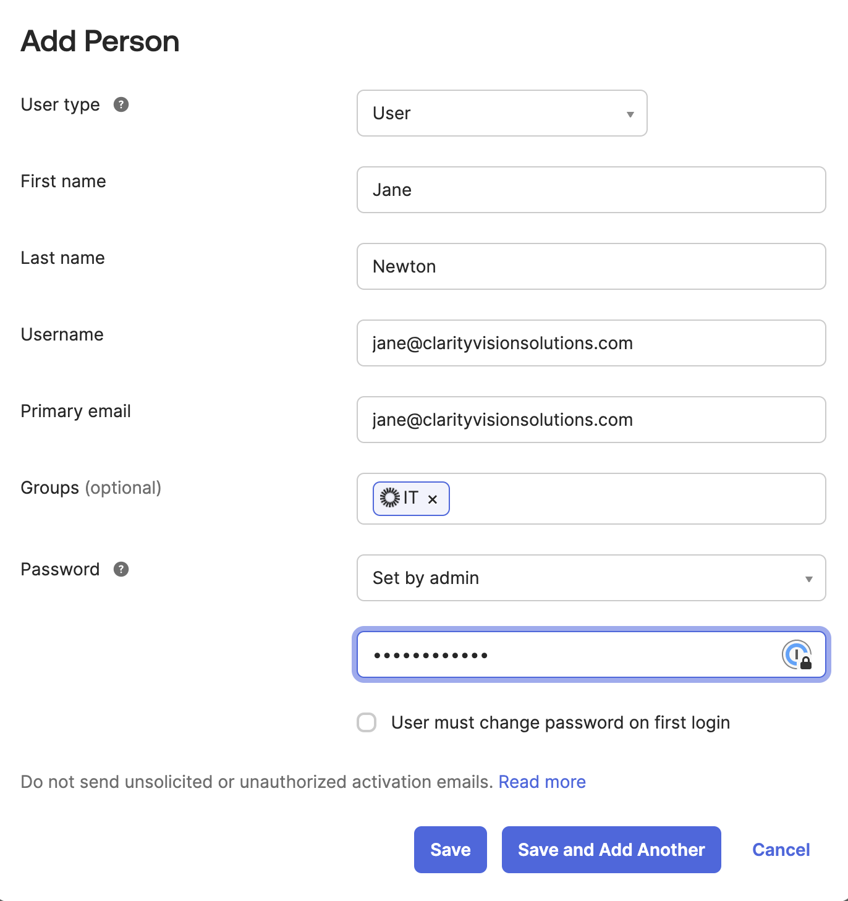
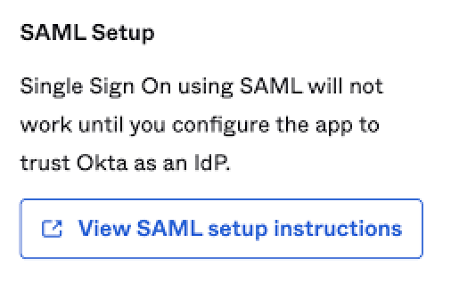

# Integrating Okta SSO

Liferay supports a variety of single sign-on (SSO) standards including OpenID Connect (OIDC) and Security Assertion Markup Language (SAML). Clarity wants to use Okta, a SAML based SSO service, together with Liferay. Clarity appreciates the convenience of having one login not only for Liferay, but for the other services they use. In addition to authentication, they can use Okta to serve as their identity provider (IdP) and sync all user identities with Liferay. Continue reading to see the basic steps to set up your Liferay DXP instance as the Service Provider (SP), and Okta as the Identity Provider (IdP).

!!! note
    This tutorial requires you to have an existing Okta account to test with.

## Okta Configuration

1. Log in to [Okta Dev](https://developer.okta.com/login/) and navigate to _Applications_ &rarr; _Add Application_ (Shortcuts in the right menu) &rarr; _Create App Integration_. 

1. Select SAML 2.0.

1. Enter *liferaysaml* as the name and click next.

1. Enter the following fields:
    - Single sign-on URL: *http://[your_lifray_saas_environment]:8080/c/portal/saml/acs*
    - Audience URI (SP Entity ID): *samlspdemo*
    - Name ID format: *EmailAddress*
    - Application username: *Email*

    

1. Select Attribute Statements
    - `screenName (Unspecified) = user.firstName`
    - `firstName (Unspecified) = user.firstName`
    - `lastName (Unspecified) = user.lastName`
    - `emailAddress (Unspecified) = user.email`

1. Click *Next*, check the second box on either you are a customer or partner > *Finish*.

1. On the Sign On tab, confirm that Application username format is set to to Email.

1. On the Sign On tab, under SAML Setup on the right side, click *View SAML Setup Instructions* button.

1. Under the Optional heading, select all the xml text and use it to create `oktametadata.xml`.

1. Navigate to Applications &rarr; Applications. Click on the down arrow for the *liferaysaml* application. Click on *Assign to Users*, click *Assign* for your users, then on *Save and Go Back*.

## Liferay DXP Configuration

1. Log in to Liferay and navigate to _Control Panel_ &rarr; _Security_ &rarr; _SAML Admin_.

1. Set the SAML Role to *Service Provider*, and Entity ID to *samlspdemo*.

1. Click *Create Certificate* under the certificate and private key section.
    - Enter the common name as `foo`.
    - Scroll down to the bottom. Input the key password as `learn`.
    - Click *Save*.
    - Finally, tick the *Enabled* checkbox under the general tab and click *Save*.

1. In Service Provider tab, keep the default settings and click *Save*.
    - *Clock Skew*: 3000
    - *Sign Authn Requests?* selected
    - *Sign Metadata?* selected
    - *Allow showing the login portlet.* selected

1. In Identity Provider Connections tab, click *Add Identity Provider* and set the following:
    1. Name: *okta*
    1. Enter the entity ID (found in xml file as `entityID`)
    1. Check the *Enabled* box
    1. Choose *Upload Metadata XML* and upload the `oktametadata.xml` file created previously
    1. Set *Name Identifier Format* to *Email Address*
    1. Enter the following attributes under Basic User Fields:

        | User Field Expression | SAML Attribute |
        |:----------------------|:---------------|
        | emailAddress          | emailAddress   |
        | firstName             | firstName      |
        | lastName              | lastName       |
        | screenName            | screenName     |

    1. Click on *Save*

1. Go back to *General* tab and enable the Service Provider. Click *Save*.

1. As a precaution, create a temporary site page and add a `Sign In` widget to it. In case testing the SSO fails, this can provide a login workaround.

1. Open a new browser and click top right *Sign In* which will redirect user to Okta sign in page.

    

1. Fill in the user email and password.

1. You will be redirected back to your Liferay home page and automatically signed in.

## Further Reading

See our documentation about [configuring single sign-on](https://learn.liferay.com/w/dxp/installation-and-upgrades/securing-liferay/configuring-sso) to learn about integrating other solutions such as OpenAM, OpenID Connect, CAS, and Kerberos.  

In addition to a universal user directory like Okta, Liferay supports connecting traditional active directories. See [connecting a user directory](https://learn.liferay.com/w/dxp/users-and-permissions/connecting-to-a-user-directory/connecting-to-an-ldap-directory) to learn more.

Next: [Liferay Security Features](./liferay-security-features.md)
