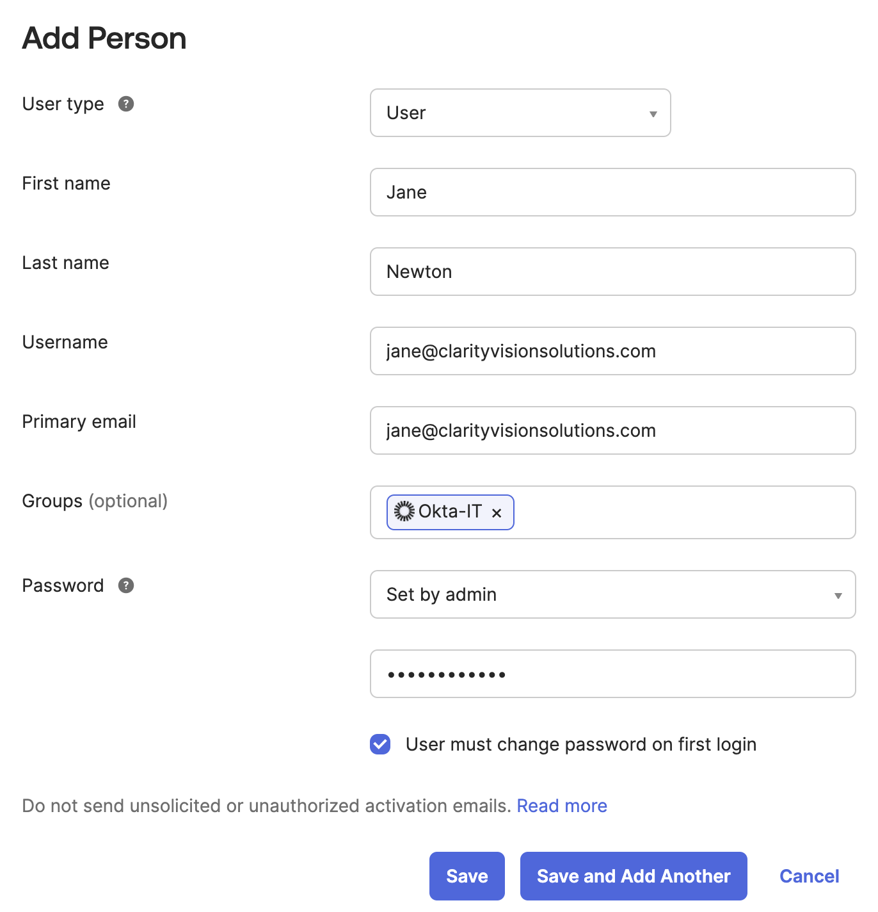
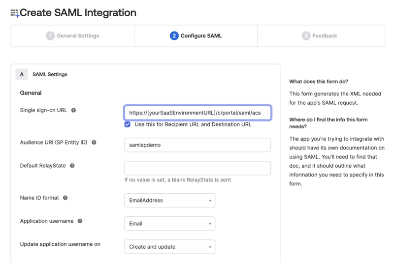

# Integrating Okta SSO

Clarity is leveraging Okta’s Workforce Identity Cloud product to manage their employee information. Okta is a Cloud based Identity Management service that allows Clarity to securely manage their employee’s identity information and manage secure authentication into the applications they use. Okta provides many different features, but for this training we’re going to be focusing on their support of the SAML protocol to support Single Sign On.

!!! important
    In this training course, we are using Okta to illustrate a common identity management and single sign on scenario. While we are not specifically endorsing the use of Okta as a best practice, we are endorsing the use of external authentication as a best practice. The process of authentication requires multiple rounds of password hashing which consumes a considerable amount of processing power. This is processing power that can’t be used to serve other web site requests.

    While Clarity's current user base may be small, implementing a Single Sign-On (SSO) solution now offers significant advantages that extend beyond simply accommodating future growth. This proactive approach ensures a smooth user experience and robust security posture as Clarity scales.

## What is SAML?

SAML stands for Security Assertion Markup Language and it is an open standard used for authentication. SAML works by passing authentication information in a specific format between two applications, an Identity Provider (IdP) and a Service Provider (SP). By using SAML, Clarity employees only need to remember one set of credentials to access all their SAML-enabled applications, eliminating the need for multiple logins. Additionally, Okta securely stores these credentials, reducing the risk of data breaches compared to individual app logins. Okta's robust security features like multi-factor authentication and streamlined password resets further enhance protection against common attacks.

In this context and using this language, Okta is configured as the Identity Provider (IdP) and Liferay will be acting as a Service Provider (SP).

## Configuring Okta as an IdP

!!! note
    These steps are not guaranteed to be accurate and are only presented to illustrate the general steps needed. This tutorial requires you to have an existing Okta developer account to test with.

In your Okta developer account, create a new group called `Okta-IT`. Then create the following user:

| Field | Value |
|:--- |:--- |
| User type | Select `User` |
| First name | `Jane` |
| Last name | `Newton` |
| Username | `jane@clarityvisionsolutions.com` |
| Primary email | `jane@clarityvisionsolutions.com` |
| Groups | `Okta-IT` |
| Password | select `Set by admin` and input `LearnLiferay` as the password |
| User must change password on first login | unchecked |

## Exercise 1: Configuring Okta as an Identity Provider

In order to configure Okta as an Identity Provider for your Liferay instance, you will need to provide it with the URL of your Liferay instance. As part of this process, you will prompt Okta to generate a metadata `.xml` file that you will need in order to configure Liferay as a Service Provider in a later exercise.

Follow these steps in Okta to configure Okta as an Identity Provider:

1. Log in to [Okta Dev](https://developer.okta.com/login/). In the left menu, click on *Applications* under the applications sub-section. In the new page click *Create App Integration*.

1. Select `SAML 2.0` and click *Next*.

1. Enter `liferay-saml-{your.name}` as the app name and click next.

1. Enter the following fields:
    * Single sign-on URL: *http://[your_lifray_saas_environment]/c/portal/saml/acs*
    * Audience URI (SP Entity ID): *samlspdemo*
    * Name ID format: *EmailAddress*
    * Application username: *Email*

    

1. Add the following attribute statement:

    | Name | Name Format | Value |
    |:--- |:--- |:--- |
    | `screenName` | Unspecified | `user.firstName` |
    | `firstName` | Unspecified | `user.firstName` |
    | `lastName` | Unspecified | `user.lastName` |
    | `emailAddress` | Unspecified | `user.email` |

1. Add the following group attribute statement:

    | Name | Name Format | Filter | Value |
    |:--- |:--- |:--- |:--- |
    | `userGroup` | Unspecified | Starts with | `Okta` |

1. Click *Next* at the bottom of the page. Finally, click *Finish* on the next page.

1. On the Sign On tab, confirm that Application username format is set to Email.

1. Click *View SAML Setup Instructions* on the right side of the page. A new page will open.

    

1. Under the Optional heading, select and copy all the xml text. Paste the block of text into a new text file and save the file with the name `oktametadata.xml`.

1. Next, click on the *Assignments* tab of your application. Click *Assign* and select *Assign to People*. Click *Assign* next to Jane Newton.

    

    In the next window, click *Save and Go Back*.

1. In the list of users, click *Assign* for your own user account as well. Click *Save and Go Back*.

!!! note
    Make sure to assign yourself and provision your own user account so that you will still be able to log in as the Liferay administrator.

## Exercise 2: Configuring Liferay as a Service Provider

Follow these steps in Liferay to configure Liferay as a Service Provider:

!!! Note
    This exercise assumes you have a Liferay User Group created, named `Okta-IT`. If you are following the story of Clarity with the Clarity sample site, then this has already been created for you. Otherwise, create a new User Group on Liferay called, `Okta-IT`. See our documentation about [user groups](https://learn.liferay.com/w/dxp/users-and-permissions/user-groups)

1. In Liferay, navigate to *Control Panel* &rarr; *Security* &rarr; *SAML Admin*.

1. Set the SAML Role to *Service Provider*, and Entity ID to *samlspdemo*. Click *Save*.

1. Click *Create Certificate* under the certificate and private key section. Input the following:
    * Enter the common name as `okta-saml`.
    * Scroll down to the bottom. Input the key password as `learn`.
    * Click *Save*.

1. Leave the default settings under the *Service Provider* tab.

1. Click the *Identity Provider Connections* tab. Click *Add Identity Provider* and set the following:
    1. Name: *okta*
    1. Enter the entity ID (found in xml file as `entityID`)
    1. Check the *Enabled* box
    1. Under the Metadata section, choose *Upload Metadata XML* and upload the `oktametadata.xml` file created previously
    1. Set *Name Identifier Format* to *Email Address*
    1. Enter the following attribute mappings under Basic User Fields:

        | User Field Expression | SAML Attribute |
        |:----------------------|:---------------|
        | emailAddress          | emailAddress   |
        | firstName             | firstName      |
        | lastName              | lastName       |
        | screenName            | screenName     |

    1. Enter the following attribute mapping under Group Attribute Statements:

        | Name      | Name format | Filter      | Input |
        |:--------- | :---------- |:----------- |:----- |
        | userGroup | Unspecified | Starts with | Okta  |

        !!! note
            This [importing user groups through SAML](https://learn.liferay.com/w/dxp/installation-and-upgrades/securing-liferay/configuring-sso/authenticating-with-saml/importing-user-groups-memberships-from-an-external-idp-through-saml) feature is currently behind a dev feature flag.

    1. Click on *Save*

1. Go back to *General* tab and make sure the `Enabled` checkbox is checked. Click *Save*.

1. Log out of your Liferay instance and click *Sign In* in the top right corner. You are redirected to the Okta login page.

    

    !!! important
        Note, if you have previously logged in with Okta, you may need to try with your browser in incognito mode.

1. Input the user name `jane@clarityvisionsolutions.com` and the password `LearnLiferay`. You have successfully logged in as a Clarity team member.

1. Log out of the account and sign back in with your Liferay administrator account.

1. Navigate to *Control Panel* &rarr; *Users and Organizations*. Verify that Jane Newton's account came into Liferay and that she was automatically assigned to the `Okta-IT` Liferay user group.

    

!!! note
    Okta SSO was enabled in this exercise. Feel free to disable it as you continue this course.

## Conclusion

Great job! Your Liferay instance is now integrated with Okta and Clarity's employees now have a clear path to begin authenticating to Liferay! Later on we will get into how to configure roles and permissions for those users, but next we will turn our attention to Clarity's Business Partners and Guest users.

Next Up: [Managing Clarity Business Partners and Guests](./managing-clarity-business-partners-and-guests.md)

## Additional Resources

See our documentation to learn more about configuring SSO with other identity management solutions or integrating user directories with Liferay:

* [Configuring Single Sign-On](https://learn.liferay.com/w/dxp/installation-and-upgrades/securing-liferay/configuring-sso)
* [Connecting a User Directory](https://learn.liferay.com/w/dxp/users-and-permissions/connecting-to-a-user-directory/connecting-to-an-ldap-directory)
