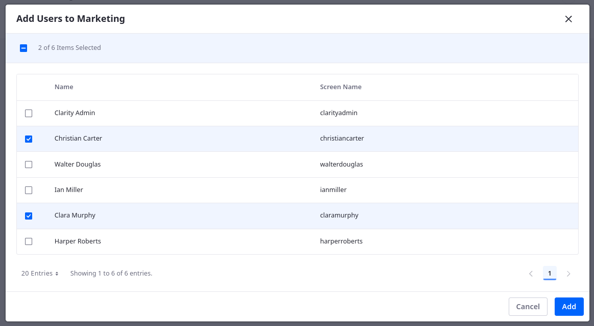

# Adding Clarity's Users and Groups

Users are individuals who interact with the Liferay platform, whether authenticated or not. To organize authenticated users, you can also create user groups based on shared attributes to simplify role management. In this section, you'll set up users and user groups for Clarity's enterprise website.

## Exercise: Creating Users

<!-- Exercise 3a -->

While building the public enterprise website, we'll follow these Clarity personas as they contribute to the final site:

| Screen Name     | Email                                         | First Name | Last Name | Job Title                  |
|:----------------|:----------------------------------------------|:-----------|:----------|:---------------------------|
| christiancarter | `christian.carter@clarityvisionsolutions.com` | Christian  | Carter    | Marketing Coordinator      |
| claramurphy     | `clara.murphy@clarityvisionsolutions.com`     | Clara      | Murphy    | Marketing Manager          |
| harperroberts   | `harper.roberts@clarityvisionsolutions.com`   | Harper     | Roberts   | Human Resources Specialist |
| ianmiller       | `ian.miller@clarityvisionsolutions.com`       | Ian        | Miller    | IT Manager                 |
| walterdouglas   | `walter.douglas@clarityvisionsolutions.com`   | Walter     | Douglas   | Web Developer              |

The training workspace already includes all of these users except for Christian Carter. Here you'll add him manually as the Clarity Admin user.

!!! note
    In real world scenarios, large organizations like Clarity would benefit from using an identity and access management system (e.g., Okta) to add users to their Liferay instance. For training purposes, you'll create the missing user manually.

To do this,

1. Open the *Global Menu* (), go to the *Control Panel* tab, and click *Users and Organizations*.

   

   Here you can view and manage all users for the current Liferay instance. This should include the Clarity Admin user along with Walter Douglas, Ian Miller, Clara Murphy, and Harper Roberts.

   

1. Click *New*.

1. To set the user's profile image, click the *Change Image* button (), click *Select*, navigate to the `[repository-folder]/exercises/lesson-3/` folder in the training workspace, select `christian-carter.png`, and click *Done*.

   

1. Enter these details for Christian Carter:

   | Field         | Value                                         |
   |:--------------|:----------------------------------------------|
   | Screen Name   | `christiancarter`                             |
   | Email Address | `christian.carter@clarityvisionsolutions.com` |
   | Job Title     | `Marketing Coordinator`                       |
   | First Name    | `Christian`                                   |
   | Last Name     | `Carter`                                      |

   

1. Click *Save*.

   You can now access additional configuration options for Christian Carter.

1. In the left menu, click *Password*.

1. Enter `learn` for his password.

   

1. Click *Save*.

Great! You've added Christian Carter to Clarity's Liferay instance. Next you'll create a user group to help organize and manage Clarity's users.

## Exercise: Creating and Assigning User Groups

<!-- Exercise 3b -->

In a real-world scenario, organizations like Clarity have hundreds of users, and managing them individually is impossible. To help reduce the burden of user management, Liferay provides user groups for easily assigning roles to related users. The next exercise will explore roles in more detail.

To begin with, Clarity needs these user groups:

| Group Name      | Description                                           |
|:----------------|:------------------------------------------------------|
| Human Resources | Members of the human resources department at Clarity. |
| IT              | Members of the IT department at Clarity.              |
| Marketing       | Members of the marketing department at Clarity.       |

The training workspace includes both the IT and Human Resources user groups. Here you'll create and assign Clarity's *Marketing* user group as the Clarity Admin user.

To do this,

1. Open the *Global Menu* (), go to the *Control Panel* tab, and click *User Groups*.

   

1. Click *New*.

1. Enter these details for the user group:

   | Field       | Value                                             |
   |:------------|:--------------------------------------------------|
   | Name        | `Marketing`                                       |
   | Description | `Members of the marketing department at Clarity.` |

   

1. Click *Save*.

   This creates the user group, so you can now add Clarity's marketing users to it.

1. Click the *Marketing* user group.

1. Click *New*.

1. Select *Christian Carter* and *Clara Murphy*.

   

1. Click *Add*.

<!-- Great! Now any roles assigned to the Marketing user group are automatically assigned to all team members. Next, you'll learn how to define and assign custom roles for Clarity. -->

## Conclusion

Great! Now any roles assigned to the Marketing user group are automatically assigned to all team members. Next, you'll learn how to define and assign custom roles for Clarity.

Next Up: [Defining and Assigning Roles to Clarity's Users](./defining-and-assigning-roles-to-claritys-users.md)

## Additional Resources

See official documentation to learn more about users and user groups:

* [Users](https://learn.liferay.com/w/dxp/users-and-permissions/users)
* [Creating and Managing User Groups](https://learn.liferay.com/w/dxp/users-and-permissions/user-groups/creating-and-managing-user-groups#creating-and-managing-user-groups)
