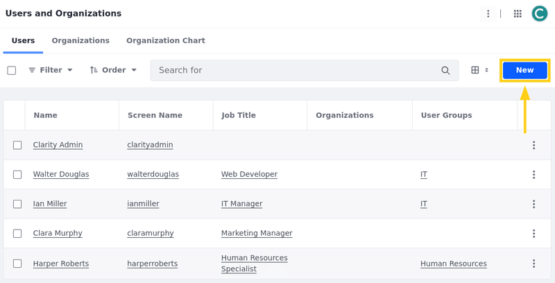
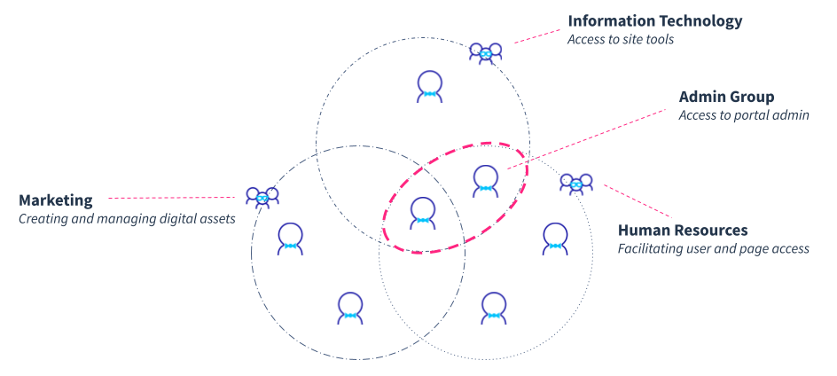

# Understanding Liferay Authorization and User Management

So far we've seen how Clarity Vision Solutions can authenticate and manage users with SSO services. Next we'll shift our focus to authorization and learn best practices for managing users and their permissions. Where authentication verifies user identities, authorization determines the applications and resources they can access and the actions they can perform. Liferay includes multiple applications for designing a robust user management strategy.

<!--TASK: Add diagram of Liferay's user management features-->

!!! note "User Management"
    The primary concern of user management is controlling access to content and platform features. When done right, users are granted access only to the resources and applications necessary for their responsibilities.

At Clarity, each user has different responsibilities in developing the enterprise website. In the following articles, you'll learn how to grant the right level of platform permissions to users so they can do everything they need to do and nothing they shouldn't.

## Users and User Groups

The cornerstone of Liferay's user management is the user entity. Every person who accesses and interacts with the Liferay platform is considered a user. Users can be either authenticated (with credentials) or unauthenticated (guests). Authenticated users can be created manually in Liferay or imported and managed from existing data stores or identity providers. 

!!! tip
    While manually creating users in Liferay is possible, importing them from existing data stores or identity providers is far more efficient. 

To help manage users, Liferay provides user groups. These groups are essentially groups of authenticated users that you can use to more easily manage role assignment.

In the real world, it often takes a lot of people to manage and maintain a vibrant enterprise website. For this training, you'll follow these five personas:

By understanding their responsibilities, we can begin to define how to grant appropriate permissions for each user.

<!--TASK: Determine whether to include...
### Organizations

Liferay offers Organizations as an additional user management tool. You can use them to model a company's hierarchy. It is also an important part of managing groups of accounts. As Clarity's business grows and site requirements evolve, Clarity can consider leveraging Liferay organizations in the future. See official documentation to learn more about [organizations](https://learn.liferay.com/w/dxp/users-and-permissions/organizations/understanding-organizations).

### Accounts

Liferay also offers for user accounts. You can use them to model business relationships to help manage external parties. For example, accounts can represent individual customers in a business-to-consumer (B2C) context, or they can represent individual businesses in a business-to-business (B2B) context where each account has multiple associated users. See official documentation to learn more about [accounts](https://learn.liferay.com/w/dxp/users-and-permissions/accounts). -->

## Roles and Permissions

Liferay employs a role-based access control (RBAC) model for managing user authorization. This system revolves around two core components: roles and permissions. 

* **Role**: Roles are essentially collections of permissions that you can assign to users or user groups. Once assigned, the user receives all permissions defined for that role. 

* **Permissions**: Permissions, on the other hand, are granular checks that grant access to specific applications or resources. Within this system, permissions are additive, meaning users only have access to what's explicitly granted through assigned roles. 

This role-based approach fosters flexibility and efficiency. By strategically assigning permissions through roles, organizations can streamline user management while maintaining granular control over system access. This method promotes reusability, reducing administrative overhead and minimizing security risks.

### Role Types

Each role has a specific type that determines the scope of its permissions.

| Role type          | Scope                                                   |
|:-------------------|:--------------------------------------------------------|
| Regular Role       | Apply permissions globally across the Liferay instance. |
| Site Role          | Scopes permissions to a particular site.                |
| Organization Role  | Scopes permissions to an organization hierarchy.        |
| Asset Library Role | Scopes permissions to an asset library                  |
| Account Role       | Scopes permissions to users in an account.              |

Besides regular roles, each role is assigned on an individual basis (i.e., to an individual site, organization, asset library, or account). This enables a high level of permission control. For example, sometimes you may want permissions to be valid only in certain sites or set of pages. other times you may want the permissions to apply across the whole instance. With Liferay you can build multiple sites, and users can be members of multiple sites with different roles with different permissions in each site.

### Permissions Types

With Liferay's flexible permissions system, you can assign permissions at two levels. You can assign general permissions for applications and resources, or you can assign specific permissions for individual data items.

* **General Permissions**: Provide overall access to an application and its resources. 

* **Resource-Specific Permissions**: Grant specific resource-related actions for existing data items within an application.

General permissions are assigned within the Roles application, granting overarching access to applications and their functionalities. These permissions are further classified into two main categories: application and resource permissions. Application permissions grant the ability to perform general application-related operations and do not include permissions to create, view, or manage the application’s resources. By contrast, resource permissions grant access to view, create, and act on all application resources. Some of these permissions are for creating data items while others are for acting on existing data items. For example, with these permissions, a role might grant access the Asset Libraries application and the ability to create new libraries or configure existing libraries. 

Resource-specific permissions are defined within an application itself, allowing fine-grained control over individual data items. For example, a role might have permission to access and configure one library without being able to access other libraries.

Understanding these concepts is crucial for effective permission management. You might have the ability to view a content template, but not necessarily the specific content using that template. For instance, you could view the "News Article" template without having access to all published news articles. This level of granularity is essential for building robust and secure access controls.

So when you are building out your permissions matrix, it is important to think about what actions your role should have as well as which data (or resources) they should be able to perform those actions on. In addition to  defining a role's permissions, it's important to consider how best to manage role assignment.

## Managing Role Assignment with User Groups

Maintaining accurate and up-to-date user permissions is critical to an organization's security. Yet assigning roles to individual users can be time-consuming and error-prone, especially in large organizations. Liferay provides user groups to streamline and simplify role assignment. These groups serve as categories for users who share common responsibilities in Liferay. Roles assigned to a user group are inherited by all members of that group. 

The above diagram illustrates overlapping responsibilities among different organizational groups. To implement this in Liferay, users can belong to multiple groups to inherit the correct sets of permissions. The overlap between the circles indicates shared responsibilities or users. For example, the overlap between Marketing and Human Resources might represent individuals who both create and manage digital assets related to HR. The "Admin Group" represents a broader level of access, encompassing tasks beyond specific departmental functions.

!!! tip
    By assigning roles to user groups, you can simplify role assignment. Where possible, avoid directly assigning roles to individual users.

When creating user groups, ensure you follow a consistent organizational principle. For example, you may create user groups based on shared responsibilities. That is, if some users require the same permissions on the platform (e.g., IT administrators), you can create a user group for them and assign the appropriate role(s) to the group. Also, if your organization has multiple users who need access to the same site(s), you can leverage user groups to manage membership and site roles. As such, user groups are an integral part of creating reusable user segments for authorization.

Furthermore, user groups enhance efficiency and security by integrating with external LDAP systems. This means you can import user groups and synchronize changes between systems. This streamlines user provisioning and ensures consistent access controls across your organization, since Liferay can synchronize the LDAP and internal Liferay records at regular intervals.

## Designing Role Architectures

The foundation for a successful role architecture lies in understanding your organization's structure and individual responsibilities. While there is no one-size-fits-all solution, the following considerations are helpful for implementing an effective strategy in Liferay. 

<!--TASK: Add Diagram-->

### Identify Responsibilities and Necessary Permissions

Effectively designing a role architecture begins with a thorough understanding of your organization's structure and user responsibilities. Analyze each responsibility to determine the actions they need to perform. By identifying these core functions, you can establish a solid foundation for creating roles and identifying their necessary permissions.

### Define Roles for Discrete Responsibilities

After identifying user responsibilities, you can group related responsibilities and create corresponding roles. As part of this process, you'll want to consider the scope of each responsibility. For example, does it require users to have permissions across all sites or only one site? Then you can define the role's permissions.

As you define permissions, follow the principle of least privilege. That is, ensure you only grant the role the permissions necessary for fulfilling its corresponding responsibility. If a responsibility doesn't need a particular privilege, then don’t grant it. And if a responsibility only requires permissions within a single site, then use a site role instead of a regular role.

### Group Users for Efficient Role Assignment

As you define roles and permissions, it's essential to organize users into groups for efficient role management. This streamlines administration, reduces errors, and enhances security. Users can belong to multiple groups, and groups may encompass several roles. So throughout the planning process, identify the groups of users that belong together and consider how to efficiently group together your defined roles for their shared responsibilities.

### Iterate and Review Your Design

Finally, role architectures are often refined over time. Be prepared to make adjustments as needed, and periodically assess and update your role architecture to ensure it aligns with evolving requirements.

## Conclusion

With Liferay, you can create multiple roles, define specific privileges or permissions for each role, and then assign those roles to user groups. Next, let's explore best practices for designing a role architecture in Liferay.

Now that you've reviewed the features and best practices for implementing effective authorization strategies in Liferay, let's put these concepts into practice by creating users and user groups for Clarity's enterprise website solution.

Next Up: [Setting Up Clarity's Users and Groups](./setting-up-claritys-users-and-groups.md)

## Additional Resources

See official documentation to learn more about Liferay's authorization and user management features:

* [Users](https://learn.liferay.com/w/dxp/users-and-permissions/users)
* [Understanding Roles and Permissions](https://learn.liferay.com/w/dxp/users-and-permissions/roles-and-permissions/understanding-roles-and-permissions)
* [Creating and Managing User Groups](https://learn.liferay.com/w/dxp/users-and-permissions/user-groups/creating-and-managing-user-groups#creating-and-managing-user-groups)
