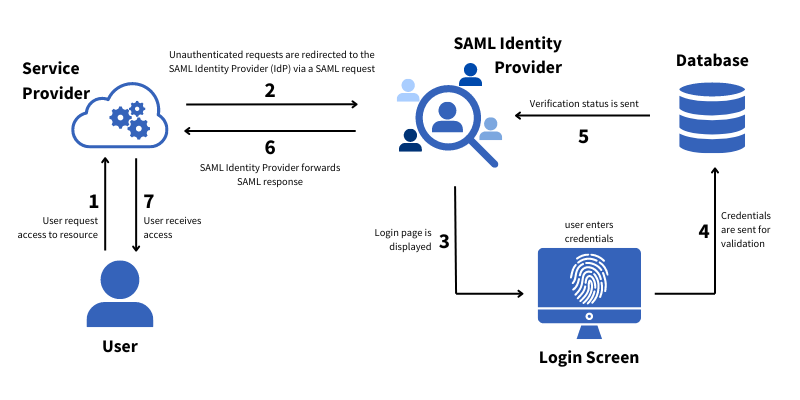

# Using Third-Party Services for Authentication and SSO

As previously mentioned, using Liferay for authentication is not recommended for production environments. While Liferay instances begin with basic authentication, organizations should integrate with third-party authentication and SSO services. Here we'll explore some of those options available.

## OpenID Connect (OIDC)

Liferay provides native support for OpenID Connect. OpenID Connect is a standards-based, decentralized authentication protocol that allows websites and applications to verify a user's identity based on existing login sessions with other services. It sits on top of OAuth 2.0, providing login and profile information in addition to the authorizations defined and handled by OAuth 2.0.

OpenID Connect is typically used in commerce scenarios, where you’re allowing users to connect to Liferay using well-known providers like Google, Facebook, Microsoft, Apple, and GitHub. As long as a provider supports OIDC, you can use it for authentication with a simple configuration on the Liferay DXP side and does not require custom development. Additionally, OIDC automatically creates accounts in Liferay when users first authenticate to the platform using their OIDC credentials.

That said, OIDC is generally best for lightweight applications or ones that need minimum verification. From a security standpoint, you should use a more mature and feature rich authentication standard like SAML.

## SAML, SSO, and Identity Management Systems

Security Assertion Markup Language (SAML) is an alternative standard to OpenID Connect for securely exchanging authentication and authorization data between two parties. These parties are known as the identity provider (IdP) and the service provider (SP).

* **Identity Provider**: The identity provider is any (typically centralized) service that stores user accounts and credentials and is responsible for verifying login attempts.

* **Service Provider**: The service provider is any application or website that relies on the IdP to verify user identities for access control.

In this scenario, a third-party identity provider is configured to work with Liferay as the service provider. With this configuration, passwords are not maintained in Liferay, but user accounts are still created so that permissions can be assigned. This is a good example of the separation between Authentication and Authorization: Users are Authenticated against their credentials in the IDM, but are authorized by their permissions that are defined in Liferay.

SAML is frequently used to support Single Sign-On (SSO) where a single authentication task grants access to multiple systems. For example, imagine an organization that uses Liferay DXP for their intranet solution, alongside several cloud-based applications for customer relationship management (CRM), analytics, and project management. Traditionally, employees would need separate logins for the Liferay intranet and each cloud-based application. Single Sign-on allows employees to access all of these systems by authenticating once with the company's identity provider.

<!--TASK: Add Diagram -->

## How to Set Up Third-Party Services

Throughout this course, we'll use basic authentication for training purposes. For detailed instructions on setting up Okta and other authentication services, official documentation:

* [PingOne (SAML)](https://learn.liferay.com/web/guest/w/dxp/installation-and-upgrades/securing-liferay/configuring-sso/configuring-liferay-authentication-with-pingone-using-saml)
* [Okta (OIDC)](https://learn.liferay.com/w/dxp/installation-and-upgrades/securing-liferay/configuring-sso/configuring-liferay-authentication-with-okta-using-openid-connect)
* [Auth0 (OIDC)](https://learn.liferay.com/w/dxp/installation-and-upgrades/securing-liferay/configuring-sso/configuring-liferay-authentication-with-auth0-using-openid-connect)

## Clarity's Identity Authentication Solution

Clarity Vision Solutions already uses Okta's cloud-based identity management to manage employee information and authentication. They also have established efficient HR processes for onboarding and data management within Okta. Therefore, it is critical for Clarity to leverage these systems and processes. Fortunately, Liferay integrates seamlessly with Okta, enabling single sign-on (SSO) and eliminating the need for separate logins for the new website. This aligns with Clarity's desire to streamline access for content managers and system administrators.

Overall, using Okta for authentication and SSO provides these benefits:

* **Streamlined Access**: With SSO, Clarity employees only need one set of credentials to access all their SAML-enabled applications, eliminating the need for multiple logins.

* **Robust Security**: Okta securely stores user credentials, reducing the risk of data breaches compared to individual app logins. Additional security features like multi-factor authentication and streamlined password resets further enhance protection against common attacks.

* **Reduced IT Burden**: Using Okta leverages Clarity's existing identity management system, accelerating their delivery timeline while reducing costs and minimizing the need for additional IT resources.

* **Improved Efficiency**: Automatic synchronization with HR data provides real-time updates to user information and access control.

<!--TASK: Remove?
The following demo provides an illustration of how companies like Clarity can integrate Liferay with third-party services like Okta. If you want to follow along, you'll need an Okta account and a hosted Liferay DXP instance.

### Demo: Configuring Okta as an IdP

Coming Soon!

!!! important
    This demo uses Okta to illustrate a common identity management and SSO scenario. While we are not specifically endorsing the use of Okta as a best practice, we are endorsing the use of external authentication as a best practice.

    While Clarity's current user base may be small, implementing an SSO solution now offers significant advantages that extend beyond simply accommodating future growth. This proactive approach ensures a smooth user experience and robust security posture as Clarity scales.
-->

## Conclusion

Great job! You've explored how Clarity can use Okta SAML with SSO to authenticate users. Next, let's explore how to leverage Liferay's user management features to ensure Clarity's users have the correct platform authorizations. <!--ALT: "Next, let's explore how to leverage Liferay's user management features to authorize Clarity's users within the platform."-->

Next Up: [Understanding Liferay Authorization and User Management](./understanding-liferay-authorization-and-user-management.md)

## Additional Resources

See our documentation to learn more about configuring SSO with other identity management solutions or integrating user directories with Liferay:

* [Configuring Single Sign-On](https://learn.liferay.com/w/dxp/installation-and-upgrades/securing-liferay/configuring-sso)
* [Connecting a User Directory](https://learn.liferay.com/w/dxp/users-and-permissions/connecting-to-a-user-directory/connecting-to-an-ldap-directory)
* [Integrate Okta with Liferay DXP using OpenID Connect](https://learn.liferay.com/w/integrate-okta-with-liferay-dxp-using-openid-connect-1)
* [Configuring Liferay Authentication With Auth0 Using OpenId Connect](https://learn.liferay.com/web/guest/w/dxp/installation-and-upgrades/securing-liferay/configuring-sso/configuring-liferay-authentication-with-auth0-using-openid-connect)
