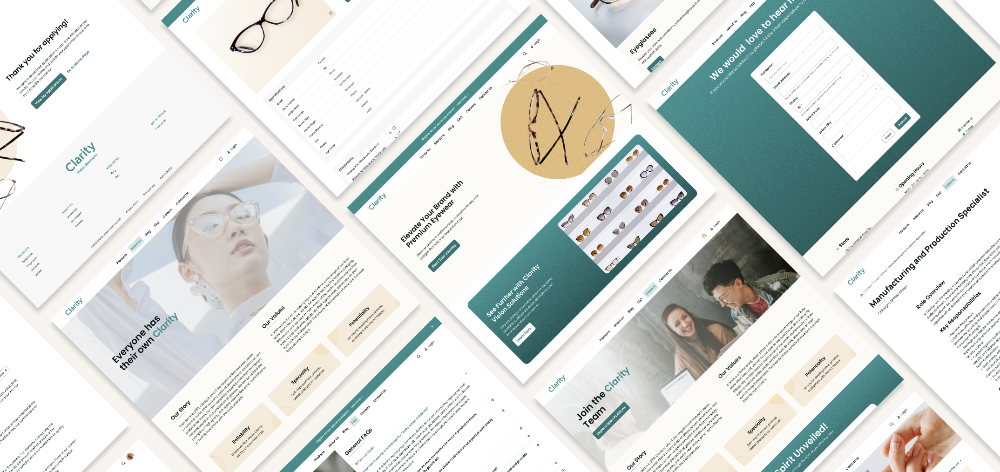

---
toc:
- ./module-5-site-building/claritys-site-building-requirements.md
- ./module-5-site-building/setting-up-claritys-site.md
- ./module-5-site-building/configuring-claritys-site.md
- ./module-5-site-building/adding-pages-to-claritys-site.md
- ./module-5-site-building/understanding-page-design.md
- ./module-5-site-building/designing-claritys-master-pages.md
- ./module-5-site-building/creating-claritys-navigation-menus.md
- ./module-5-site-building/creating-custom-fragments-for-clarity.md
- ./module-5-site-building/applying-claritys-brand-styling.md
uuid: b46186fd-6e49-4418-9b6f-b04710b36e4d
---
# Module 5: Site Building

!!! important "Webinar Note"
    This module was presented using slides for a live webinar audience. The formatting, presentation, and examples may differ from what is presented here as part of the course.

    * View the [recording](https://learn.liferay.com/web/guest/d/lp1-6-site-building) from the live webinar of this module.
    * Download the [PDF](https://learn.liferay.com/documents/d/guest/lp1-6-site-building-pdf) of the presentation used in the live workshop.

In the previous modules, we've seen how Clarity can leverage Liferay's user management features to import users and establish role-based access control. Now, it’s time to start contributing to Clarity’s public enterprise website! Liferay provides out-of-the-box tools for designing personalized website experiences across multiple channels and devices with ease. With a drag-and-drop visual page editor, Liferay's site building tools empower non-technical users to create and preview web pages without needing to write code. This allows for greater agility and content ownership. Liferay also provides more technical users with advanced features for extending a site's style and creating page elements with HTML, CSS, and JavaScript.

Throughout this module, you'll take on different Clarity personas and experience how Liferay's intuitive interface empowers them to implement site architecture, styling, and page design with speed and ease.

In this module, you will learn how to:

* Create a public website from scratch and learn about the benefits of templates and initializers
* Manage key site settings like membership, virtual hosting, and localization
* Create and publish different types of site pages
* Wireframe page designs
* Leverage master pages to establish consistent layouts and structures for site pages
* Implement user-friendly navigation experiences for users
* Create custom page fragments
* Apply custom styling to your site using Liferay’s out-of-the-box features and client extensions

Before you start working on the Clarity site, let’s review some of their site building requirements to help focus and guide our lessons and exercises.

Up First: [Clarity’s Site Building Requirements](./module-5-site-building/claritys-site-building-requirements.md)
