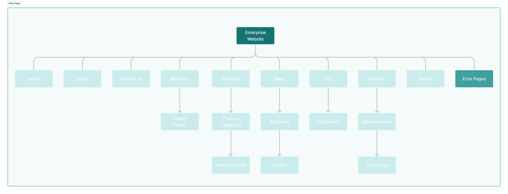
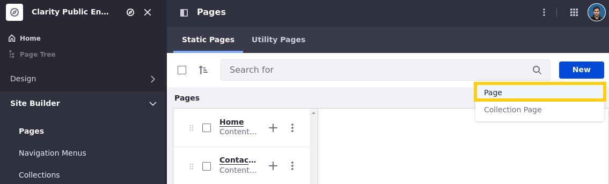
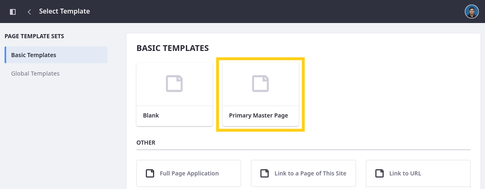
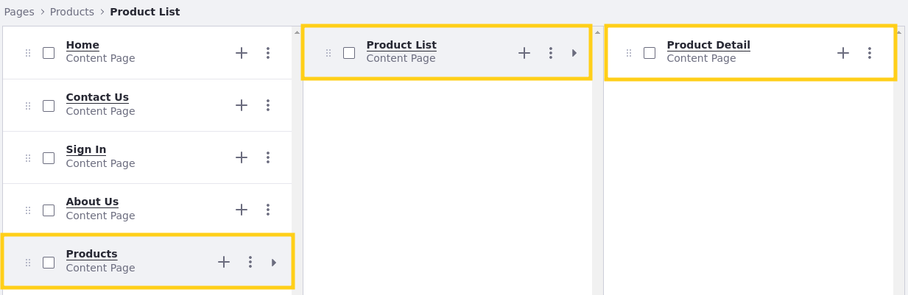
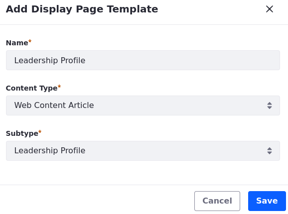
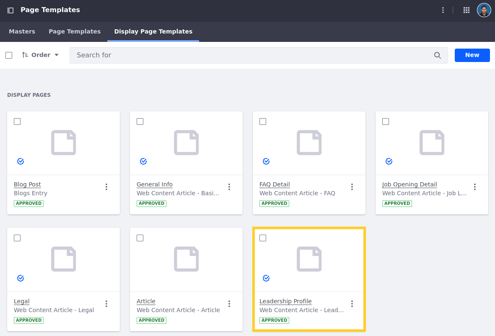

# Adding Pages to Clarity's Site

Pages are the fundamental building blocks of website structures. Each page is a canvas for designing engaging layouts with content (e.g., text, images, videos) and interactive elements (e.g., forms, widgets). Liferay's WYSIWYG editor and drag-and-drop elements provide an intuitive and user-friendly experience, so you can implement your vision without writing code. For advanced use cases, you can also create custom page elements using HTML, CSS, and JavaScript. To help you implement your solution, Liferay provides a variety of page types.

In this lesson, you'll use different page types to finish implementing Clarity's site map:

This site structure includes content pages, display pages, and utility pages.

## Content Pages

Content pages are used to create content-rich, visually engaging experiences. With an intuitive visual editor and drag-and-drop elements, you can quickly design page layouts, display content, and integrate functionality. Personalize content for specific audiences, manage localized translations, and optimize for all devices with the responsive layout editor. When integrated with Analytics Cloud, you can track content performance metrics and conduct A/B testing, creating page variants and track visitor data (e.g., bounce rate, clicks) to continuously improve engagement. Together, these features make content pages ideal for landing pages, marketing campaigns, and any scenario where presentation and user engagement are crucial.

<!--TASK: Update img -->

!!! tip “Content Pages vs. Widget Pages”
    Liferay also provides widget pages, but this course focuses on building user experiences with content pages. Content pages provide superior flexibility and integration with Liferay's latest content and personalization features, including fragments, collections, segmentation, and client extensions. Widget pages do not support these features. If you're working on an existing site with widget pages, you can convert them to content pages. See [Converting Widget Pages to Content Pages](https://learn.liferay.com/w/dxp/site-building/creating-pages/using-widget-pages/converting-widget-pages-to-content-pages) for more information.

<!--TASK:
### Parent and Child Pages

Explain the value of defining these relationships for content pages. Also note that the Open Positions page is a child of the Careers page. 
-->

## Display Pages

Display page templates define structures for displaying content at a dedicated URL. When you create or upload content items, Liferay generates a unique friendly URL for accessing it. However, you can only use this URL to view the content if you create one of these templates for displaying it. Display pages are built using the same UI and features as content pages. With these templates, you can establish a consistent visual style for different types of content.

<!--TASK: Update img -->

<!--TASK:
### Default Templates

Explain how applying a display page works... we will need to mark the category and product display pages and as the default for their content type.
-->

## Utility Pages

Utility pages handle specific functions within a site. Currently, you can use them to create your site's default 404 and 500 error pages. They are designed using the same tools and features as content pages. With them, you can ensure that even the errors returned to users maintain corporate branding while being easily maintained. Each site includes out-of-the-box error pages, which you can use or modify as needed.

<!--TASK: Update img -->

## Exercise: Adding Content Pages

<!-- Exercise 6a -->

As previously mentioned, Clarity wants to implement this page hierarchy for their enterprise website:

Some parts of this structure should be implemented as content pages, while others should be display pages or utility pages. The training workspace includes most of these pages, though it is missing the *FAQ* content page and the *Leadership Profile* display page.

Here you'll add the missing content page as Clarity's web developer, Walter Douglas.

To add the FAQ content page,

1. Sign in as Walter Douglas.

   * Email: `walter.douglas@clarityvisionsolutions.com`
   * Password: `learn`

   !!! note
       As a web developer, Walter Douglas has the site administrator role and perform most actions within the enterprise website.

1. Open the *Site Menu* (), expand *Site Builder*, and click *Pages*.

1. In the Static Pages tab, click *New* and select *Page*.

   

1. Select the *Primary Master Page* template.

   !!! note
       This applies an incomplete template provided by the training workspace. You'll complete this template in later exercises.

   

1. For name, enter `FAQ` and click *Add*.

   This creates a blank content page and directs you to Liferay's page editor UI. Here you can access all page building tools and configuration options.

   <!--TASK: Assess whether users should add the FAQ to the Resources navigation menu here instead of later.-->

1. For now, leave the page blank and click *Publish*.

   This is the final content page that Clarity needs for their site structure. But they need to reorganize some pages to create the desired hierarchy.

1. Drag and drop *Product Detail* onto *Product List* and then drag and drop *Product List* onto *Products*.

   This creates a hierarchical relationship between these pages.

   

1. Drag and drop *Open Positions* onto *Careers*.

With these pages in place, let's create the final part of Clarity's site structure: a display page for their leadership profiles.

## Exercise: Adding Display Page Templates

<!-- Exercise 6b -->

Display page templates define structures for displaying content at a dedicated URL. When you create or upload content items, Liferay generates a unique friendly URL for accessing it. However, you can only use this URL to view the content if you create one of these templates for displaying it. Display pages are built using the same UI and features as content pages.

The training workspace includes all necessary display pages except for the *Leadership Profile* template. Here you'll add this missing template as Walter Douglas.

To do this,

1. Open the *Site Menu* (), expand *Design*, and click *Page Templates*.

1. Go to the *Display Page Templates* tab.

1. Click *New*.

1. Select *Blank*.

1. For Name, enter `Leadership Profile`.

1. For Content Type, select *Web Content Article*.

1. For Subtype, select *Leadership Profile*.

   !!! note
       The Leadership Profile subtype was provided by the training workspace. You'll learn more about web content types in a later lesson.

   

1. Click *Save*.

   This creates a blank display page template that's linked to the selected content type. Each template has the same page building tools and configuration options as content pages.

1. For now, leave the template blank and click *Publish*.

1. Click *Actions* () for the Leadership Profile template and select *Mark as Default*.

   This ensures leadership profile articles use this template.

   

For now, we'll leave this template blank, but we'll revisit it in a later exercise. With Clarity's page structure complete, let's finish designing the header for Clarity's pages.

## Conclusion

Congratulations! You've finished the foundational page structure for Clarity's site. Next, you'll take these blank pages and start designing their layout. But before that, let's take a moment to review some core concepts for Liferay page design.

Next Up: [Understanding Page Design](./understanding-page-design.md)

## Additional Resources

See official documentation to learn more about site pages:

* [Understanding Pages](https://learn.liferay.com/w/dxp/site-building/creating-pages/understanding-pages)
* [Using Content Pages](https://learn.liferay.com/w/dxp/site-building/creating-pages/using-content-pages)
* [Managing Page Hierarchies](https://learn.liferay.com/w/dxp/site-building/site-navigation/managing-page-hierarchies)
* [Using Display Page Templates](https://learn.liferay.com/w/dxp/site-building/displaying-content/using-display-page-templates)
