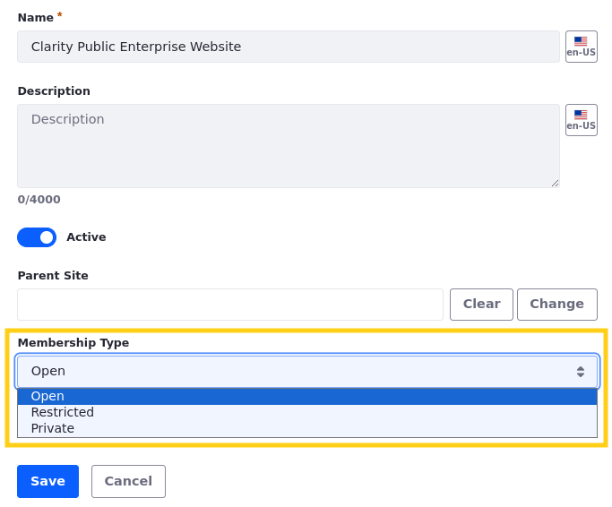
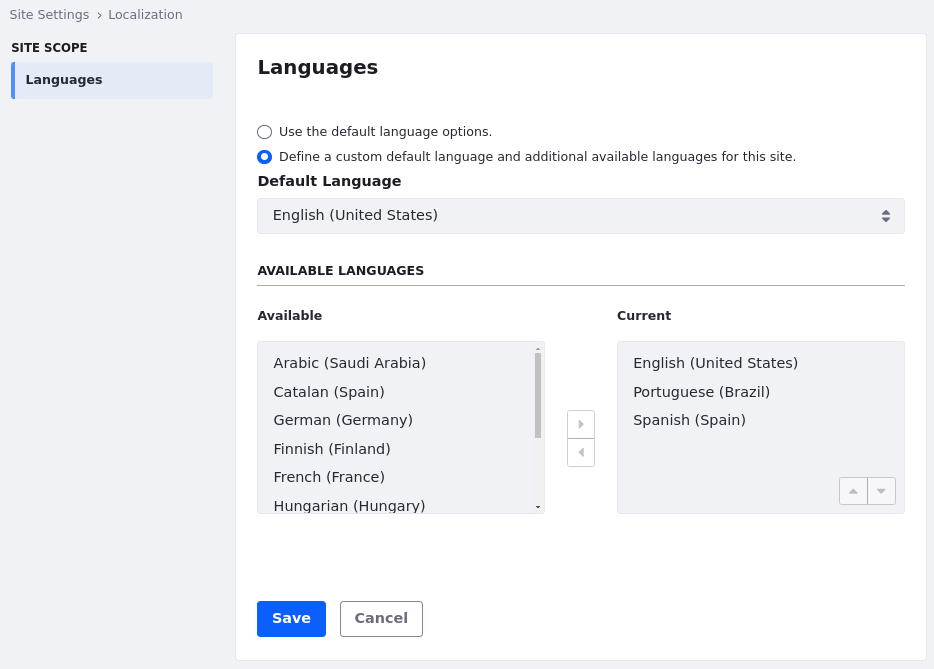
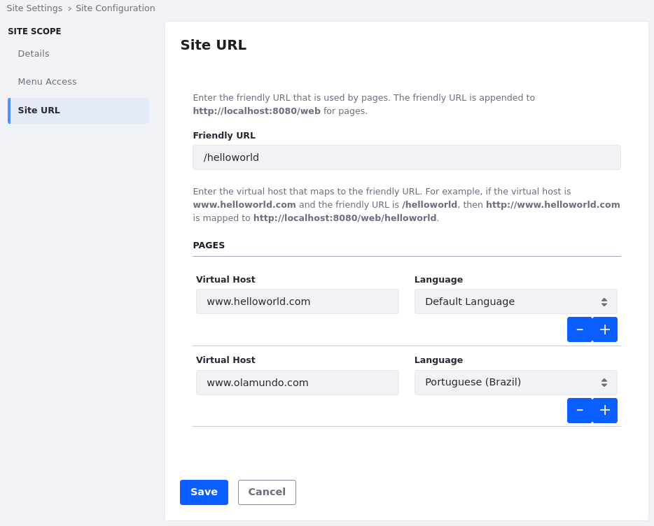
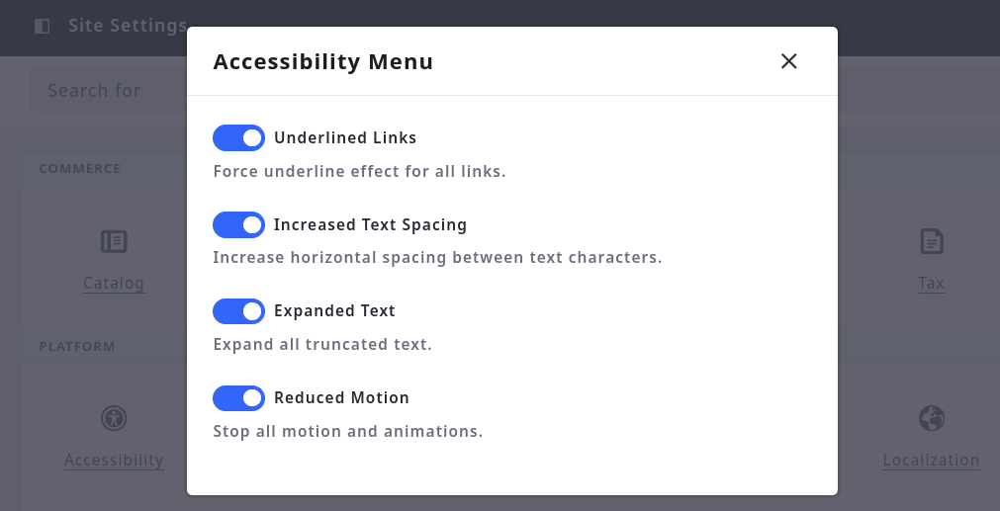
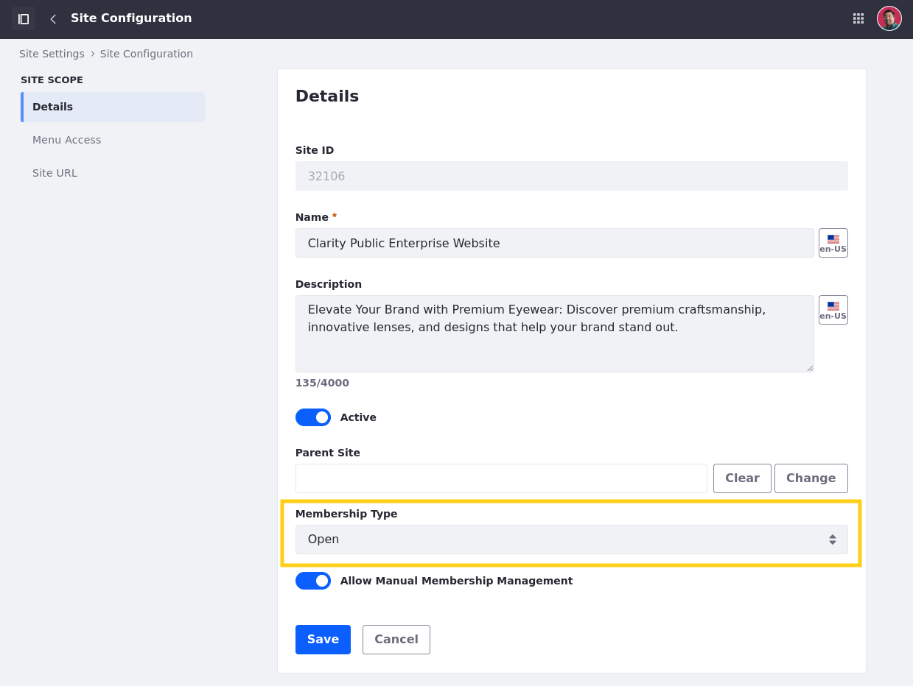

# Configuring the Clarity Site

With your local copy of Clarity's public enterprise website, it’s time to configure it! Clarity's website aims to be accessible by all, engaging the full spectrum of their global audiences. This lesson covers critical settings like membership types, localization, and accessibility. By configuring these elements, you'll ensure Clarity's website is inclusive and user-friendly for everyone who visits.

## Site Membership

Liferay provides three different types of site membership: open, restricted, and private. This configuration determines how freely users can join your site.

* Open: Users can join and leave the site whenever they want.

* Restricted: Users must request membership to join the site.

* Private: Site administrators must explicitly invite and add users for them to join the site.

<!--TASK: -->

Should site membership be completely open, require review, or only allow users to join by the invitation of site administrators? Membership type provides the first level of security. With it, you can set a baseline for user access to site content, since you can restrict data access to only site members.

Since Clarity's website is a public enterprise website, it should be open and accessible to a wide audience. This way guests can become members to remain updated on Clarity’s products, sign up for events, submit distributor applications, and more. Hence Clarity should select the Open membership type, allowing users to join and leave freely.

## Localization

In addition to site membership, Clarity wants to explore how to reach their global audience. Liferay provides robust localization features for creating websites that speak the language of your users. From configuring available site languages to localizing site URLs, you can help ensure Clarity's messages resonate with their international visitors. By default, every site uses the languages enabled at the instance level, but Clarity wants to limit the languages available in their site.

<!--TASK: -->

## Virtual Host

Setting the virtual host connects a domain name (e.g., `www.helloworld.com`) to a site. This can be a full domain or a subdomain (e.g., `partners.helloworld.com`), so you can differentiate between multiple sites on the same Liferay DXP server. Before setting the virtual host in Liferay, you must contact your provider and set the DNS name to point to the IP address for your Liferay DXP instance.

<!--TASK: -->

Clarity wants to set their site’s virtual host to `www.clarityvisionsolutions.com`. They also want to set a virtual host for Spanish (`www.solucionesdeclaridad.com`) to better engage their international audience.

## Accessibility

Site accessibility is essential for ensuring everyone can access and interact with your website. Liferay provides the accessibility menu to make it easier for users to enable some accessibility properties. Once enabled, users can access the menu by pressing Tab twice and then pressing Enter.

Enabling the accessibility menu provides users access to these configurations,

* Underlined Links: Force underline effect for all links.

* Increased Text Spacing: Increase horizontal spacing between text characters.

* Expanded Text: Expand all truncated text.

* Reduced Motion: Stop all motion and animations.

Accessibility is a core principle that should be woven into the design and development of any public site. And just like Clarity offers premium eyewear for all, their website should be equally inclusive. Enabling the accessibility menu is a good start, but we'll revisit this topic throughout the course.

## Exercise: Adding Users to a Site

<!-- Exercise 4b -->

By default, when you create a public site, all unauthenticated visitors can view its public pages and content. For authenticated site members, you can grant additional privileges using site-scoped roles. While most users in your training workspace are already members of the enterprise website, Christian Carter and Harper Robert are not.

Here you'll add them to the site as Ian Miller.

To do this,

1. Open the *Global Menu* () and select *Clarity Public Enterprise Website* in the right panel.

1. Open the *Site Menu* (), expand *People*, and select *Memberships*.

1. Click *New*.

1. Select *Christian Carter* and *Harper Roberts*.

1. Click *Done*.

   Great! Now both users are members of the site and you can assign site roles to them.

   

1. Click *Actions* () for Christian Carter and select *Assign Roles*.

1. Select the *Site Content Contributor* role and click *Done*.

   This enables Christian Carter to make contributions to the Clarity's website content.

1. Repeat steps 6-7 to assign the Site Content Contributor role to Harper Roberts as well.

   <!--TASK: Fix bootcamp step.-->

Next, you'll begin configuring Clarity's enterprise website to ensure it is public and accessible to their target audience.

<!-- Great! Now the Clarity personas are members of the new site. Next, we'll log in as Walter Douglas, to configure the new site. -->

## Exercise: Configuring the Site

<!-- Exercise 4c -->

As mentioned previously, the purpose of Clarity's site is to increase brand awareness, showcase their products, and convert visitors to customers. To this end, Clarity wants to

* Allow guest users to freely register as site members.
* Set their site's virtual host.
* Configure their language settings.
* Enable Liferay's OOTB accessibility tools.

Here you'll configure these settings as Clarity's IT Manager, Ian Miller.

To do this,

1. Ensure you're in the *Clarity Public Enterprise Website*.

1. Open the *Site Menu* (), expand *Configuration*, and select *Site Settings*.

   

1. Go to *Site Configuration* &rarr; *Details*.

1. Add this description:

   > Elevate Your Brand with Premium Eyewear: Discover premium craftsmanship, innovative lenses, and designs that help your brand stand out.

1. Set membership type to *Open*. This allows guests to freely become site members and access the site's public pages and content.

   

1. Click *Save*.

1. Go to the *Site URL* tab.

1. Set the friendly URL to `/clarity`.

   This URL is used by site pages and is appended to `http://localhost:8080/web`.

1. Set the site’s virtual host for the default language to `www.clarityvisionsolutions.com`.

   Setting the virtual host connects a domain name (e.g., `www.helloworld.com`) to a site.

   !!! note
       Before setting the virtual host in Liferay, you must contact your provider and set the DNS name to point to the IP address for your Liferay DXP instance.

1. Click *Add* () to add an extra virtual host for Spanish with the URL `www.solucionesdeclaridad.com`.

   This way their Spanish speaking audience can access the site using a localized domain name.

   

1. Click *Save*.

1. Return to the *Site Settings* page and go to *Localization*.

1. Click *Define a custom default language* and use the *left arrow* button () to remove all languages except for English and Spanish.

   <!-- TASK: Add icon -->

   For now, Clarity only wants to support English (United States) and Spanish (Spain) for content localization on their site.

   

   !!! tip
       To select multiple languages at a time, hold the CTRL key.

1. Click *Save*.

1. Return to the *Site Settings* page and go to *Accessibility*.

1. Check the box to enable the accessibility menu.

   This means users can press Tab twice and hit Enter to access a menu for configuring their accessibility settings.

   

1. Click *Save*.

Together, these configurations help Clarity’s enterprise website fulfill its intended purpose: promoting their products to their international audience. Liferay provides many other site configurations, including cookie handling, session timeouts, and SEO. For now, these configurations satisfy Clarity's basic needs.

Before moving further, let's update the default home page and landing page for Clarity's instance.

### Configuring the Instance's Default Home and Landing Pages

Currently, when you visit `http://localhost:8080/`, you're directed to the Clarity Vision Solutions site, instead of Clarity Public Enterprise Website. Here you'll update the default home and landing pages for your instance as the Clarity Admin user.

To do this,

1. Sign in as the Clarity Admin user:

   * Username: `admin@clarityvisionsolutions.com`
   * Password: `learn`

1. Open the *Global Menu* (), go to the *Control Panel* tab, and click *Instance Settings*.

1. Under Platform, click *Instance Configuration* and go to the *General*  tab.

1. For Home URL, enter `/web/clarity`.

   This sets the default page displayed when you access `http://localhost:8080/`.

1. For Default Landing Page, enter `/web/clarity`.

   This specifies the default page to which users are redirected after logging in.

1. For Default Logout Page, enter `/web/clarity`.

   This defines the default page to which users are redirected after signing out.

   

1. Click *Save*.

Now when users visit `http://localhost:8080/` and log out or log in, they're directed to the home page for Clarity's public enterprise website.

## Conclusion

Congratulations! You’ve configured Clarity's enterprise website to ensure it is public and accessible to Clarity’s global audience. Next you’ll add some pages to Clarity’s site.

Next Up: [Adding Pages to Clarity's Site](./adding-pages-to-claritys-site.md)
